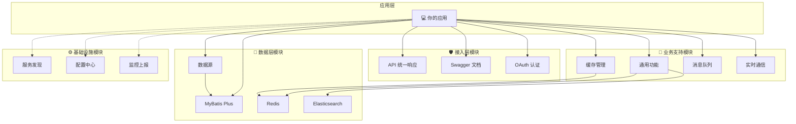

# Spring Support Parent Starter

[](https://www.oracle.com/java/)
[](https://spring.io/projects/spring-boot)
[](https://maven.apache.org/)
[](https://opensource.org/licenses/Apache-2.0)

## 📖 项目简介

Spring Support Parent Starter 是一个基于 Spring Boot 3.x 的企业级应用支持框架，提供了丰富的功能模块和组件，帮助开发者快速构建企业级应用。框架采用模块化设计，按需引入，涵盖数据库集成、缓存、消息队列、文件存储、认证授权、监控、第三方服务集成等多个方面。

### ✨ 主要特性

- 🚀 **基于最新技术栈** - Spring Boot 3.x + Java 25 LTS
- 🧩 **模块化设计** - 按需引入，避免依赖冗余
- 🏢 **企业级功能** - 提供生产环境所需的各种组件
- ⚙️ **统一配置管理** - 一致的配置风格和管理方式
- 📦 **开箱即用** - 预配置的集成方案，快速上手
- 🔧 **高度可定制** - 灵活的配置选项，满足不同需求
- 📚 **完善文档** - 详细的使用说明和示例代码

## 🏗️ 架构设计

### 模块分层架构



### 完整模块列表

```
Spring Support Parent Starter
├── 🔧 基础功能模块
│   ├── spring-support-common-starter          # 通用功能和工具类
│   ├── spring-support-datasource-starter      # 数据源配置和管理
│   └── spring-support-mybatis-starter         # MyBatis Plus集成
├── 🔐 认证和安全模块
│   └── spring-support-oauth-client-starter    # OAuth客户端认证
├── 💾 缓存和存储模块
│   ├── spring-support-redis-starter           # Redis缓存集成
│   ├── spring-support-filesystem-minio-starter # MinIO对象存储
│   └── spring-support-filesystem-starter      # 统一文件存储抽象
├── 🛡️ 容错和稳定性模块
│   └── spring-support-strategy-starter        # 策略和容错
├── 📡 消息和通信模块
│   ├── spring-support-queue-starter           # 消息队列抽象
│   ├── spring-support-queue-mqtt-starter      # MQTT消息队列
│   ├── spring-support-queue-kafka-starter     # Kafka消息队列
│   ├── spring-support-queue-rabbitmq-starter  # RabbitMQ消息队列
│   ├── spring-support-queue-rocketmq-starter  # RocketMQ消息队列
│   ├── spring-support-socket-starter          # Socket抽象层
│   ├── spring-support-socket-websocket-starter # WebSocket实现
│   ├── spring-support-socket-io-starter        # Socket.IO实现
│   ├── spring-support-socket-rsocket-starter   # RSocket实现
│   ├── spring-support-socket-sse-starter       # SSE实现
│   ├── spring-support-rpc-starter             # RPC远程调用
│   ├── spring-support-sync-starter            # 同步服务
│   └── spring-support-message-starter         # 消息推送
├── 🤖 AI 深度学习模块
│   └── spring-support-ai-starter              # 图像检测、OCR、版面分析、人脸特征等
├── 🔍 搜索和数据处理模块
│   └── spring-support-elasticsearch-starter   # Elasticsearch搜索引擎
├── 🌐 服务发现和配置模块
│   ├── spring-support-discovery-starter       # 服务发现
│   └── spring-support-configcenter-starter    # 配置中心
├── 📊 监控和日志模块
│   ├── spring-support-report-client-starter   # 设备数据上报客户端
│   └── spring-support-report-client-arthas-starter # Arthas诊断集成
├── 📚 API文档模块
│   └── spring-support-swagger-starter         # Swagger API文档
├── 🛠️ 运维管理模块
│   ├── spring-support-shell-starter           # SSH Shell管理
│   ├── spring-support-ssh-starter             # SSH服务
│   └── spring-support-job-starter             # 定时任务调度
├── 🤖 AI深度学习模块
│   └── spring-support-ai-starter              # AI深度学习功能
├── 🌐 API网关模块
│   └── spring-support-gateway-starter         # API网关
└── 🔌 第三方服务集成模块
    ├── spring-support-tencent-starter         # 腾讯云服务集成
    └── spring-support-pay-client-starter      # 支付客户端
```

## 🚀 快速开始

### 环境要求

- **Java**: 25 或更高版本
- **Maven**: 3.6+ 或 **Gradle**: 7.0+
- **Spring Boot**: 3.4.5

### 添加依赖

在你的项目中添加需要的模块依赖：

#### Maven

```xml
<dependency>
    <groupId>com.chua</groupId>
    <artifactId>spring-support-common-starter</artifactId>
    <version>4.0.0.32</version>
</dependency>

<!-- 根据需要添加其他模块 -->
<dependency>
    <groupId>com.chua</groupId>
    <artifactId>spring-support-circuit-breaker-starter</artifactId>
    <version>4.0.0.32</version>
</dependency>
```

#### Gradle

```
implementation 'com.chua:spring-support-common-starter:4.0.0.32'
implementation 'com.chua:spring-support-circuit-breaker-starter:4.0.0.32'
```

### 基本配置

#### 🔧 配置开关说明

**重要**：从 v4.0.0.32 版本开始，所有功能模块都添加了 `enable` 配置开关，默认值为 `false`。

**使用原则**：

- ✅ 所有功能默认不启用，避免不必要的资源占用
- ✅ 需要使用某个功能时，显式设置 `enable: true`
- ✅ 统一的配置前缀：`plugin.{模块名}.enable`

**配置示例**：

在 `application.yml` 中添加基本配置：

```yaml
# 通用功能配置
plugin:
  # API 统一响应格式
  api:
    enable: true # 默认: false，需要显式启用

  # Redis 缓存
  redis:
    server:
      enable: true # 默认: false

  # MyBatis 数据库
  mybatis:
    enable: true # 默认: false

  # OAuth 客户端
  oauth:
    client:
      enable: true # 默认: false

  # 熔断降级和限流配置
  circuit-breaker:
    enable: true
    circuit-breaker:
      failure-rate-threshold: 50.0
      minimum-number-of-calls: 10
    rate-limiter:
      limit-for-period: 100
      limit-refresh-period: 1s
      enable-management: true
```

#### 📋 所有模块配置开关列表

| 模块              | 配置前缀                          | 默认值 | 说明               |
| ----------------- | --------------------------------- | ------ | ------------------ |
| **基础功能**      |
| Actuator          | `plugin.actuator.enable`          | false  | 监控端点           |
| API               | `plugin.api.enable`               | false  | API 统一配置       |
| API CORS          | `plugin.api.cors.enable`          | false  | 跨域配置           |
| Cache             | `plugin.cache.enable`             | false  | 缓存管理           |
| Jackson           | `plugin.jackson.enable`           | false  | JSON 序列化        |
| Log               | `plugin.log.enable`               | false  | 日志配置           |
| Async             | `plugin.async.enable`             | false  | 异步线程池         |
| Captcha           | `plugin.captcha.enable`           | false  | 验证码             |
| Create Table      | `plugin.create-table.enable`      | false  | 自动建表           |
| IP                | `plugin.ip.enable`                | false  | IP 解析            |
| Message Converter | `plugin.message-converter.enable` | false  | 消息转换           |
| Notice            | `plugin.notice.enable`            | false  | 通知               |
| Optional          | `plugin.optional.enable`          | false  | 可选配置           |
| **数据库**        |
| MyBatis           | `plugin.mybatis.enable`           | false  | MyBatis Plus       |
| MyBatis Tenant    | `plugin.tenant.enable`            | false  | 多租户             |
| DataSource Script | `plugin.datasource.script.enable` | false  | 数据源脚本         |
| Multi DataSource  | `plugin.datasource.multi.enable`  | false  | 多数据源           |
| Transaction       | `plugin.transaction.enable`       | false  | 事务管理           |
| **缓存存储**      |
| Redis             | `plugin.redis.server.enable`      | false  | Redis 服务         |
| Minio             | `plugin.minio.enable`             | false  | 对象存储           |
| Elasticsearch     | `plugin.elasticsearch.enable`     | false  | 搜索引擎           |
| **认证授权**      |
| OAuth Client      | `plugin.oauth.client.enable`      | false  | OAuth 客户端       |
| **消息通信**      |
| Email             | `plugin.email.enable`             | false  | 邮件发送           |
| MQTT              | `plugin.mqtt.enable`              | false  | MQTT 消息          |
| Socket.IO         | `plugin.socketio.enable`          | false  | Socket.IO          |
| SSE               | `plugin.sse.enable`               | false  | Server-Sent Events |
| Socket            | `plugin.socket.enable`            | false  | TCP/UDP Socket     |
| RPC               | `plugin.rpc.enable`               | false  | RPC 远程调用       |
| **服务治理**      |
| Discovery         | `plugin.discovery.enable`         | false  | 服务发现           |
| Config Center     | `plugin.config-center.enable`     | false  | 配置中心           |
| Sync              | `plugin.sync.enable`              | false  | 同步服务           |
| **监控运维**      |
| Prometheus        | `plugin.prometheus.enable`        | false  | Prometheus 监控    |
| Report Client     | `plugin.report.enable`            | false  | 上报客户端         |
| Arthas Client     | `plugin.arthas.enable`            | false  | Arthas 诊断        |
| **其他服务**      |
| Pay Client        | `plugin.pay.enable`               | false  | 支付客户端         |
| Swagger           | `plugin.knife4j.enable`           | false  | API 文档           |
| Shell             | `plugin.shell.enable`             | false  | Shell 服务         |
| SSH               | `plugin.ssh.enable`               | false  | SSH 服务           |
| Tencent           | `plugin.tencent.mini-app.enable`  | false  | 腾讯云服务         |

### 简单示例

```
@RestController
@RequestMapping("/api/users")
public class UserController {

    @Autowired
    private UserService userService;

    @GetMapping("/{id}")
    @CircuitBreakerProtection(
        circuitBreaker = "userService",
        rateLimiter = "userService",
        fallbackMethod = "getUserFallback"
    )
    public User getUser(@PathVariable Long id) {
        return userService.findById(id);
    }

    @PostMapping
    @RateLimiter(
        name = "createUser",
        limitForPeriod = 10,
        dimension = RateLimiter.Dimension.IP,
        message = "创建用户请求过于频繁"
    )
    public User createUser(@RequestBody User user) {
        return userService.save(user);
    }

    // 降级方法
    public User getUserFallback(Long id, Exception ex) {
        return User.builder()
                .id(id)
                .name("默认用户")
                .build();
    }
}
```

## 📋 模块详细说明

### 🔧 基础功能模块

#### spring-support-common-starter

**通用功能和工具类模块**

提供企业级应用开发中常用的基础功能：

- 统一响应处理和异常处理
- 参数验证和数据转换
- 缓存支持和管理
- 验证码生成和验证
- 文件存储统一接口
- 数据加密和隐私保护
- 异步任务和线程池管理
- 通用拦截器和过滤器

**Maven 依赖：**

```xml
<dependency>
    <groupId>com.chua</groupId>
    <artifactId>spring-support-common-starter</artifactId>
    <version>4.0.0.32</version>
</dependency>
```

**配置示例：**

```yaml
plugin:
  parameter:
    enable: true # 启用统一响应格式
  cache:
    type: ["default", "redis"]
    redis:
      ttl: 600 # 缓存时间（秒）
```

#### spring-support-datasource-starter

**数据源配置和管理模块**

提供多数据源配置和管理功能：

- 多数据源动态切换
- 数据源连接池管理
- 数据库连接监控
- 事务管理增强

**Maven 依赖：**

```xml
<dependency>
    <groupId>com.chua</groupId>
    <artifactId>spring-support-datasource-starter</artifactId>
    <version>4.0.0.32</version>
</dependency>
```

#### spring-support-mybatis-starter

**MyBatis Plus 集成模块**

基于 MyBatis Plus 的数据库操作增强：

- 自动代码生成
- 分页插件集成
- 乐观锁支持
- 逻辑删除
- 自动填充功能

**Maven 依赖：**

```xml
<dependency>
    <groupId>com.chua</groupId>
    <artifactId>spring-support-mybatis-starter</artifactId>
    <version>4.0.0.32</version>
</dependency>
```

### 🛡️ 容错和稳定性模块

#### spring-support-circuit-breaker-starter

**熔断降级和增强限流模块**

基于 Resilience4j 的完整容错解决方案：

- 🔥 **熔断器** - 防止级联故障，快速失败
- 🔄 **重试机制** - 自动重试失败操作
- 🚦 **增强限流** - 多维度限流（IP、用户、API、全局）
- 🏠 **舱壁隔离** - 资源隔离，防止资源耗尽
- ⏰ **超时控制** - 防止长时间等待
- 📊 **动态管理** - Web 管理界面，实时监控和配置

**Maven 依赖：**

```xml
<dependency>
    <groupId>com.chua</groupId>
    <artifactId>spring-support-circuit-breaker-starter</artifactId>
    <version>4.0.0.32</version>
</dependency>
```

**配置示例：**

```yaml
plugin:
  circuit-breaker:
    enable: true
    # 熔断器配置
    circuit-breaker:
      failure-rate-threshold: 50.0
      minimum-number-of-calls: 10
      instances:
        userService:
          failure-rate-threshold: 30.0

    # 增强限流配置
    rate-limiter:
      limit-for-period: 100
      limit-refresh-period: 1s
      enable-management: true # 启用管理页面
      rules:
        api-limit:
          name: "API限流"
          pattern: "/api/**"
          limit-for-period: 50
          dimension: API
        ip-limit:
          name: "IP限流"
          pattern: "/**"
          limit-for-period: 1000
          dimension: IP
```

**使用示例：**

```
// 使用组合注解
@CircuitBreakerProtection(
    circuitBreaker = "userService",
    rateLimiter = "userService",
    fallbackMethod = "fallback"
)
public User getUser(Long id) { ... }

// 使用专门的限流注解
@RateLimiter(
    name = "searchUsers",
    limitForPeriod = 20,
    dimension = RateLimiter.Dimension.IP,
    message = "搜索请求过于频繁"
)
public List<User> searchUsers(String keyword) { ... }
```

**管理页面：**
访问 `http://localhost:8080/actuator/rate-limiter` 查看限流管理界面

### 🗄️ 缓存和存储模块

#### spring-support-redis-starter

**Redis 缓存集成模块**

提供 Redis 缓存的完整集成方案：

- Redis 连接池配置
- 分布式锁实现
- 缓存注解增强
- 序列化配置
- 集群支持

**Maven 依赖：**

```xml
<dependency>
    <groupId>com.chua</groupId>
    <artifactId>spring-support-redis-starter</artifactId>
    <version>4.0.0.32</version>
</dependency>
```

#### spring-support-minio-starter

**MinIO 对象存储模块**

MinIO 对象存储服务集成：

- 文件上传下载
- 存储桶管理
- 文件预览和分享
- 权限控制

**Maven 依赖：**

```xml
<dependency>
    <groupId>com.chua</groupId>
    <artifactId>spring-support-minio-starter</artifactId>
    <version>4.0.0.32</version>
</dependency>
```

### 📡 消息和通信模块

#### spring-support-email-starter

**邮件发送服务模块**

企业级邮件发送解决方案：

- 多邮件服务商支持
- 模板邮件
- 附件支持
- 发送状态跟踪

**Maven 依赖：**

```xml
<dependency>
    <groupId>com.chua</groupId>
    <artifactId>spring-support-email-starter</artifactId>
    <version>4.0.0.32</version>
</dependency>
```

#### spring-support-mqtt-starter

**MQTT 消息队列模块**

MQTT 协议消息队列集成：

- 发布订阅模式
- QoS 质量保证
- 连接管理
- 消息持久化

**Maven 依赖：**

```xml
<dependency>
    <groupId>com.chua</groupId>
    <artifactId>spring-support-mqtt-starter</artifactId>
    <version>4.0.0.32</version>
</dependency>
```

### 🔍 搜索和数据处理模块

#### spring-support-elasticsearch-starter

**Elasticsearch 搜索引擎模块**

Elasticsearch 集成和搜索功能：

- 全文搜索
- 聚合分析
- 索引管理
- 查询构建器

**Maven 依赖：**

```xml
<dependency>
    <groupId>com.chua</groupId>
    <artifactId>spring-support-elasticsearch-starter</artifactId>
    <version>4.0.0.32</version>
</dependency>
```

### 📊 监控和日志模块

#### spring-support-prometheus-starter

**Prometheus 监控模块**

应用性能监控和指标收集：

- 自定义指标
- JVM 监控
- HTTP 请求监控
- 数据库连接池监控

**Maven 依赖：**

```xml
<dependency>
    <groupId>com.chua</groupId>
    <artifactId>spring-support-prometheus-starter</artifactId>
    <version>4.0.0.32</version>
</dependency>
```

#### spring-support-loki-starter

**Loki 日志收集模块**

集成 Grafana Loki 进行日志收集和分析：

- 结构化日志
- 日志聚合
- 实时日志流
- 日志查询和过滤

**Maven 依赖：**

```xml
<dependency>
    <groupId>com.chua</groupId>
    <artifactId>spring-support-loki-starter</artifactId>
    <version>4.0.0.32</version>
</dependency>
```

### 🔐 认证和安全模块

#### spring-support-oauth-client-starter

**OAuth 客户端认证模块**

OAuth 2.0 客户端集成：

- 多 OAuth 提供商支持
- 令牌管理
- 用户信息获取
- 权限控制

**Maven 依赖：**

```xml
<dependency>
    <groupId>com.chua</groupId>
    <artifactId>spring-support-oauth-client-starter</artifactId>
    <version>4.0.0.32</version>
</dependency>
```

#### spring-support-token-starter

**令牌认证模块**

基于数据库的令牌认证功能：

- 令牌生成和验证
- IP 白名单控制
- 令牌有效期管理
- 用户关联认证

**Maven 依赖：**

```xml
<dependency>
    <groupId>com.chua</groupId>
    <artifactId>spring-support-token-starter</artifactId>
    <version>4.0.0.32</version>
</dependency>
```

### 🌐 服务发现和配置模块

#### spring-support-discovery-starter

**服务发现模块**

微服务架构中的服务发现功能：

- 服务注册与发现
- 健康检查
- 负载均衡
- 服务路由

**Maven 依赖：**

```xml
<dependency>
    <groupId>com.chua</groupId>
    <artifactId>spring-support-discovery-starter</artifactId>
    <version>4.0.0.32</version>
</dependency>
```

#### spring-support-configcenter-starter

**配置中心模块**

分布式配置管理：

- 配置热更新
- 环境隔离
- 配置版本管理
- 配置加密

**Maven 依赖：**

```xml
<dependency>
    <groupId>com.chua</groupId>
    <artifactId>spring-support-configcenter-starter</artifactId>
    <version>4.0.0.32</version>
</dependency>
```

### 📚 API 文档模块

#### spring-support-swagger-starter

**Swagger API 文档模块**

自动生成 API 文档：

- OpenAPI 3.0 支持
- 交互式文档界面
- API 测试功能
- 文档自定义

**Maven 依赖：**

```xml
<dependency>
    <groupId>com.chua</groupId>
    <artifactId>spring-support-swagger-starter</artifactId>
    <version>4.0.0.32</version>
</dependency>
```

**配置示例：**

```yaml
springdoc:
  api-docs:
    enabled: true
    path: /v3/api-docs
  swagger-ui:
    enabled: true
    path: /swagger-ui.html
```

### 🏢 数据库扩展模块

#### spring-support-mybatis-tenant-starter

**MyBatis 多租户支持模块**

SaaS 应用的多租户数据隔离：

- 租户数据隔离
- 动态数据源切换
- 租户上下文管理
- 数据权限控制

**Maven 依赖：**

```xml
<dependency>
    <groupId>com.chua</groupId>
    <artifactId>spring-support-mybatis-tenant-starter</artifactId>
    <version>4.0.0.32</version>
</dependency>
```

### 🔌 第三方服务集成模块

#### spring-support-tencent-starter

**腾讯云服务集成模块**

腾讯云服务 SDK 集成：

- 对象存储 COS
- 短信服务 SMS
- 人脸识别
- 语音识别

**Maven 依赖：**

```xml
<dependency>
    <groupId>com.chua</groupId>
    <artifactId>spring-support-tencent-starter</artifactId>
    <version>4.0.0.32</version>
</dependency>
```

#### spring-support-pay-client-starter

**支付客户端模块**

多支付平台集成：

- 支付宝支付
- 微信支付
- 银联支付
- 支付回调处理

**Maven 依赖：**

```xml
<dependency>
    <groupId>com.chua</groupId>
    <artifactId>spring-support-pay-client-starter</artifactId>
    <version>4.0.0.32</version>
</dependency>
```

#### spring-support-guacamole-starter

**Apache Guacamole 远程桌面模块**

远程桌面访问功能：

- VNC 协议支持
- RDP 协议支持
- SSH 协议支持
- Web 端远程访问

**Maven 依赖：**

```xml
<dependency>
    <groupId>com.chua</groupId>
    <artifactId>spring-support-guacamole-starter</artifactId>
    <version>4.0.0.32</version>
</dependency>
```

### 📡 实时通信模块

#### spring-support-socketio-starter

**Socket.IO 实时通信模块**

WebSocket 实时通信：

- 实时消息推送
- 房间管理
- 事件处理
- 连接管理

**Maven 依赖：**

```xml
<dependency>
    <groupId>com.chua</groupId>
    <artifactId>spring-support-socketio-starter</artifactId>
    <version>4.0.0.32</version>
</dependency>
```

#### spring-support-sse-starter

**Server-Sent Events 模块**

服务器推送事件：

- 单向数据流
- 自动重连
- 事件类型支持
- 浏览器兼容

**Maven 依赖：**

```xml
<dependency>
    <groupId>com.chua</groupId>
    <artifactId>spring-support-sse-starter</artifactId>
    <version>4.0.0.32</version>
</dependency>
```

#### spring-support-rpc-starter

**RPC 远程调用模块**

远程过程调用支持：

- 多协议支持
- 服务发现集成
- 负载均衡
- 容错处理

**Maven 依赖：**

```xml
<dependency>
    <groupId>com.chua</groupId>
    <artifactId>spring-support-rpc-starter</artifactId>
    <version>4.0.0.32</version>
</dependency>
```

## 🔧 版本兼容性

| Spring Support | Spring Boot | Java | 说明               |
| -------------- | ----------- | ---- | ------------------ |
| 4.0.0.32       | 3.4.5       | 25+  | 当前版本，推荐使用 |
| 4.0.0.x        | 3.2.x       | 25+  | 稳定版本           |

## 📝 更新日志

### v4.0.0.32 (2024-12-20)

#### 🚀 新功能

- **增强限流功能**：从 common 模块迁移到 circuit-breaker 模块，使用 resilience4j 实现
- **多维度限流**：支持全局、IP、用户、API 四种限流维度
- **动态管理页面**：提供 Web 界面进行限流器的实时监控和管理
- **SpEL 表达式支持**：限流键支持 Spring 表达式语言

#### 🔧 改进

- **模块重构**：优化模块间依赖关系，提高可维护性
- **配置统一**：统一各模块的配置命名规范
- **文档完善**：更新所有模块的使用文档和示例

#### 🐛 修复

- 修复限流功能在高并发场景下的性能问题
- 优化熔断器状态转换逻辑

## 🤝 贡献指南

我们欢迎所有形式的贡献，包括但不限于：

1. **提交 Issue** - 报告 bug 或提出新功能建议
2. **提交 PR** - 修复 bug 或实现新功能
3. **完善文档** - 改进文档或添加示例
4. **分享经验** - 分享使用心得和最佳实践

### 开发流程

1. Fork 本仓库
2. 创建特性分支 (`git checkout -b feature/AmazingFeature`)
3. 提交更改 (`git commit -m 'Add some AmazingFeature'`)
4. 推送到分支 (`git push origin feature/AmazingFeature`)
5. 创建 Pull Request

## 📄 许可证

本项目采用 [Apache License 2.0](LICENSE) 许可证。

## 📞 联系我们

- **作者**: CH
- **邮箱**: [your-email@example.com]
- **项目地址**: [https://github.com/your-username/spring-support-parent-starter]

## 🙏 致谢

感谢以下开源项目的支持：

- [Spring Boot](https://spring.io/projects/spring-boot)
- [Resilience4j](https://resilience4j.readme.io/)
- [MyBatis Plus](https://baomidou.com/)
- [Redis](https://redis.io/)
- [Elasticsearch](https://www.elastic.co/)

---

## 📚 模块文档

> 💡 **提示：** 点击模块名称查看详细文档和配置说明。完整配置示例请参考 [`application-example.yml`](application-example.yml) 和 [`application-example.properties`](application-example.properties)

### 🔧 基础功能模块

- **[spring-support-common-starter](spring-support-common-starter/README.md)** - 通用工具模块
  - 异步任务、缓存管理、工具类等

### 🌐 接入层模块

- **[spring-support-swagger-starter](spring-support-swagger-starter/README.md)** - API文档模块
  - Knife4j/Swagger接口文档生成

- **[spring-support-gateway-starter](spring-support-gateway-starter/README.md)** - 网关模块
  - 路由、限流、熔断等

### 🛡️ 安全认证模块

- **[spring-support-oauth-client-starter](spring-support-oauth-client-starter/README.md)** - OAuth客户端模块
  - OAuth 2.0认证集成

### 💾 数据访问层模块

- **[spring-support-datasource-starter](spring-support-datasource-starter/README.md)** - 数据源模块
  - 多数据源、动态数据源、多租户支持

- **[spring-support-mybatis-starter](spring-support-mybatis-starter/README.md)** - MyBatis模块
  - MyBatis Plus增强、分页、逻辑删除、乐观锁等

- **[spring-support-redis-starter](spring-support-redis-starter/README.md)** - Redis模块
  - Redis操作、分布式锁、缓存管理

- **[spring-support-elasticsearch-starter](spring-support-elasticsearch-starter/README.md)** - Elasticsearch模块
  - 全文搜索、日志分析

### 📁 文件存储模块

- **[spring-support-filesystem-starter](spring-support-filesystem-starter/README.md)** - 文件系统抽象模块
  - 统一文件操作接口

- **[spring-support-filesystem-minio-starter](spring-support-filesystem-minio-starter/README.md)** - MinIO存储模块
  - MinIO对象存储集成

### 📡 消息队列模块

- **[spring-support-queue-starter](spring-support-queue-starter/README.md)** - 消息队列抽象模块
  - 统一消息队列接口

- **[spring-support-queue-rabbitmq-starter](spring-support-queue-rabbitmq-starter/README.md)** - RabbitMQ模块
  - RabbitMQ消息队列实现

- **[spring-support-queue-kafka-starter](spring-support-queue-kafka-starter/README.md)** - Kafka模块
  - Kafka消息队列实现

- **[spring-support-queue-rocketmq-starter](spring-support-queue-rocketmq-starter/README.md)** - RocketMQ模块
  - RocketMQ消息队列实现

- **[spring-support-queue-mqtt-starter](spring-support-queue-mqtt-starter/README.md)** - MQTT模块
  - MQTT物联网消息协议实现

### 🔌 Socket通信模块

- **[spring-support-socket-starter](spring-support-socket-starter/README.md)** - Socket抽象模块
  - 统一Socket通信接口

- **[spring-support-socket-websocket-starter](spring-support-socket-websocket-starter/README.md)** - WebSocket模块
  - WebSocket双向通信

- **[spring-support-socket-io-starter](spring-support-socket-io-starter/README.md)** - Socket.IO模块
  - Socket.IO实时通信

- **[spring-support-socket-rsocket-starter](spring-support-socket-rsocket-starter/README.md)** - RSocket模块
  - RSocket响应式通信

- **[spring-support-socket-sse-starter](spring-support-socket-sse-starter/README.md)** - SSE模块
  - Server-Sent Events服务器推送

### 🌐 微服务治理模块

- **[spring-support-discovery-starter](spring-support-discovery-starter/README.md)** - 服务发现模块
  - Nacos、Eureka、Consul服务注册与发现

- **[spring-support-configcenter-starter](spring-support-configcenter-starter/README.md)** - 配置中心模块
  - 动态配置管理、配置热更新

- **[spring-support-rpc-starter](spring-support-rpc-starter/README.md)** - RPC模块
  - 远程过程调用支持

### 📊 业务支撑模块

- **[spring-support-report-client-starter](spring-support-report-client-starter/README.md)** - 报表模块
  - 报表生成、导出

- **[spring-support-report-client-arthas-starter](spring-support-report-client-arthas-starter/README.md)** - Arthas诊断模块
  - 性能监控、问题诊断

- **[spring-support-pay-client-starter](spring-support-pay-client-starter/README.md)** - 支付模块
  - 支付宝、微信支付集成

- **[spring-support-tencent-starter](spring-support-tencent-starter/README.md)** - 腾讯云服务模块
  - COS对象存储、SMS短信服务

- **[spring-support-message-starter](spring-support-message-starter/README.md)** - 消息通知模块
  - 邮件、短信、微信公众号通知

### 🤖 AI集成模块

- **[spring-support-ai-starter](spring-support-ai-starter/README.md)** - AI服务模块
  - OpenAI、文心一言、通义千问等AI大模型集成

### 🛠️ 运维管理模块

- **[spring-support-job-starter](spring-support-job-starter/README.md)** - 定时任务模块
  - 定时任务调度管理

- **[spring-support-shell-starter](spring-support-shell-starter/README.md)** - Shell命令模块
  - Shell脚本执行

- **[spring-support-ssh-starter](spring-support-ssh-starter/README.md)** - SSH服务模块
  - SSH远程登录和命令执行

- **[spring-support-sync-starter](spring-support-sync-starter/README.md)** - 数据同步模块
  - 数据同步和迁移

### 🎯 设计模式模块

- **[spring-support-strategy-starter](spring-support-strategy-starter/README.md)** - 策略模式模块
  - 策略模式实现支持

### 🔌 插件系统模块

#### spring-support-plugin-starter

**企业级插件系统模块（PF4J 兼容）**

基于 PF4J 标准的企业级插件系统，提供完整的插件生命周期管理和 Spring Boot 深度集成。

**Maven 依赖：**

```xml
<dependency>
    <groupId>com.chua</groupId>
    <artifactId>spring-support-plugin-starter</artifactId>
    <version>4.0.0.32</version>
</dependency>
```

#### 插件系统能力（PF4J 兼容）

| 能力项 | 状态 | 说明 | PF4J 兼容性 |
|--------|------|------|------------|
| **插件管理** | ✅ | 完整的插件生命周期管理：`loadPlugin`, `startPlugin`, `stopPlugin`, `unloadPlugin`, `reloadPlugin` | ✅ 完全兼容 |
| **扩展点机制** | ✅ | 支持 `ExtensionPoint` 接口和 `@Extension` 注解，实现插件扩展功能 | ✅ 完全兼容 |
| **插件生命周期** | ✅ | 完整的生命周期管理：`Plugin.start()`, `Plugin.stop()`, `Plugin.delete()` | ✅ 完全兼容 |
| **插件依赖管理** | ✅ | 支持 `PluginDependency`，自动解析依赖关系并按正确顺序加载插件 | ✅ 完全兼容 |
| **类加载器隔离** | ✅ | 每个插件使用独立的 `PluginClassLoader`，实现类隔离，避免冲突 | ✅ 完全兼容 |
| **插件描述符** | ✅ | 支持 `plugin.properties` 格式，兼容 PF4J 描述符规范 | ✅ 完全兼容 |
| **热加载** | ✅ | 支持 `DirectoryWatcher` 监听文件变化，自动加载/重载/卸载插件 | ✅ 完全兼容 |
| **插件状态管理** | ✅ | 完整的插件状态管理：`CREATED`, `STARTED`, `STOPPED`, `DISABLED`, `FAILED` | ✅ 完全兼容 |
| **插件优先级** | ✅ | 支持插件优先级配置，按优先级顺序加载和启动 | ✅ 完全兼容 |
| **插件依赖解析** | ✅ | 自动解析插件依赖关系，确保依赖插件先于被依赖插件加载 | ✅ 完全兼容 |

#### 增强功能（PF4J 扩展）

| 能力项 | 状态 | 说明 | PF4J 兼容性 |
|--------|------|------|------------|
| **Spring Bean 自动注册** | ✅ | 自动扫描插件中的 `@Service`/`@Component`/`@Repository`/`@Controller` 注解，注册到 Spring 容器 | ❌ PF4J 不支持 |
| **Controller 映射管理** | ✅ | 动态注册/卸载 Spring MVC 路由，支持热加载时的映射升级 | ❌ PF4J 不支持 |
| **SPI 扩展支持** | ✅ | 支持 Java SPI 机制，与插件系统无缝集成 | ❌ PF4J 不支持 |
| **Windows 文件锁处理** | ✅ | 完美解决 Windows 系统下插件文件锁定问题，支持自动重试和 GC 释放 | ⚠️ PF4J 在 Windows 上有问题 |
| **运行模式** | ✅ | 支持 `DEVELOPMENT`/`PRODUCTION` 模式，自动调整配置（热加载、日志级别等） | ❌ PF4J 不支持 |
| **Spring Boot 自动配置** | ✅ | 零配置启动，通过 `@ConditionalOnProperty` 自动装配插件系统 | ❌ PF4J 需要手动集成 |
| **插件 Bean 命名隔离** | ✅ | 插件 Bean 使用 `{pluginId}.{beanName}` 命名规则，避免与主应用 Bean 冲突 | ❌ PF4J 不支持 |
| **Bean 覆盖策略** | ✅ | 支持 `@Primary` 和 `@Order` 注解控制 Bean 覆盖优先级 | ❌ PF4J 不支持 |
| **插件上下文管理** | ✅ | 每个插件拥有独立的上下文，管理插件内的 Bean 和资源 | ❌ PF4J 不支持 |
| **插件卸载资源清理** | ✅ | 完整的资源清理机制：卸载 Bean、关闭 ClassLoader、释放文件锁、触发 GC | ⚠️ PF4J 资源清理不完善 |

#### 功能对比总结

| 功能类别 | PF4J | 本项目 | 说明 |
|---------|------|-------|------|
| **核心插件功能** | ✅ | ✅ | 完全兼容 PF4J 所有核心功能 |
| **Spring 集成** | ⚠️ | ✅ | PF4J 需要手动集成，本项目自动集成 |
| **Bean 管理** | ❌ | ✅ | PF4J 不支持，本项目完整支持 |
| **Windows 支持** | ⚠️ | ✅ | PF4J 在 Windows 上有文件锁问题，本项目完美解决 |
| **热加载** | ✅ | ✅ | 完全兼容，并增强 Spring Bean 和 Controller 映射管理 |
| **扩展点** | ✅ | ✅ | 完全兼容，并支持 SPI 扩展 |

**配置示例：**

```yaml
plugin:
  plugin:
    enable: true
    path: ./plugins
    watch: true  # 启用热加载
    mode: DEVELOPMENT  # DEVELOPMENT 或 PRODUCTION
```

**结论：**

本项目实现了 **PF4J 的所有核心功能**，并在此基础上提供了 **Spring Boot 深度集成**和 **增强功能**，是一个功能完整、生产就绪的企业级插件系统。

---

⭐ 如果这个项目对你有帮助，请给我们一个星标！
