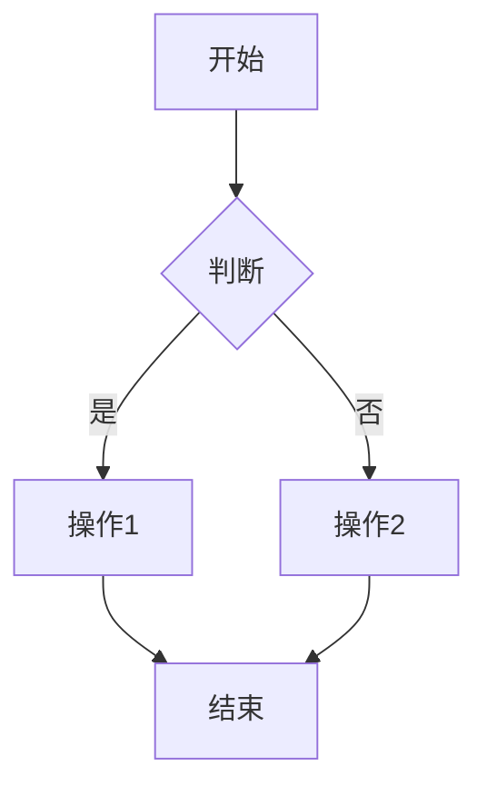
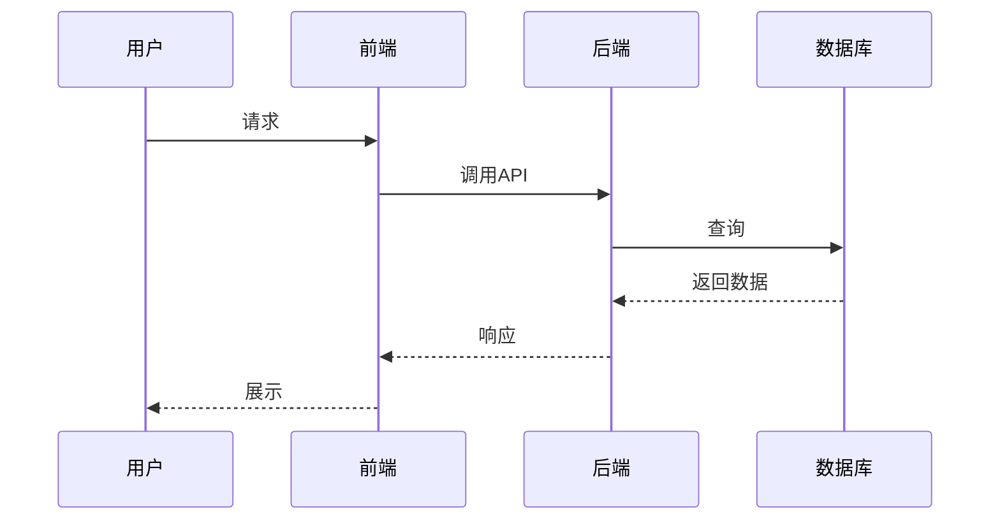
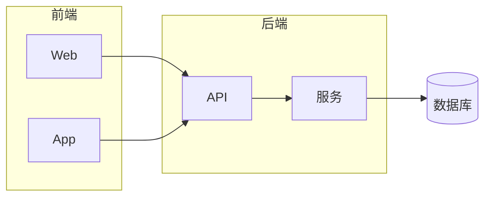

# 图表绘制

## Mermaid 常用图

### 流程图

```mermaid
graph TD
    A[开始] --> B{判断}
    B -->|是| C[操作1]
    B -->|否| D[操作2]
    C --> E[结束]
    D --> E
```

### 时序图

```mermaid
sequenceDiagram
    用户->>前端: 请求
    前端->>后端: 调用API
    后端->>数据库: 查询
    数据库-->>后端: 返回数据
    后端-->>前端: 响应
    前端-->>用户: 展示
```

### 架构图

```mermaid
graph LR
    subgraph 前端
        A[Web]
        B[App]
    end
    subgraph 后端
        C[API]
        D[服务]
    end
    E[(数据库)]
    A --> C
    B --> C
    C --> D
    D --> E
```

## 常用图类型

- **流程图**: graph TD/LR
- **时序图**: sequenceDiagram
- **类图**: classDiagram
- **状态图**: stateDiagram
- **架构图**: graph + subgraph
