# spring-support-configcenter-starter

## 📖 模块简介

**配置中心模块** - 提供分布式配置管理功能，支持动态配置刷新、配置版本管理、多环境配置等特性。

## ✨ 核心功能

### 🔧 配置管理

- ✅ 集中式配置管理
- ✅ 多环境配置支持
- ✅ 配置动态刷新
- ✅ 配置版本管理
- ✅ 配置加密存储

### 🔄 配置同步

- ✅ 配置变更实时推送
- ✅ 配置缓存机制
- ✅ 配置回滚支持

## 🚀 快速开始

### 1. 添加依赖

```xml
<dependency>
    <groupId>com.chua</groupId>
    <artifactId>spring-support-configcenter-starter</artifactId>
    <version>4.0.0.32</version>
</dependency>
```

### 2. 配置开关

**配置文件**：`application.yml`

```yaml
plugin:
  config-center:
    # 是否启用配置中心
    # 默认: false
    # 说明: 设置为true时才会启用配置中心功能
    enable: true

    # 配置中心地址
    server-url: http://localhost:8888

    # 应用名称
    application: ${spring.application.name}

    # 环境
    profile: ${spring.profiles.active}

    # 命名空间
    namespace: default
```

### 3. 使用配置

#### 3.1 使用 @Value 注解（支持缓存和热更新）

```java
@Component
public class MyService {
    
    @Value("${custom.config.key:defaultValue}")
    private String configValue;
    
    @Value("${app.timeout:5000}")
    private Integer timeout;
}
```

> 💡 **@Value 注解特性**：
> - ✅ **配置缓存**：配置值会被缓存，提高性能
> - ✅ **热更新支持**：配置中心配置变更时，自动更新字段值
> - ✅ **无需 @RefreshScope**：通过 `ValueAnnotationBeanPostProcessor` 实现热更新
> - ⚙️ **配置开关**：通过 `plugin.config-center.hot-reload.value-annotation-enabled` 控制

#### 3.2 使用 @ConfigValue 注解（支持缓存和热更新）

```java
@Component
public class MyService {
    
    @ConfigValue(value = "${custom.config.key:defaultValue}", hotReload = true)
    private String configValue;
    
    @ConfigValue(value = "${app.timeout:5000}", hotReload = true, callback = "onConfigChange")
    private Integer timeout;
    
    // 配置变更回调方法
    public void onConfigChange(String key, Object oldValue, Object newValue) {
        log.info("配置变更: key={}, oldValue={}, newValue={}", key, oldValue, newValue);
    }
}
```

> 💡 **@ConfigValue 注解特性**：
> - ✅ **配置缓存**：配置值会被缓存，提高性能
> - ✅ **热更新支持**：配置中心配置变更时，自动更新字段值
> - ✅ **回调支持**：配置变更时可执行自定义回调方法
> - ✅ **配置推送**：支持将配置推送到配置中心（`publish` 或 `publishIfAbsent`）
> - ⚙️ **配置开关**：通过 `plugin.config-center.hot-reload.config-value-annotation-enabled` 控制

#### 3.3 使用 @ConfigurationProperties（传统方式）

```java
@ConfigurationProperties(prefix = "custom.config")
@Data
public class CustomConfig {
    private String key;
}
```

## ⚙️ 配置说明

### 配置加载优先级

配置中心加载配置时，按照以下优先级顺序（从高到低）：

1. **远程配置中心 - Application-{appName}-{profile}**
   - 格式：`Application-xxx-dev`
   - 说明：基于 `spring.application.name` 和应用环境，带环境后缀的配置
   - 示例：应用名为 `my-app`，环境为 `dev`，则加载 `Application-my-app-dev`

2. **远程配置中心 - Application-{appName}**
   - 格式：`Application-xxx`
   - 说明：基于 `spring.application.name`，不带环境后缀的配置
   - 示例：应用名为 `my-app`，则加载 `Application-my-app`

3. **spring.profiles.include 配置 - application-{name}-{profile}.yml**
   - 格式：`application-{name}-{profile}.yml`
   - 说明：`spring.profiles.include` 指定的配置，带环境后缀
   - 示例：`spring.profiles.include=common,shared`，环境为 `dev`，则加载 `application-common-dev.yml`、`application-shared-dev.yml`

4. **spring.profiles.include 配置 - application-{name}.yml**
   - 格式：`application-{name}.yml`
   - 说明：`spring.profiles.include` 指定的配置，不带环境后缀
   - 示例：`spring.profiles.include=common,shared`，则加载 `application-common.yml`、`application-shared.yml`

> 💡 **提示**：
> - 高优先级的配置会覆盖低优先级的同名配置项
> - 如果某个优先级的配置不存在，会自动跳过，继续加载下一优先级的配置
> - 所有配置都会添加到 Spring Environment 的 PropertySources 中，后加载的配置会覆盖先加载的同名配置
> - **所有 ConfigCenter 子类实现都遵循此优先级**：
>   - 配置加载优先级在 `ConfigCenterConfigurationEnvironmentPostProcessor` 中统一实现
>   - 所有通过 SPI 机制加载的 ConfigCenter 实现类（如 Nacos、Apollo、Consul、Zookeeper 等）都会使用相同的加载逻辑
>   - 配置加载逻辑与具体的 ConfigCenter 实现无关，确保所有配置中心实现都遵循相同的优先级规则
>   - 配置加载通过 `ConfigCenter.get(dataId)` 方法获取配置，所有实现类只需实现此方法即可

### 热重载配置说明

热重载功能允许配置中心配置变更时自动同步到应用，无需重启应用。

#### 配置项说明

| 配置项 | 类型 | 默认值 | 说明 |
|--------|------|--------|------|
| `hot-reload.enabled` | boolean | `true` | 是否启用热更新。启用后，配置中心的配置变更会自动同步到应用 |
| `hot-reload.value-annotation-enabled` | boolean | `true` | 是否支持 @Value 注解热更新。启用后，使用 @Value 注解的字段也能实现热更新，无需 @RefreshScope |
| `hot-reload.config-value-annotation-enabled` | boolean | `true` | 是否支持 @ConfigValue 注解热更新。启用后，使用 @ConfigValue 注解的字段支持热更新，无需 @RefreshScope |
| `hot-reload.refresh-delay-ms` | long | `100` | 配置变更后的延迟刷新时间（毫秒）。防止配置频繁变更导致应用抖动 |
| `hot-reload.log-on-change` | boolean | `true` | 是否在配置变更时打印日志 |

#### 使用说明

1. **@Value 注解热更新**：
   - 需要设置 `hot-reload.value-annotation-enabled: true`（默认已启用）
   - 无需使用 `@RefreshScope` 注解
   - 配置变更后会自动更新字段值

2. **@ConfigValue 注解热更新**：
   - 需要设置 `hot-reload.config-value-annotation-enabled: true`（默认已启用）
   - 无需使用 `@RefreshScope` 注解
   - 支持配置变更回调方法

3. **刷新延迟**：
   - `refresh-delay-ms` 用于防止配置频繁变更导致应用抖动
   - 如果配置在短时间内多次变更，只会在延迟时间后刷新一次

### 完整配置示例

```yaml
plugin:
  config-center:
    # 功能开关
    enable: true

    # 配置中心服务地址
    server-url: http://config-server:8888

    # 应用名称（用于区分不同应用的配置）
    application: my-app

    # 环境（dev/test/prod）
    profile: dev

    # 命名空间（用于配置隔离）
    namespace: default

    # 热重载配置
    hot-reload:
      # 是否启用热更新
      # 默认: true
      # 说明: 启用后，配置中心的配置变更会自动同步到应用
      enabled: true

      # 是否支持 @Value 注解热更新
      # 默认: true
      # 说明: 启用后，使用 @Value 注解的字段也能实现热更新，无需 @RefreshScope
      value-annotation-enabled: true

      # 是否支持 @ConfigValue 注解热更新
      # 默认: true
      # 说明: 启用后，使用 @ConfigValue 注解的字段支持热更新，无需 @RefreshScope
      config-value-annotation-enabled: true

      # 配置变更后的延迟刷新时间（毫秒）
      # 默认: 100
      # 说明: 防止配置频繁变更导致应用抖动
      refresh-delay-ms: 100

      # 是否在配置变更时打印日志
      # 默认: true
      log-on-change: true
```

## 💡 使用示例

### 动态刷新配置

```java
@RefreshScope
@RestController
public class ConfigController {

    @Value("${custom.message}")
    private String message;

    @GetMapping("/message")
    public String getMessage() {
        return message;  // 配置变更后自动刷新
    }
}
```

### 监听配置变更

```java
@Component
public class ConfigChangeListener {

    @EventListener
    public void onConfigChange(ConfigChangeEvent event) {
        log.info("配置变更: {} -> {}",
            event.getOldValue(),
            event.getNewValue());
    }
}
```

## 🎯 设计原则

### 1. 配置隔离

- ✅ 按应用隔离配置
- ✅ 按环境隔离配置
- ✅ 按命名空间隔离配置

### 2. 高可用

- ✅ 本地配置缓存
- ✅ 配置中心故障降级
- ✅ 配置变更通知机制

### 3. 安全性

- ✅ 配置加密存储
- ✅ 访问权限控制
- ✅ 配置变更审计

## 🏗️ 系统架构流程图

### 1. 整体系统架构

```mermaid
%%{init: {'theme':'base', 'themeVariables': { 'primaryColor':'#fff'}}}%%
flowchart TB
    subgraph Application
        SpringApp
        UserCode
        ConfigController
    end
    
    subgraph Config
        ConfigCenterProperties
        ConfigProps
    end
    
    subgraph PostProcessor
        ConfigCenterConfigurationEnvironmentPostProcessor
        LoadConfig
        RegisterListener
    end
    
    subgraph AutoConfig
        ConfigValueAutoConfiguration
        ConfigValueBeanPostProcessor
        ValueAnnotationBeanPostProcessor
    end
    
    subgraph Holder
        ConfigCenterHolder
        ConfigCenterInstance
    end
    
    subgraph ConfigCenter
        ConfigCenterInterface
        NacosConfigCenter
        ApolloConfigCenter
        ConsulConfigCenter
        ZookeeperConfigCenter
    end
    
    subgraph Annotation
        ConfigValueAnnotation
        ValueAnnotation
        ScanFields
        ScanMethods
    end
    
    subgraph HotReload
        ConfigListener
        ConfigValueCache
        BindingInfo
        UpdateValue
        Callback
    end
    
    subgraph Publish
        PublishConfig
        PublishIfAbsent
    end
    
    SpringApp("Spring Boot应用<br/>SpringBootApplication")
    UserCode("用户代码<br/>使用@ConfigValue注解")
    ConfigController("ConfigController<br/>配置管理接口")
    
    ConfigCenterProperties("ConfigCenterProperties<br/>配置属性读取<br/>application.yml")
    ConfigProps("配置属性<br/>enable protocol<br/>address hotReload等")
    
    ConfigCenterConfigurationEnvironmentPostProcessor("ConfigCenterConfigurationEnvironmentPostProcessor<br/>环境后置处理器<br/>在环境准备阶段加载配置")
    LoadConfig("加载配置<br/>从配置中心加载<br/>添加到Environment")
    RegisterListener("注册监听器<br/>配置变更监听<br/>热更新支持")
    
    ConfigValueAutoConfiguration("ConfigValueAutoConfiguration<br/>自动配置类<br/>ConditionalOnProperty")
    ConfigValueBeanPostProcessor("ConfigValueBeanPostProcessor<br/>Bean后置处理器<br/>扫描@ConfigValue注解<br/>支持缓存和热更新")
    ValueAnnotationBeanPostProcessor("ValueAnnotationBeanPostProcessor<br/>Bean后置处理器<br/>扫描@Value注解<br/>支持缓存和热更新")
    
    ConfigCenterHolder("ConfigCenterHolder<br/>配置中心持有者<br/>统一管理ConfigCenter实例")
    ConfigCenterInstance("ConfigCenter实例<br/>全局单例<br/>避免重复创建")
    
    ConfigCenterInterface("ConfigCenter接口<br/>统一配置中心接口")
    NacosConfigCenter("NacosConfigCenter<br/>Nacos配置中心<br/>阿里云Nacos")
    ApolloConfigCenter("ApolloConfigCenter<br/>Apollo配置中心<br/>携程Apollo")
    ConsulConfigCenter("ConsulConfigCenter<br/>Consul配置中心<br/>HashiCorp Consul")
    ZookeeperConfigCenter("ZookeeperConfigCenter<br/>Zookeeper配置中心<br/>Apache Zookeeper")
    
    ConfigValueAnnotation("@ConfigValue注解<br/>配置值注入<br/>支持热更新和缓存")
    ValueAnnotation("@Value注解<br/>配置值注入<br/>支持热更新和缓存")
    ScanFields("扫描字段<br/>扫描@ConfigValue/@Value字段<br/>注入配置值")
    ScanMethods("扫描方法<br/>扫描@ConfigValue/@Value方法<br/>注入配置值")
    
    ConfigListener("ConfigListener<br/>配置变更监听器<br/>监听配置变化")
    ConfigValueCache("配置值缓存<br/>configValueCache<br/>缓存配置值提高性能")
    BindingInfo("BindingInfo<br/>绑定信息<br/>字段/方法与配置键绑定")
    UpdateValue("更新值<br/>配置变更时<br/>自动更新字段值和缓存")
    Callback("回调方法<br/>配置变更回调<br/>执行自定义逻辑")
    
    PublishConfig("推送配置<br/>publish配置<br/>强制推送")
    PublishIfAbsent("推送配置不存在时<br/>publishIfAbsent配置<br/>仅当不存在时推送")
    
    SpringApp --> ConfigCenterConfigurationEnvironmentPostProcessor
    ConfigCenterConfigurationEnvironmentPostProcessor --> ConfigCenterProperties
    ConfigCenterProperties --> ConfigProps
    
    ConfigCenterConfigurationEnvironmentPostProcessor --> LoadConfig
    ConfigCenterConfigurationEnvironmentPostProcessor --> RegisterListener
    LoadConfig --> ConfigCenterHolder
    RegisterListener --> ConfigCenterHolder
    
    SpringApp --> ConfigValueAutoConfiguration
    ConfigValueAutoConfiguration --> ConfigCenterHolder
    ConfigCenterHolder --> ConfigCenterInstance
    
    ConfigValueAutoConfiguration --> ConfigValueBeanPostProcessor
    ConfigValueAutoConfiguration --> ValueAnnotationBeanPostProcessor
    ConfigValueBeanPostProcessor --> ConfigValueAnnotation
    ValueAnnotationBeanPostProcessor --> ValueAnnotation
    ConfigValueAnnotation --> ScanFields
    ValueAnnotation --> ScanFields
    ConfigValueAnnotation --> ScanMethods
    ValueAnnotation --> ScanMethods
    
    ConfigCenterHolder --> ConfigCenterInterface
    ConfigCenterInterface --> NacosConfigCenter
    ConfigCenterInterface --> ApolloConfigCenter
    ConfigCenterInterface --> ConsulConfigCenter
    ConfigCenterInterface --> ZookeeperConfigCenter
    
    ConfigValueBeanPostProcessor --> ConfigListener
    ValueAnnotationBeanPostProcessor --> ConfigListener
    ConfigValueBeanPostProcessor --> ConfigValueCache
    ValueAnnotationBeanPostProcessor --> ConfigValueCache
    ConfigValueBeanPostProcessor --> BindingInfo
    ValueAnnotationBeanPostProcessor --> BindingInfo
    ConfigValueBeanPostProcessor --> UpdateValue
    ValueAnnotationBeanPostProcessor --> UpdateValue
    ConfigValueBeanPostProcessor --> Callback
    
    ConfigValueBeanPostProcessor --> PublishConfig
    ConfigValueBeanPostProcessor --> PublishIfAbsent
    PublishConfig --> ConfigCenterInterface
    PublishIfAbsent --> ConfigCenterInterface
    
    style Application fill:#e3f2fd
    style Config fill:#fff3e0
    style PostProcessor fill:#f3e5f5
    style AutoConfig fill:#e8f5e9
    style Holder fill:#fce4ec
    style ConfigCenter fill:#fff9c4
    style Annotation fill:#e1f5fe
    style HotReload fill:#f1f8e9
    style Publish fill:#ffe0b2
```



### 2. 配置加载与初始化流程架构

```mermaid
%%{init: {'theme':'base', 'themeVariables': { 'primaryColor':'#fff'}}}%%
flowchart TD
    Start([开始: Spring Boot应用启动]) --> EnvironmentPostProcessor
    
    EnvironmentPostProcessor --> ReadProperties
    
    ReadProperties --> CheckEnabled
    
    CheckEnabled -->|未启用| EndSkip([结束: 跳过配置中心初始化])
    
    CheckEnabled -->|已启用| GetProtocol
    
    GetProtocol --> CreateConfigCenter
    
    CreateConfigCenter --> ConfigCenterType
    
    ConfigCenterType -->|nacos| CreateNacos
    ConfigCenterType -->|apollo| CreateApollo
    ConfigCenterType -->|consul| CreateConsul
    ConfigCenterType -->|zookeeper| CreateZookeeper
    
    CreateNacos --> StartConfigCenter
    CreateApollo --> StartConfigCenter
    CreateConsul --> StartConfigCenter
    CreateZookeeper --> StartConfigCenter
    
    StartConfigCenter --> SaveToHolder
    
    SaveToHolder --> GetActiveProfile
    
    GetActiveProfile --> LoadConfigurations
    
    LoadConfigurations --> LoadAppConfigWithProfile
    
    LoadAppConfigWithProfile --> LoadAppConfig
    
    LoadAppConfig --> GetIncludeProfiles
    
    GetIncludeProfiles --> LoadIncludeWithProfile
    
    LoadIncludeWithProfile --> LoadIncludeConfig
    
    LoadIncludeConfig --> ProcessDataId
    
    ProcessDataId --> GetConfig
    
    GetConfig --> ConfigFound
    
    ConfigFound -->|不存在| LogWarning
    
    ConfigFound -->|存在| ParseConfig
    
    ParseConfig --> AddToEnvironment
    
    AddToEnvironment --> MoreDataIds
    
    MoreDataIds -->|是| ProcessDataId
    MoreDataIds -->|否| CheckHotReload
    
    LogWarning --> MoreDataIds
    
    CheckHotReload -->|未启用| EndInit([结束: 初始化完成])
    
    CheckHotReload -->|已启用| RegisterListener
    
    RegisterListener --> SupportListener
    
    SupportListener -->|不支持| LogNoListener
    
    SupportListener -->|支持| AddListener
    
    AddListener --> EndInit
    LogNoListener --> EndInit
    
    EnvironmentPostProcessor("ConfigCenterConfigurationEnvironmentPostProcessor<br/>环境后置处理器<br/>Ordered优先级执行")
    ReadProperties("读取ConfigCenterProperties<br/>从Environment读取配置<br/>Binder绑定属性")
    CheckEnabled{检查<br/>plugin config-center enable配置}
    GetProtocol("获取协议类型<br/>protocol配置<br/>nacos apollo consul等")
    CreateConfigCenter("创建ConfigCenter实例<br/>ServiceProvider<br/>根据协议创建对应实现")
    ConfigCenterType{配置中心类型判断<br/>根据protocol}
    CreateNacos("创建NacosConfigCenter<br/>Nacos客户端<br/>Nacos SDK")
    CreateApollo("创建ApolloConfigCenter<br/>Apollo客户端<br/>Apollo SDK")
    CreateConsul("创建ConsulConfigCenter<br/>Consul客户端<br/>Consul SDK")
    CreateZookeeper("创建ZookeeperConfigCenter<br/>Zookeeper客户端<br/>Zookeeper SDK")
    StartConfigCenter("启动ConfigCenter<br/>连接配置中心")
    SaveToHolder("保存到ConfigCenterHolder<br/>全局单例管理")
    GetActiveProfile("获取激活环境<br/>spring profiles active<br/>或namespaceId配置")
    LoadConfigurations("加载配置<br/>loadConfigurations方法<br/>从配置中心加载配置<br/>按优先级顺序加载")
    LoadAppConfigWithProfile("1. 加载Application-appName-profile<br/>远程配置中心<br/>带环境后缀（最高优先级）")
    LoadAppConfig("2. 加载Application-appName<br/>远程配置中心<br/>不带环境后缀")
    GetIncludeProfiles("3. 获取spring profiles include<br/>获取额外配置列表")
    LoadIncludeWithProfile("4. 加载application-name-profile yml<br/>include配置<br/>带环境后缀")
    LoadIncludeConfig("5. 加载application-name yml<br/>include配置<br/>不带环境后缀")
    ProcessDataId("处理每个配置<br/>循环处理每个配置")
    GetConfig("获取配置<br/>从配置中心获取配置内容")
    ConfigFound{配置是否存在}
    LogWarning("记录警告日志<br/>配置不存在")
    ParseConfig("解析配置<br/>解析YAML Properties<br/>转换为键值对")
    AddToEnvironment("添加到Environment<br/>OriginTrackedMapPropertySource<br/>添加到PropertySources")
    MoreDataIds{是否还有更多<br/>DataId需要处理}
    CheckHotReload{检查热更新配置<br/>hotReload enabled}
    RegisterListener("注册配置监听器<br/>registerConfigListener<br/>监听配置变更")
    SupportListener{是否支持监听<br/>isSupportListener方法}
    LogNoListener("记录日志<br/>配置中心不支持监听")
    AddListener("添加监听器<br/>addListener方法<br/>注册配置变更监听")
    
    style Start fill:#e1f5ff
    style EndSkip fill:#ffcdd2
    style EndInit fill:#c8e6c9
    style CheckEnabled fill:#ffccbc
    style ConfigCenterType fill:#ffccbc
    style ConfigFound fill:#ffccbc
    style MoreDataIds fill:#ffccbc
    style CheckHotReload fill:#ffccbc
    style SupportListener fill:#ffccbc
    style CreateConfigCenter fill:#fff9c4
    style LoadConfigurations fill:#fff9c4
    style LoadAppConfigWithProfile fill:#fff9c4
    style LoadAppConfig fill:#fff9c4
    style LoadIncludeWithProfile fill:#fff9c4
    style LoadIncludeConfig fill:#fff9c4
    style AddListener fill:#fff9c4
```



### 3. @ConfigValue注解处理与热更新流程架构

```mermaid
%%{init: {'theme':'base', 'themeVariables': { 'primaryColor':'#fff'}}}%%
flowchart TD
    Start([开始: Bean初始化完成]) --> PostProcessAfterInit
    
    PostProcessAfterInit --> ScanBean
    
    ScanBean --> FoundAnnotation
    
    FoundAnnotation -->|未找到| EndScan([结束: 扫描完成])
    
    FoundAnnotation -->|找到注解| ProcessAnnotation
    
    ProcessAnnotation --> ParseExpression
    
    ParseExpression --> CheckPublish
    
    CheckPublish -->|需要推送| CheckSupportPublish
    
    CheckSupportPublish -->|不支持| LogNoPublish
    
    CheckSupportPublish -->|支持| GetPublishValue
    
    GetPublishValue --> PublishType
    
    PublishType -->|强制推送| ForcePublish
    
    PublishType -->|不存在时推送| PublishIfAbsent
    
    ForcePublish --> InjectValue
    PublishIfAbsent --> InjectValue
    LogNoPublish --> InjectValue
    CheckPublish -->|不需要推送| InjectValue
    
    InjectValue --> ResolveValue
    
    ResolveValue --> ConvertValue
    
    ConvertValue --> FieldOrMethod
    
    FieldOrMethod -->|字段| InjectField
    
    FieldOrMethod -->|方法| InjectMethod
    
    InjectField --> CheckHotReload
    InjectMethod --> CheckHotReload
    
    CheckHotReload -->|未启用| EndScan
    
    CheckHotReload -->|已启用| CheckSupportListener
    
    CheckSupportListener -->|不支持| EndScan
    
    CheckSupportListener -->|支持| CreateBinding
    
    CreateBinding --> RegisterBinding
    
    RegisterBinding --> CheckRegistered
    
    CheckRegistered -->|已注册| EndScan
    
    CheckRegistered -->|未注册| AddListener
    
    AddListener --> AddToRegistered
    
    AddToRegistered --> EndScan
    
    PostProcessAfterInit("ConfigValueBeanPostProcessor<br/>postProcessAfterInitialization<br/>Bean后置处理")
    ScanBean("扫描Bean<br/>扫描所有字段和方法<br/>查找ConfigValue注解")
    FoundAnnotation{是否找到<br/>ConfigValue注解}
    ProcessAnnotation("处理注解<br/>解析注解信息<br/>获取配置键和默认值")
    ParseExpression("解析表达式<br/>parseExpression<br/>解析key defaultValue格式")
    CheckPublish{检查推送配置<br/>publish或publishIfAbsent}
    CheckSupportPublish{配置中心是否<br/>支持推送<br/>isSupportPublish方法}
    LogNoPublish("记录警告日志<br/>配置中心不支持推送")
    GetPublishValue("获取推送值<br/>defaultValue或注解值<br/>获取要推送的配置值")
    PublishType{推送类型判断<br/>publish或publishIfAbsent}
    ForcePublish("强制推送配置<br/>configCenter publish方法<br/>覆盖已存在配置")
    PublishIfAbsent("推送配置不存在时<br/>configCenter publishIfAbsent方法<br/>仅当不存在时推送")
    InjectValue("注入初始值<br/>从缓存或Environment获取配置值<br/>注入到字段或方法")
    ResolveValue("解析配置值<br/>getCachedOrResolveValue<br/>先从缓存获取，再从Environment获取<br/>获取配置值或默认值并缓存")
    ConvertValue("转换值类型<br/>Converter convertIfNecessary<br/>转换为目标类型")
    FieldOrMethod{字段或方法判断<br/>Field或Method}
    InjectField("注入字段值<br/>field set方法<br/>设置字段值")
    InjectMethod("注入方法值<br/>method invoke方法<br/>调用方法设置值")
    CheckHotReload{检查热更新<br/>annotation hotReload方法<br/>且hotReloadEnabled}
    CheckSupportListener{配置中心是否<br/>支持监听<br/>isSupportListener方法}
    CreateBinding("创建绑定信息<br/>BindingInfo<br/>字段方法与配置键绑定")
    RegisterBinding("注册绑定<br/>registerBinding方法<br/>添加到bindingsByKey")
    CheckRegistered{是否已注册<br/>监听器<br/>registeredListeners contains方法}
    AddListener("添加配置监听器<br/>configCenter addListener方法<br/>注册ConfigValueListener")
    AddToRegistered("添加到已注册集合<br/>registeredListeners add方法<br/>避免重复注册")
    
    style Start fill:#e1f5ff
    style EndScan fill:#c8e6c9
    style FoundAnnotation fill:#ffccbc
    style CheckPublish fill:#ffccbc
    style CheckSupportPublish fill:#ffccbc
    style PublishType fill:#ffccbc
    style FieldOrMethod fill:#ffccbc
    style CheckHotReload fill:#ffccbc
    style CheckSupportListener fill:#ffccbc
    style CheckRegistered fill:#ffccbc
    style ProcessAnnotation fill:#fff9c4
    style InjectValue fill:#fff9c4
    style AddListener fill:#fff9c4
```



### 4. @Value 注解处理与热更新流程架构

```mermaid
%%{init: {'theme':'base', 'themeVariables': { 'primaryColor':'#fff'}}}%%
flowchart TD
    Start([开始: Bean初始化完成]) --> PostProcessAfterInit
    
    PostProcessAfterInit --> ScanBean
    
    ScanBean --> FoundAnnotation
    
    FoundAnnotation -->|未找到| EndScan([结束: 扫描完成])
    
    FoundAnnotation -->|找到注解| ProcessAnnotation
    
    ProcessAnnotation --> ParseExpression
    
    ParseExpression --> GetCachedOrResolve
    
    GetCachedOrResolve --> CheckCache
    
    CheckCache -->|存在| UseCached
    
    CheckCache -->|不存在| GetFromEnv
    
    GetFromEnv --> UseDefault
    
    UseDefault -->|有值| CacheValue
    
    UseDefault -->|无值| InjectValue
    
    UseCached --> InjectValue
    CacheValue --> InjectValue
    
    InjectValue --> ConvertValue
    
    ConvertValue --> FieldOrMethod
    
    FieldOrMethod -->|字段| InjectField
    
    FieldOrMethod -->|方法| InjectMethod
    
    InjectField --> CheckHotReload
    InjectMethod --> CheckHotReload
    
    CheckHotReload -->|未启用| EndScan
    
    CheckHotReload -->|已启用| CreateBinding
    
    CreateBinding --> RegisterBinding
    
    RegisterBinding --> CheckRegistered
    
    CheckRegistered -->|已注册| EndScan
    
    CheckRegistered -->|未注册| AddListener
    
    AddListener --> AddToRegistered
    
    AddToRegistered --> EndScan
    
    PostProcessAfterInit("ValueAnnotationBeanPostProcessor<br/>postProcessAfterInitialization<br/>Bean后置处理")
    ScanBean("扫描Bean<br/>扫描所有字段和方法<br/>查找Value注解")
    FoundAnnotation{是否找到<br/>Value注解}
    ProcessAnnotation("处理注解<br/>解析注解信息<br/>获取配置键和默认值")
    ParseExpression("解析表达式<br/>parseExpression<br/>解析key defaultValue格式")
    GetCachedOrResolve("获取配置值<br/>getCachedOrResolveValue<br/>先从缓存获取，再从Environment获取")
    CheckCache{缓存中是否存在<br/>configValueCache get方法}
    UseCached("使用缓存值<br/>直接返回缓存值")
    GetFromEnv("从Environment获取<br/>environment getProperty方法<br/>获取配置值")
    UseDefault{是否有默认值<br/>或Environment值}
    CacheValue("缓存配置值<br/>configValueCache put方法<br/>缓存配置值")
    InjectValue("注入初始值<br/>转换值类型并注入<br/>注入到字段或方法")
    ConvertValue("转换值类型<br/>Converter convertIfNecessary<br/>转换为目标类型")
    FieldOrMethod{字段或方法判断<br/>Field或Method}
    InjectField("注入字段值<br/>field set方法<br/>设置字段值")
    InjectMethod("注入方法值<br/>method invoke方法<br/>调用方法设置值")
    CheckHotReload{检查热更新<br/>hotReloadEnabled<br/>且配置中心支持监听}
    CreateBinding("创建绑定信息<br/>ValueBindingInfo<br/>字段方法与配置键绑定")
    RegisterBinding("注册绑定<br/>registerBinding方法<br/>添加到bindingsByKey")
    CheckRegistered{是否已注册<br/>监听器<br/>registeredListeners contains方法}
    AddListener("添加配置监听器<br/>configCenter addListener方法<br/>注册ValueConfigListener")
    AddToRegistered("添加到已注册集合<br/>registeredListeners add方法<br/>避免重复注册")
    
    style Start fill:#e1f5ff
    style EndScan fill:#c8e6c9
    style FoundAnnotation fill:#ffccbc
    style CheckCache fill:#ffccbc
    style UseDefault fill:#ffccbc
    style FieldOrMethod fill:#ffccbc
    style CheckHotReload fill:#ffccbc
    style CheckRegistered fill:#ffccbc
    style ProcessAnnotation fill:#fff9c4
    style InjectValue fill:#fff9c4
    style CacheValue fill:#fff9c4
    style AddListener fill:#fff9c4
```



### 5. 配置变更热更新流程架构

```mermaid
%%{init: {'theme':'base', 'themeVariables': { 'primaryColor':'#fff'}}}%%
flowchart TD
    Start([开始: 配置中心配置变更]) --> ConfigChanged
    
    ConfigChanged --> ConfigValueListener
    
    ConfigValueListener --> EventType
    
    EventType -->|onUpdate| UpdateCacheUpdate
    
    EventType -->|onDelete| UpdateCacheDelete
    
    UpdateCacheUpdate --> GetBindingsUpdate
    
    UpdateCacheDelete --> GetBindingsDelete
    
    GetBindingsUpdate --> ResolveValueUpdate
    
    GetBindingsDelete --> UseDefaultValueForDelete
    
    ResolveValueUpdate --> ProcessBindingUpdate
    
    UseDefaultValueForDelete --> ProcessBindingDelete
    
    ProcessBindingUpdate --> GetOldValue
    
    ProcessBindingDelete --> UseDefaultValueForBinding
    
    GetOldValue --> UpdateValue
    
    UseDefaultValueForBinding --> UpdateValue
    
    UpdateValue --> ConvertNewValue
    
    ConvertNewValue --> FieldOrMethod
    
    FieldOrMethod -->|字段| SetFieldValue
    
    FieldOrMethod -->|方法| InvokeMethodValue
    
    SetFieldValue --> LogUpdate
    
    InvokeMethodValue --> LogUpdate
    
    LogUpdate --> CheckCallback
    
    CheckCallback -->|无回调| EndUpdate([结束: 配置更新完成])
    
    CheckCallback -->|有回调| GetCallbackMethod
    
    GetCallbackMethod --> MethodFound
    
    MethodFound -->|不存在| LogNoMethod
    
    MethodFound -->|存在| InvokeCallback
    
    LogNoMethod --> EndUpdate
    
    InvokeCallback --> EndUpdate
    
    ConfigChanged("配置变更事件<br/>ConfigCenter检测到配置变化<br/>触发监听器")
    ConfigValueListener("ConfigValueListener<br/>配置值监听器<br/>onUpdate或onDelete")
    EventType{事件类型判断<br/>onUpdate或onDelete}
    UpdateCacheUpdate("更新配置缓存<br/>updateCache<br/>更新configValueCache中的配置值")
    UpdateCacheDelete("清除配置缓存<br/>updateCache<br/>从configValueCache中移除配置值")
    GetBindingsUpdate("获取绑定信息<br/>bindingsByKey.get<br/>获取该配置键的所有绑定")
    GetBindingsDelete("获取绑定信息<br/>bindingsByKey.get<br/>获取该配置键的所有绑定")
    ResolveValueUpdate("重新解析配置值<br/>从Environment获取最新值<br/>或使用新值")
    UseDefaultValueForDelete("使用默认值<br/>binding.defaultValue<br/>配置删除时使用默认值")
    ProcessBindingUpdate("处理每个绑定<br/>循环处理每个BindingInfo<br/>更新配置值")
    ProcessBindingDelete("处理每个绑定<br/>循环处理每个BindingInfo<br/>使用默认值")
    GetOldValue("获取旧值<br/>从字段获取当前值<br/>field.get(bean)")
    UseDefaultValueForBinding("使用默认值<br/>binding.defaultValue<br/>配置删除时使用默认值")
    UpdateValue("更新值<br/>injectFieldValue或injectMethodValue<br/>注入新值")
    ConvertNewValue("转换新值类型<br/>Converter.convertIfNecessary<br/>转换为目标类型")
    FieldOrMethod{字段或方法判断<br/>Field或Method}
    SetFieldValue("设置字段值<br/>field.set<br/>更新字段值")
    InvokeMethodValue("调用方法值<br/>method.invoke<br/>调用方法更新值")
    LogUpdate("记录更新日志<br/>log.info<br/>记录配置变更信息")
    CheckCallback{是否有回调方法<br/>binding.callback<br/>配置变更回调}
    GetCallbackMethod("获取回调方法<br/>bean.getClass().getDeclaredMethod<br/>获取回调方法")
    MethodFound{方法是否存在<br/>NoSuchMethodException}
    LogNoMethod("记录警告日志<br/>回调方法不存在")
    InvokeCallback("调用回调方法<br/>callback.invoke<br/>执行自定义逻辑<br/>参数: key oldValue newValue")
    
    style Start fill:#e1f5ff
    style EndUpdate fill:#c8e6c9
    style EventType fill:#ffccbc
    style FieldOrMethod fill:#ffccbc
    style CheckCallback fill:#ffccbc
    style MethodFound fill:#ffccbc
    style ConfigValueListener fill:#fff9c4
    style UpdateValue fill:#fff9c4
    style InvokeCallback fill:#fff9c4
```



> 💡 **提示**: 架构图支持横向滚动查看，也可以点击图表在新窗口中打开查看大图。

## 🔗 相关模块

- [spring-support-common-starter](../spring-support-common-starter) - 公共基础模块
- [spring-support-redis-starter](../spring-support-redis-starter) - Redis 缓存模块

## 📄 许可证

本项目采用 Apache License 2.0 许可证。

---

**作者**: CH  
**版本**: 4.0.0.32  
**更新时间**: 2024/12/11
