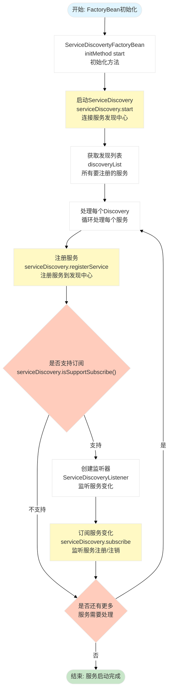

# spring-support-discovery-starter

## 📖 模块简介

**服务发现模块** - 提供服务注册与发现功能，支持多种服务发现协议，实现微服务架构中的服务治理。

## ✨ 核心功能

### 🔍 服务发现

- ✅ 服务自动注册
- ✅ 服务健康检查
- ✅ 服务实例管理
- ✅ 服务负载均衡

### 🌐 多协议支持

- ✅ Consul
- ✅ Eureka
- ✅ Nacos
- ✅ Zookeeper

## 🚀 快速开始

### 1. 添加依赖

```xml
<dependency>
    <groupId>com.chua</groupId>
    <artifactId>spring-support-discovery-starter</artifactId>
    <version>4.0.0.32</version>
</dependency>
```

### 2. 配置开关

**配置文件**：`application.yml`

```yaml
plugin:
  discovery:
    # 是否启用服务发现
    # 默认: false
    enable: true

    # 多个发现中心配置列表
    properties:
      - protocol: nacos           # 必填: 协议, 对应 ServiceDiscovery SPI 实现名
        address: http://localhost:8848
        username: nacos
        password: nacos
        connection-timeout-millis: 10000
        session-timeout-millis: 10000

        # 要注册的服务节点列表
        node:
          - server-id: ${spring.application.name}   # 可选: 服务ID, 为空则自动生成
            namespace: /demo-service               # 必填: 服务命名空间/业务标识
            protocol: http                         # 可选: 服务协议, 默认 http
```

### 3. 服务注册

服务启动后会自动注册到服务发现中心，无需额外代码。

### 4. 服务调用

```java
@Service
public class DemoService {

    @Resource
    private DiscoveryService discoveryService;

    public Discovery getOne(String namespace) {
        // 使用默认协议查询
        return discoveryService.getDiscovery(namespace);
    }

    public Set<Discovery> getAll(String namespace) {
        // 使用默认协议查询所有实例
        return discoveryService.getDiscoveryAll(namespace);
    }
}
```

## ⚙️ 配置说明

### 多协议配置示例

```yaml
plugin:
  discovery:
    enable: true
    properties:
      - protocol: nacos
        address: http://localhost:8848
        username: nacos
        password: nacos
        node:
          - server-id: demo-nacos
            namespace: /demo-service
            protocol: http

      - protocol: zookeeper
        address: 127.0.0.1:2181
        connection-timeout-millis: 5000
        session-timeout-millis: 15000
        node:
          - server-id: demo-zk
            namespace: /demo-service
            protocol: http
```

## 💡 使用示例

### 按协议查询服务

```java
@Service
public class MultiProtocolService {

    @Resource
    private DiscoveryService discoveryService;

    public Discovery selectFromNacos(String namespace) {
        return discoveryService.getDiscovery("nacos", namespace);
    }

    public Set<Discovery> selectAllFromZookeeper(String namespace) {
        return discoveryService.getDiscoveryAll("zookeeper", namespace);
    }
}
```

## 🎯 设计原则

### 1. 高可用

- ✅ 服务健康检查
- ✅ 故障自动剔除
- ✅ 服务自动恢复

### 2. 负载均衡

- ✅ 轮询策略
- ✅ 随机策略
- ✅ 权重策略

### 3. 易于集成

- ✅ 自动配置
- ✅ 最小化配置
- ✅ 多协议支持

## 🏗️ 系统架构流程图

### 1. 整体系统架构

```mermaid
%%{init: {'theme':'base', 'themeVariables': { 'primaryColor':'#fff'}}}%%
flowchart TB
    subgraph Application["应用层 Application Layer"]
        SpringApp["Spring Boot应用<br/>SpringBootApplication"]
        UserCode["用户代码<br/>使用DiscoveryService"]
        ServiceController["ServiceController<br/>服务管理接口"]
    end
    
    subgraph Config["配置层 Configuration Layer"]
        DiscoveryListProperties["DiscoveryListProperties<br/>配置属性读取<br/>application.yml"]
        DiscoveryProperties["DiscoveryProperties<br/>单个发现配置<br/>protocol address等"]
        DiscoveryNodeProperties["DiscoveryNodeProperties<br/>节点配置<br/>namespace serverId等"]
    end
    
    subgraph PostProcessor["后置处理层 PostProcessor Layer"]
        DiscoveryConfiguration["DiscoveryConfiguration<br/>Bean定义后置处理器<br/>BeanDefinitionRegistryPostProcessor"]
        RegistryBean["注册Bean<br/>registryBean<br/>创建ServiceDiscovery Bean"]
        CreateFactoryBean["创建FactoryBean<br/>ServiceDiscovertyFactoryBean<br/>管理ServiceDiscovery生命周期"]
    end
    
    subgraph Service["服务层 Service Layer"]
        DiscoveryService["DiscoveryService<br/>服务发现服务<br/>统一操作接口"]
        ServiceDiscovery["ServiceDiscovery接口<br/>统一服务发现接口"]
        DefaultServiceDiscovery["DefaultServiceDiscovery<br/>默认服务发现<br/>空实现"]
    end
    
    subgraph Discovery["发现层 Discovery Layer"]
        ConsulServiceDiscovery["ConsulServiceDiscovery<br/>Consul服务发现<br/>HashiCorp Consul"]
        EurekaServiceDiscovery["EurekaServiceDiscovery<br/>Eureka服务发现<br/>Netflix Eureka"]
        NacosServiceDiscovery["NacosServiceDiscovery<br/>Nacos服务发现<br/>阿里云Nacos"]
        ZookeeperServiceDiscovery["ZookeeperServiceDiscovery<br/>Zookeeper服务发现<br/>Apache Zookeeper"]
    end
    
    subgraph Registration["注册层 Registration Layer"]
        RegisterService["注册服务<br/>registerService<br/>注册服务到发现中心"]
        Discovery["Discovery对象<br/>服务信息<br/>id host port metadata等"]
        ServiceDiscoveryListener["ServiceDiscoveryListener<br/>服务变更监听器<br/>监听服务变化"]
        Subscribe["订阅服务变化<br/>subscribe<br/>监听服务注册/注销"]
    end
    
    subgraph Query["查询层 Query Layer"]
        GetService["获取服务<br/>getService<br/>获取单个服务实例"]
        GetServiceAll["获取所有服务<br/>getServiceAll<br/>获取所有服务实例"]
        ServiceInstance["ServiceInstance<br/>服务实例<br/>服务地址信息"]
    end
    
    subgraph Metadata["元数据层 Metadata Layer"]
        Project["Project<br/>项目信息<br/>应用名称 主机 端口等"]
        DiscoveryEnvironment["DiscoveryEnvironment<br/>发现环境<br/>自定义元数据"]
        Metadata["Metadata<br/>元数据<br/>服务标签和属性"]
    end
    
    SpringApp --> DiscoveryConfiguration
    DiscoveryConfiguration --> DiscoveryListProperties
    DiscoveryListProperties --> DiscoveryProperties
    DiscoveryProperties --> DiscoveryNodeProperties
    
    DiscoveryConfiguration --> RegistryBean
    RegistryBean --> CreateFactoryBean
    CreateFactoryBean --> ServiceDiscovery
    
    DiscoveryConfiguration --> DiscoveryService
    DiscoveryService --> ServiceDiscovery
    ServiceDiscovery --> DefaultServiceDiscovery
    
    ServiceDiscovery --> ConsulServiceDiscovery
    ServiceDiscovery --> EurekaServiceDiscovery
    ServiceDiscovery --> NacosServiceDiscovery
    ServiceDiscovery --> ZookeeperServiceDiscovery
    
    CreateFactoryBean --> RegisterService
    RegisterService --> Discovery
    RegisterService --> ServiceDiscoveryListener
    ServiceDiscoveryListener --> Subscribe
    
    DiscoveryService --> GetService
    DiscoveryService --> GetServiceAll
    GetService --> ServiceInstance
    GetServiceAll --> ServiceInstance
    
    RegistryBean --> Project
    RegistryBean --> DiscoveryEnvironment
    Discovery --> Metadata
    Project --> Metadata
    DiscoveryEnvironment --> Metadata
    
    style Application fill:#e3f2fd
    style Config fill:#fff3e0
    style PostProcessor fill:#f3e5f5
    style Service fill:#e8f5e9
    style Discovery fill:#fce4ec
    style Registration fill:#fff9c4
    style Query fill:#e1f5fe
    style Metadata fill:#f1f8e9
```

### 2. 服务注册流程架构

```mermaid
%%{init: {'theme':'base', 'themeVariables': { 'primaryColor':'#fff'}}}%%
flowchart TD
    Start([开始: Spring Boot应用启动]) --> PostProcessRegistry["DiscoveryConfiguration<br/>postProcessBeanDefinitionRegistry<br/>Bean定义后置处理"]
    
    PostProcessRegistry --> ReadProperties["读取DiscoveryListProperties<br/>从Environment读取配置<br/>Binder.get绑定属性"]
    
    ReadProperties --> CheckEnabled{"检查<br/>plugin.discovery.enable配置"}
    
    CheckEnabled -->|"未启用"| CreateDefaultService["创建默认服务<br/>DefaultServiceDiscovery<br/>空实现"]
    
    CheckEnabled -->|"已启用"| GetPropertiesList["获取配置列表<br/>properties.getProperties<br/>多个发现配置"]
    
    CreateDefaultService --> CreateEmbeddedService["创建嵌入式服务<br/>DiscoveryService<br/>使用默认实现"]
    
    CreateEmbeddedService --> EndInit([结束: 初始化完成])
    
    GetPropertiesList --> ProcessProperties["处理每个配置<br/>循环处理每个DiscoveryProperties"]
    
    ProcessProperties --> CheckPropertyEnabled{"配置是否启用<br/>discoveryProperties.isEnabled()"}
    
    CheckPropertyEnabled -->|"未启用"| MoreProperties{"是否还有更多<br/>配置需要处理"}
    
    CheckPropertyEnabled -->|"已启用"| CreateDiscoveryOption["创建DiscoveryOption<br/>address username password<br/>connectionTimeout sessionTimeout"]
    
    CreateDiscoveryOption --> GetServiceProvider["获取服务提供者<br/>ServiceProvider.of<br/>ServiceDiscovery.class"]
    
    GetServiceProvider --> CreateServiceDiscovery["创建ServiceDiscovery实例<br/>getNewExtension<br/>根据protocol创建对应实现"]
    
    CreateServiceDiscovery --> ServiceDiscoveryType{"服务发现类型判断<br/>根据protocol"]
    
    ServiceDiscoveryType -->|"consul"| CreateConsul["创建ConsulServiceDiscovery<br/>Consul客户端<br/>Consul SDK"]
    ServiceDiscoveryType -->|"eureka"| CreateEureka["创建EurekaServiceDiscovery<br/>Eureka客户端<br/>Eureka SDK"]
    ServiceDiscoveryType -->|"nacos"| CreateNacos["创建NacosServiceDiscovery<br/>Nacos客户端<br/>Nacos SDK"]
    ServiceDiscoveryType -->|"zookeeper"| CreateZookeeper["创建ZookeeperServiceDiscovery<br/>Zookeeper客户端<br/>Zookeeper SDK"]
    
    CreateConsul --> ProcessNodes
    CreateEureka --> ProcessNodes
    CreateNacos --> ProcessNodes
    CreateZookeeper --> ProcessNodes
    
    ProcessNodes["处理节点配置<br/>discoveryProperties.getNode<br/>获取节点列表"] --> ProcessNode["处理每个节点<br/>循环处理每个DiscoveryNodeProperties"]
    
    ProcessNode --> GetProject["获取项目信息<br/>Project.getInstance<br/>应用名称 主机 端口等"]
    
    GetProject --> BuildServerId["构建服务ID<br/>serverId或计算UUID<br/>DigestUtils.md5Hex"]
    
    BuildServerId --> BuildMetadata["构建元数据<br/>newMetaData<br/>包含项目信息和自定义元数据"]
    
    BuildMetadata --> GetDiscoveryEnvironment["获取发现环境<br/>SpringBeanUtils.getBeanList<br/>DiscoveryEnvironment Bean"]
    
    GetDiscoveryEnvironment --> MergeMetadata["合并元数据<br/>将DiscoveryEnvironment属性<br/>添加到元数据"]
    
    MergeMetadata --> CreateDiscovery["创建Discovery对象<br/>Discovery.builder<br/>id host port metadata等"]
    
    CreateDiscovery --> AddToDiscoveryList["添加到发现列表<br/>discoveryList.add<br/>保存Discovery对象"]
    
    AddToDiscoveryList --> MoreNodes{"是否还有更多<br/>节点需要处理"}
    
    MoreNodes -->|"是"| ProcessNode
    MoreNodes -->|"否"| CreateFactoryBean["创建FactoryBean<br/>ServiceDiscovertyFactoryBean<br/>管理ServiceDiscovery生命周期"]
    
    CreateFactoryBean --> RegisterBean["注册Bean<br/>registry.registerBeanDefinition<br/>注册到Spring容器"]
    
    RegisterBean --> MoreProperties
    
    MoreProperties -->|"是"| ProcessProperties
    MoreProperties -->|"否"| CreateEmbeddedService
    
    style Start fill:#e1f5ff
    style EndInit fill:#c8e6c9
    style CheckEnabled fill:#ffccbc
    style CheckPropertyEnabled fill:#ffccbc
    style ServiceDiscoveryType fill:#ffccbc
    style MoreNodes fill:#ffccbc
    style MoreProperties fill:#ffccbc
    style CreateServiceDiscovery fill:#fff9c4
    style ProcessNodes fill:#fff9c4
    style CreateFactoryBean fill:#fff9c4
```

### 3. 服务启动与注册流程架构



### 4. 服务查询与发现流程架构

```mermaid
%%{init: {'theme':'base', 'themeVariables': { 'primaryColor':'#fff'}}}%%
flowchart TD
    Start([开始: 用户查询服务]) --> UserCall["用户代码调用<br/>DiscoveryService.getDiscovery<br/>或getDiscoveryAll"]
    
    UserCall --> QueryType{"查询类型判断<br/>getDiscovery或getDiscoveryAll"]
    
    QueryType -->|"单个服务"| GetService["获取单个服务<br/>serviceDiscovery.getService<br/>根据uriSpec获取服务"]
    
    QueryType -->|"所有服务"| GetServiceAll["获取所有服务<br/>serviceDiscovery.getServiceAll<br/>根据uriSpec获取所有服务实例"]
    
    GetService --> ServiceDiscoveryType{"服务发现类型判断<br/>根据实际实现"]
    
    GetServiceAll --> ServiceDiscoveryType
    
    ServiceDiscoveryType -->|"consul"| ConsulQuery["Consul查询<br/>ConsulServiceDiscovery.getService<br/>从Consul查询服务"]
    ServiceDiscoveryType -->|"eureka"| EurekaQuery["Eureka查询<br/>EurekaServiceDiscovery.getService<br/>从Eureka查询服务"]
    ServiceDiscoveryType -->|"nacos"| NacosQuery["Nacos查询<br/>NacosServiceDiscovery.getService<br/>从Nacos查询服务"]
    ServiceDiscoveryType -->|"zookeeper"| ZookeeperQuery["Zookeeper查询<br/>ZookeeperServiceDiscovery.getService<br/>从Zookeeper查询服务"]
    
    ConsulQuery --> QueryService["查询服务<br/>调用服务发现中心API<br/>获取服务实例列表"]
    EurekaQuery --> QueryService
    NacosQuery --> QueryService
    ZookeeperQuery --> QueryService
    
    QueryService --> FilterHealthy["过滤健康实例<br/>过滤掉不健康的实例<br/>只返回可用实例"]
    
    FilterHealthy --> BuildInstances["构建服务实例<br/>转换为Discovery对象<br/>包含host port metadata等"]
    
    BuildInstances --> ReturnResult["返回结果<br/>Discovery或Set<Discovery><br/>返回给用户"]
    
    ReturnResult --> EndQuery([结束: 查询完成])
    
    style Start fill:#e1f5ff
    style EndQuery fill:#c8e6c9
    style QueryType fill:#ffccbc
    style ServiceDiscoveryType fill:#ffccbc
    style QueryService fill:#fff9c4
    style FilterHealthy fill:#fff9c4
    style BuildInstances fill:#fff9c4
```

### 5. 服务变更监听流程架构

```mermaid
%%{init: {'theme':'base', 'themeVariables': { 'primaryColor':'#fff'}}}%%
flowchart TD
    Start([开始: 服务发现中心服务变更]) --> ServiceChanged["服务变更事件<br/>服务发现中心检测到变化<br/>触发监听器"]
    
    ServiceChanged --> ServiceDiscoveryListener["ServiceDiscoveryListener<br/>服务发现监听器<br/>listen方法"]
    
    ServiceDiscoveryListener --> EventType{"事件类型判断<br/>Event类型<br/>REGISTER/UNREGISTER/UPDATE"]
    
    EventType -->|"REGISTER"| ServiceRegistered["服务注册事件<br/>新服务注册<br/>记录日志"]
    
    EventType -->|"UNREGISTER"| ServiceUnregistered["服务注销事件<br/>服务注销<br/>记录日志"]
    
    EventType -->|"UPDATE"| ServiceUpdated["服务更新事件<br/>服务信息更新<br/>记录日志"]
    
    ServiceRegistered --> LogEvent["记录事件日志<br/>log.info<br/>记录服务变更信息<br/>uriSpec和Event类型"]
    
    ServiceUnregistered --> LogEvent
    
    ServiceUpdated --> LogEvent
    
    LogEvent --> UpdateCache["更新本地缓存<br/>更新服务实例缓存<br/>保持数据一致性"]
    
    UpdateCache --> NotifyListeners["通知其他监听器<br/>如果有其他监听器<br/>通知服务变化"]
    
    NotifyListeners --> EndListen([结束: 监听处理完成])
    
    style Start fill:#e1f5ff
    style EndListen fill:#c8e6c9
    style EventType fill:#ffccbc
    style ServiceDiscoveryListener fill:#fff9c4
    style UpdateCache fill:#fff9c4
```

> 💡 **提示**: 架构图支持横向滚动查看，也可以点击图表在新窗口中打开查看大图。

## 🔗 相关模块

- [spring-support-common-starter](../spring-support-common-starter) - 公共基础模块
- [spring-support-rpc-starter](../spring-support-rpc-starter) - RPC 远程调用模块

## 📄 许可证

本项目采用 Apache License 2.0 许可证。

---

**作者**: CH  
**版本**: 4.0.0.32  
**更新时间**: 2024/12/11
