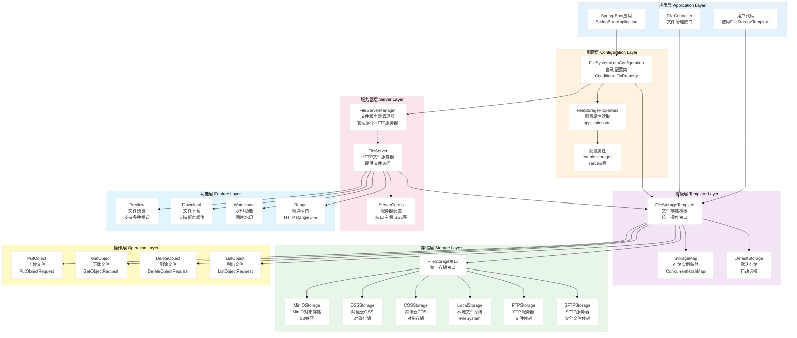
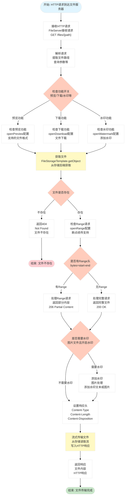

# Spring Support Filesystem Starter

[](https://opensource.org/licenses/Apache-2.0)

## 📖 模块简介

Spring Support Filesystem Starter 是一个统一的文件系统抽象模块，提供统一的文件操作接口，支持本地文件系统、MinIO、阿里云OSS、腾讯云COS等多种存储方式的无缝切换。

### ✨ 主要特性

- 🔌 **统一接口** - 提供统一的文件操作API
- 💾 **多存储支持** - 支持本地、MinIO、OSS、COS等
- 📤 **上传下载** - 支持文件上传下载
- 🗂️ **目录管理** - 支持目录创建、删除、遍历
- 🔗 **URL生成** - 支持访问URL和临时URL生成
- 📊 **元数据管理** - 支持文件元数据读写

## 🚀 快速开始

### Maven 依赖

```xml
<!-- 文件系统抽象模块 -->
<dependency>
    <groupId>com.chua</groupId>
    <artifactId>spring-support-filesystem-starter</artifactId>
    <version>4.0.0.33-SNAPSHOT</version>
</dependency>

<!-- 根据需要选择具体实现 -->
<!-- MinIO实现 -->
<dependency>
    <groupId>com.chua</groupId>
    <artifactId>spring-support-filesystem-minio-starter</artifactId>
    <version>4.0.0.33-SNAPSHOT</version>
</dependency>
```

## ⚙️ 配置说明

### 本地文件系统配置

| 参数名 | 类型 | 默认值 | 说明 |
|------|------|------|------|
| `plugin.filesystem.type` | String | local | 文件系统类型 |
| `plugin.filesystem.local.base-path` | String | /tmp | 本地存储路径 |

### 配置示例

```yaml
plugin:
  filesystem:
    type: local
    local:
      base-path: /data/uploads
```

## 📝 使用示例

### 文件上传

```java
@Service
public class FileService {

    @Autowired
    private FileSystem fileSystem;
    
    public String uploadFile(MultipartFile file) throws IOException {
        // 生成文件路径
        String fileName = UUID.randomUUID().toString() + 
                         getFileExtension(file.getOriginalFilename());
        String path = "uploads/" + LocalDate.now() + "/" + fileName;
        
        // 上传文件
        fileSystem.write(path, file.getInputStream());
        
        return path;
    }
    
    public void uploadWithMetadata(MultipartFile file, Map<String, String> metadata) 
            throws IOException {
        String path = "uploads/" + file.getOriginalFilename();
        
        // 上传文件并设置元数据
        fileSystem.write(path, file.getInputStream(), metadata);
    }
}
```

### 文件下载

```java
@RestController
public class FileController {

    @Autowired
    private FileSystem fileSystem;
    
    @GetMapping("/files/{path}")
    public ResponseEntity<Resource> downloadFile(@PathVariable String path) 
            throws IOException {
        // 读取文件
        InputStream inputStream = fileSystem.read(path);
        InputStreamResource resource = new InputStreamResource(inputStream);
        
        return ResponseEntity.ok()
                .header(HttpHeaders.CONTENT_DISPOSITION, 
                       "attachment; filename=\"" + getFileName(path) + "\"")
                .body(resource);
    }
    
    @GetMapping("/files/{path}/url")
    public String getFileUrl(@PathVariable String path) {
        // 获取文件访问URL（临时URL，24小时有效）
        return fileSystem.getPresignedUrl(path, Duration.ofHours(24));
    }
}
```

### 文件管理

```java
@Service
public class FileManagementService {

    @Autowired
    private FileSystem fileSystem;
    
    public boolean fileExists(String path) {
        return fileSystem.exists(path);
    }
    
    public void deleteFile(String path) throws IOException {
        fileSystem.delete(path);
    }
    
    public List<String> listFiles(String directory) throws IOException {
        return fileSystem.list(directory);
    }
    
    public void createDirectory(String path) throws IOException {
        fileSystem.createDirectory(path);
    }
    
    public FileInfo getFileInfo(String path) throws IOException {
        return fileSystem.getFileInfo(path);
    }
}
```

## 🏗️ 系统架构流程图

### 1. 整体系统架构



### 2. 文件上传流程架构

```mermaid
%%{init: {'theme':'base', 'themeVariables': { 'primaryColor':'#fff'}}}%%
flowchart TD
    Start([开始: 用户上传文件请求]) --> ReceiveRequest["接收请求<br/>FileStorageTemplate.putObject<br/>或指定存储名称"]
    
    ReceiveRequest --> CheckStorage{"检查存储<br/>是否指定存储名称"}
    
    CheckStorage -->|"未指定"| GetDefaultStorage["获取默认存储<br/>FileStorageTemplate.getDefaultStorage<br/>从StorageMap获取"]
    
    CheckStorage -->|"已指定"| GetNamedStorage["获取指定存储<br/>FileStorageTemplate.getStorage<br/>从StorageMap获取"]
    
    GetDefaultStorage --> StorageFound{"存储是否存在"}
    GetNamedStorage --> StorageFound
    
    StorageFound -->|"不存在"| ReturnError["返回错误<br/>PutObjectResult<br/>ResultCode.FAILURE"]
    
    StorageFound -->|"存在"| BuildRequest["构建上传请求<br/>PutObjectRequest<br/>包含文件流 路径 元数据"]
    
    ReturnError --> EndError([结束: 上传失败])
    
    BuildRequest --> CallStorage["调用存储接口<br/>FileStorage.putObject<br/>统一接口调用"]
    
    CallStorage --> StorageType{"存储类型判断<br/>根据配置的type"]
    
    StorageType -->|"minio"| MinIOUpload["MinIO上传<br/>MinIOStorage.putObject<br/>S3协议上传"]
    StorageType -->|"oss"| OSSUpload["OSS上传<br/>OSSStorage.putObject<br/>阿里云SDK上传"]
    StorageType -->|"cos"| COSUpload["COS上传<br/>COSStorage.putObject<br/>腾讯云SDK上传"]
    StorageType -->|"local"| LocalUpload["本地上传<br/>LocalStorage.putObject<br/>FileSystem写入"]
    StorageType -->|"ftp"| FTPUpload["FTP上传<br/>FTPStorage.putObject<br/>FTP协议上传"]
    StorageType -->|"sftp"| SFTPUpload["SFTP上传<br/>SFTPStorage.putObject<br/>SFTP协议上传"]
    
    MinIOUpload --> UploadFile["上传文件<br/>调用具体存储SDK<br/>上传到存储后端"]
    OSSUpload --> UploadFile
    COSUpload --> UploadFile
    LocalUpload --> UploadFile
    FTPUpload --> UploadFile
    SFTPUpload --> UploadFile
    
    UploadFile --> UploadSuccess{"上传是否成功"}
    
    UploadSuccess -->|"失败"| ReturnFailure["返回失败结果<br/>PutObjectResult<br/>包含错误信息"]
    
    UploadSuccess -->|"成功"| BuildResult["构建成功结果<br/>PutObjectResult<br/>包含文件路径 URL等"]
    
    ReturnFailure --> EndFailure([结束: 上传失败])
    
    BuildResult --> ReturnSuccess["返回成功结果<br/>PutObjectResult<br/>ResultCode.SUCCESS"]
    
    ReturnSuccess --> EndSuccess([结束: 上传成功])
    
    style Start fill:#e1f5ff
    style EndSuccess fill:#c8e6c9
    style EndError fill:#ffcdd2
    style EndFailure fill:#ffcdd2
    style CheckStorage fill:#ffccbc
    style StorageFound fill:#ffccbc
    style StorageType fill:#ffccbc
    style UploadSuccess fill:#ffccbc
    style CallStorage fill:#fff9c4
    style UploadFile fill:#fff9c4
```

### 3. 文件下载与HTTP服务器流程架构



### 4. 存储初始化与多存储管理流程架构

```mermaid
%%{init: {'theme':'base', 'themeVariables': { 'primaryColor':'#fff'}}}%%
flowchart TD
    Start([开始: Spring Boot应用启动]) --> AutoConfig["FileSystemAutoConfiguration<br/>自动配置类加载<br/>ConditionalOnProperty检查"]
    
    AutoConfig --> CheckEnabled{"检查<br/>plugin.filesystem.enable配置"}
    
    CheckEnabled -->|"未启用"| EndSkip([结束: 跳过文件系统初始化])
    
    CheckEnabled -->|"已启用"| ReadProperties["读取FileStorageProperties<br/>配置属性<br/>从application.yml读取"]
    
    ReadProperties --> CreateTemplate["创建FileStorageTemplate<br/>文件存储模板<br/>统一操作接口"]
    
    CreateTemplate --> InitializeTemplate["初始化模板<br/>FileStorageTemplate.initialize<br/>创建存储实例"]
    
    InitializeTemplate --> GetStorages["获取存储配置列表<br/>properties.getStorages<br/>多个存储后端配置"]
    
    GetStorages --> HasStorages{"是否有存储配置"}
    
    HasStorages -->|"无配置"| LogWarning["记录警告日志<br/>未配置任何存储后端"]
    
    HasStorages -->|"有配置"| ProcessStorage["处理每个存储配置<br/>循环处理每个StorageConfig"]
    
    ProcessStorage --> BuildBucketSetting["构建BucketSetting<br/>bucket endpoint<br/>accessKeyId accessKeySecret<br/>region等"]
    
    BuildBucketSetting --> CreateStorage["创建存储实例<br/>FileStorage.createStorage<br/>根据type创建对应存储"]
    
    CreateStorage --> StorageType{"存储类型判断<br/>config.getType()"}
    
    StorageType -->|"minio"| CreateMinIO["创建MinIOStorage<br/>MinIO客户端<br/>S3兼容协议"]
    StorageType -->|"oss"| CreateOSS["创建OSSStorage<br/>阿里云OSS客户端<br/>OSS SDK"]
    StorageType -->|"cos"| CreateCOS["创建COSStorage<br/>腾讯云COS客户端<br/>COS SDK"]
    StorageType -->|"local"| CreateLocal["创建LocalStorage<br/>本地文件系统<br/>FileSystem"]
    StorageType -->|"ftp"| CreateFTP["创建FTPStorage<br/>FTP客户端<br/>FTP协议"]
    StorageType -->|"sftp"| CreateSFTP["创建SFTPStorage<br/>SFTP客户端<br/>SFTP协议"]
    
    CreateMinIO --> RegisterStorage
    CreateOSS --> RegisterStorage
    CreateCOS --> RegisterStorage
    CreateLocal --> RegisterStorage
    CreateFTP --> RegisterStorage
    CreateSFTP --> RegisterStorage
    
    RegisterStorage["注册存储实例<br/>storageMap.put<br/>存储到ConcurrentHashMap"] --> CheckDefault{"是否默认存储<br/>config.isDefaultStorage()"}
    
    CheckDefault -->|"是默认存储"| SetDefault["设置默认存储<br/>defaultStorageName<br/>记录默认存储名称"]
    
    CheckDefault -->|"不是默认存储"| MoreStorages{"是否还有更多<br/>存储需要处理"}
    
    SetDefault --> MoreStorages
    
    MoreStorages -->|"是"| ProcessStorage
    MoreStorages -->|"否"| CreateServerManager["创建FileServerManager<br/>文件服务器管理器<br/>管理HTTP文件服务器"]
    
    LogWarning --> CreateServerManager
    
    CreateServerManager --> GetServers["获取服务器配置列表<br/>properties.getServers<br/>多个HTTP服务器配置"]
    
    GetServers --> HasServers{"是否有服务器配置"}
    
    HasServers -->|"无配置"| EndInit([结束: 初始化完成])
    
    HasServers -->|"有配置"| ProcessServer["处理每个服务器配置<br/>循环处理每个ServerConfig"]
    
    ProcessServer --> CreateFileServer["创建FileServer<br/>HTTP文件服务器<br/>Netty/Undertow等"]
    
    CreateFileServer --> ConfigureServer["配置服务器<br/>host port SSL<br/>contextPath等"]
    
    ConfigureServer --> StartServer["启动服务器<br/>FileServer.start<br/>监听端口"]
    
    StartServer --> MoreServers{"是否还有更多<br/>服务器需要处理"}
    
    MoreServers -->|"是"| ProcessServer
    MoreServers -->|"否"| EndInit
    
    style Start fill:#e1f5ff
    style EndSkip fill:#ffcdd2
    style EndInit fill:#c8e6c9
    style CheckEnabled fill:#ffccbc
    style HasStorages fill:#ffccbc
    style StorageType fill:#ffccbc
    style CheckDefault fill:#ffccbc
    style HasServers fill:#ffccbc
    style CreateStorage fill:#fff9c4
    style RegisterStorage fill:#fff9c4
    style StartServer fill:#fff9c4
```



> 💡 **提示**: 架构图支持横向滚动查看，也可以点击图表在新窗口中打开查看大图。

## 🔗 具体实现模块

### MinIO 实现
- [spring-support-filesystem-minio-starter](../spring-support-filesystem-minio-starter/README.md)
- 支持MinIO对象存储
- 支持桶管理和权限控制
- 适用于私有云部署

## 🔗 相关链接

- [返回主文档](../README.md)
- [配置示例文件](../application-example.yml)

## 📄 许可证

本项目采用 [Apache License 2.0](../LICENSE) 许可证。
