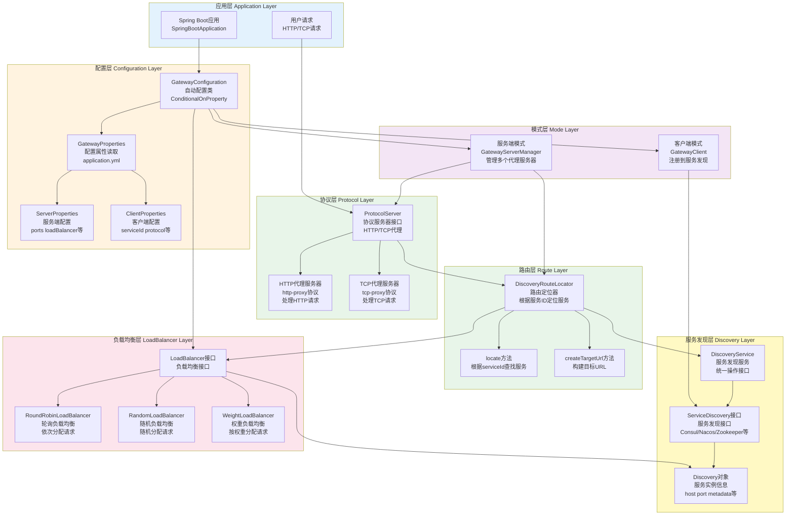

# Spring Support Gateway Starter

[](https://opensource.org/licenses/Apache-2.0)

## 📖 模块简介

Spring Support Gateway Starter 是基于 Spring Cloud Gateway 的API网关模块，提供路由、负载均衡、限流、熔断等功能，是微服务架构的统一入口。

### ✨ 主要特性

- 🌐 **动态路由** - 支持动态路由配置和刷新
- ⚖️ **负载均衡** - 支持多种负载均衡策略
- 🚦 **限流熔断** - 集成限流和熔断功能
- 🔐 **统一认证** - 集中式认证和授权
- 📊 **监控日志** - 请求日志和性能监控
- 🔧 **过滤器链** - 灵活的过滤器扩展机制

## 🚀 快速开始

### Maven 依赖

```xml
<dependency>
    <groupId>com.chua</groupId>
    <artifactId>spring-support-gateway-starter</artifactId>
    <version>4.0.0.33-SNAPSHOT</version>
</dependency>
```

## ⚙️ 配置说明

### 基础配置

| 参数名 | 类型 | 默认值 | 说明 |
|------|------|------|------|
| `plugin.gateway.enable` | Boolean | false | 是否启用网关 |
| `plugin.gateway.mode` | String | server | 运行模式: server(服务端模式) 或 client(客户端模式) |

### 服务端模式配置

| 参数名 | 类型 | 默认值 | 说明 |
|------|------|------|------|
| `plugin.gateway.server.host` | String | 0.0.0.0 | 监听主机地址 |
| `plugin.gateway.server.loadBalancer` | String | round-robin | 负载均衡策略: round-robin(轮询), random(随机), weight(权重) |
| `plugin.gateway.server.refreshInterval` | Duration | 30s | 服务刷新间隔 |
| `plugin.gateway.server.automaticOptimization` | Boolean | true | 自动优化（预留配置） |
| `plugin.gateway.server.ports[].port` | Integer | - | 代理端口号 |
| `plugin.gateway.server.ports[].protocol` | String | http | 协议类型: http 或 tcp |
| `plugin.gateway.server.ports[].serviceId` | String | - | 绑定的服务ID（可选，为空时代理所有服务） |
| `plugin.gateway.server.ports[].pathPrefix` | String | - | 路径前缀（HTTP代理时使用） |
| `plugin.gateway.server.ports[].enabled` | Boolean | true | 是否启用该端口 |
| `plugin.gateway.server.discovery.enabled` | Boolean | false | 是否启用动态服务发现 |
| `plugin.gateway.server.discovery.type` | String | - | 服务发现类型: consul, nacos, zookeeper, etcd, redis, hazelcast, multicast, default |
| `plugin.gateway.server.discovery.address` | String | - | 服务发现地址（多个地址用逗号分隔） |
| `plugin.gateway.server.discovery.protocol` | String | - | 服务发现协议 |
| `plugin.gateway.server.discovery.subscribe` | Boolean | false | 是否启用服务订阅（监听服务变化） |
| `plugin.gateway.server.discovery.options` | Map | {} | 服务发现额外配置 |

### 客户端模式配置

| 参数名 | 类型 | 默认值 | 说明 |
|------|------|------|------|
| `plugin.gateway.client.serviceId` | String | - | 注册的服务ID（必填） |
| `plugin.gateway.client.protocol` | String | http | 协议类型 |
| `plugin.gateway.client.weight` | Double | 1.0 | 权重（用于负载均衡） |
| `plugin.gateway.client.metadata` | Map | {} | 元数据（自定义标签和属性） |

### 配置示例

#### 服务端模式配置

```yaml
plugin:
  gateway:
    enable: true
    mode: server  # 服务端模式
    
    server:
      host: 0.0.0.0
      loadBalancer: round-robin  # 负载均衡策略
      refreshInterval: 30s  # 服务刷新间隔（预留）
      
      # 端口配置列表
      ports:
        # HTTP代理端口 - 代理所有服务
        - port: 8080
          protocol: http
          enabled: true
        
        # HTTP代理端口 - 只代理特定服务
        - port: 8081
          protocol: http
          serviceId: user-service  # 只代理user-service
          pathPrefix: /api  # 路径前缀
          enabled: true
        
        # TCP代理端口
        - port: 9090
          protocol: tcp
          serviceId: tcp-service
          enabled: true
```

#### 客户端模式配置

```yaml
plugin:
  gateway:
    enable: true
    mode: client  # 客户端模式
    
    client:
      serviceId: my-service  # 注册的服务ID（必填）
      protocol: http
      weight: 1.0  # 权重
      metadata:
        version: "1.0.0"
        region: "beijing"
        env: "prod"
```

### 动态服务发现配置

网关支持两种服务发现模式：

1. **静态服务发现**：通过 `DiscoveryService` 从 Spring 容器中获取已注册的服务（默认模式）
2. **动态服务发现**：通过独立的 `ServiceDiscovery` 实例动态发现服务，支持订阅服务变化事件

#### 静态服务发现（默认）

静态服务发现使用 Spring 容器中的 `DiscoveryService`，适用于服务已经通过 `spring-support-discovery-starter` 注册到服务发现的场景。

```yaml
plugin:
  gateway:
    enable: true
    mode: server
    server:
      ports:
        # 代理所有服务（不指定serviceId）
        - port: 8080
          protocol: http
          enabled: true
```

#### 动态服务发现

动态服务发现需要配置独立的服务发现实例，支持自动发现服务并订阅服务变化事件。

```yaml
plugin:
  gateway:
    enable: true
    mode: server
    server:
      host: 0.0.0.0
      loadBalancer: round-robin
      refreshInterval: 30s  # 服务刷新间隔
      
      # 动态服务发现配置
      discovery:
        enabled: true  # 启用动态服务发现
        type: nacos  # 服务发现类型: consul, nacos, zookeeper, etcd, redis, hazelcast, multicast, default
        address: 127.0.0.1:8848  # 服务发现地址（多个地址用逗号分隔）
        protocol: http  # 服务发现协议
        subscribe: true  # 是否启用服务订阅（监听服务变化）
        options:  # 额外配置
          namespace: public
          group: DEFAULT_GROUP
      
      ports:
        - port: 8080
          protocol: http
          enabled: true
```

#### 支持的服务发现类型

| 类型 | 说明 | 地址格式示例 |
|------|------|------------|
| `consul` | Consul服务发现 | `127.0.0.1:8500` |
| `nacos` | Nacos服务发现 | `127.0.0.1:8848` |
| `zookeeper` | Zookeeper服务发现 | `127.0.0.1:2181` |
| `etcd` | Etcd服务发现 | `127.0.0.1:2379` |
| `redis` | Redis服务发现 | `127.0.0.1:6379` |
| `hazelcast` | Hazelcast服务发现 | `127.0.0.1:5701` |
| `multicast` | 组播服务发现 | `224.0.0.1:9999` |
| `default` | 默认内存服务发现 | - |

#### 服务订阅功能

当 `subscribe: true` 时，网关会自动订阅服务变化事件，实时感知服务的注册、注销和更新：

- **REGISTER**: 新服务注册时，自动添加到路由表
- **UNREGISTER**: 服务注销时，自动从路由表移除
- **UPDATE**: 服务信息更新时，自动更新路由表

> 💡 **提示**: 服务订阅功能需要服务发现实现支持 `isSupportSubscribe()` 方法返回 `true`。目前支持订阅的服务发现类型包括：Consul、Nacos、Zookeeper、Etcd、Redis等。

## 📝 使用示例

### 自定义路由配置

```java
@Configuration
public class GatewayConfig {

    @Bean
    public RouteLocator customRouteLocator(RouteLocatorBuilder builder) {
        return builder.routes()
            .route("user_route", r -> r
                .path("/api/users/**")
                .filters(f -> f
                    .stripPrefix(2)
                    .addRequestHeader("X-Gateway", "true")
                    .retry(config -> config
                        .setRetries(3)
                        .setStatuses(HttpStatus.BAD_GATEWAY)))
                .uri("lb://user-service"))
            
            .route("order_route", r -> r
                .path("/api/orders/**")
                .filters(f -> f
                    .stripPrefix(2)
                    .circuitBreaker(config -> config
                        .setName("orderCircuitBreaker")
                        .setFallbackUri("forward:/fallback")))
                .uri("lb://order-service"))
            
            .build();
    }
}
```

### 自定义过滤器

```java
@Component
public class CustomGlobalFilter implements GlobalFilter, Ordered {

    @Override
    public Mono<Void> filter(ServerWebExchange exchange, GatewayFilterChain chain) {
        // 请求前处理
        log.info("请求路径: {}", exchange.getRequest().getPath());
        
        // 添加自定义响应头
        exchange.getResponse().getHeaders().add("X-Custom-Header", "CustomValue");
        
        return chain.filter(exchange);
    }
    
    @Override
    public int getOrder() {
        return -1; // 优先级
    }
}
```

## 🏗️ 系统架构流程图

### 1. 整体系统架构



### 2. 请求处理流程架构

```mermaid
flowchart TD
    Start([开始: 客户端请求到达网关]) --> ReceiveRequest["接收请求<br/>ProtocolServer<br/>HTTP/TCP代理服务器接收"]
    
    ReceiveRequest --> ParseRequest["解析请求<br/>解析请求路径和参数<br/>提取服务ID"]
    
    ParseRequest --> ExtractServiceId["提取服务ID<br/>从请求路径或配置<br/>获取目标服务ID"]
    
    ExtractServiceId --> LocateService["定位服务<br/>DiscoveryRouteLocator.locate<br/>根据服务ID查找服务"]
    
    LocateService --> GetServiceInstances["获取服务实例列表<br/>DiscoveryService.getDiscoveryAll<br/>从服务发现获取所有实例"]
    
    GetServiceInstances --> InstanceFound{"是否找到<br/>可用实例"]
    
    InstanceFound -->|未找到| Return503["返回503<br/>Service Unavailable<br/>服务不可用"]
    
    InstanceFound -->|找到实例| LoadBalance["负载均衡<br/>LoadBalancer.choose<br/>根据策略选择实例"]
    
    Return503 --> End503([结束: 服务不可用])
    
    LoadBalance --> SelectInstance["选择服务实例<br/>RoundRobin/Random/Weight<br/>返回选中的Discovery实例"]
    
    SelectInstance --> BuildTargetUrl["构建目标URL<br/>Discovery.createUrl<br/>拼接完整目标地址"]
    
    BuildTargetUrl --> ForwardRequest["转发请求<br/>Protocol转发<br/>HTTP/TCP协议转发"]
    
    ForwardRequest --> WaitResponse["等待响应<br/>目标服务处理<br/>返回响应结果"]
    
    WaitResponse --> ResponseReceived{"是否收到<br/>响应"]
    
    ResponseReceived -->|超时| ReturnTimeout["返回超时错误<br/>504 Gateway Timeout"]
    
    ResponseReceived -->|收到响应| ReturnResponse["返回响应<br/>返回给客户端<br/>响应结果"]
    
    ReturnTimeout --> EndTimeout([结束: 请求超时])
    
    ReturnResponse --> EndSuccess([结束: 请求处理完成])
    
    style Start fill:#e1f5ff
    style EndSuccess fill:#c8e6c9
    style End503 fill:#ffcdd2
    style EndTimeout fill:#ffcdd2
    style InstanceFound fill:#ffccbc
    style ResponseReceived fill:#ffccbc
    style LocateService fill:#fff9c4
    style LoadBalance fill:#fff9c4
    style ForwardRequest fill:#fff9c4
```

### 3. 服务端模式初始化流程架构

```mermaid
flowchart TD
    Start([开始: Spring Boot应用启动]) --> AutoConfig["GatewayConfiguration<br/>自动配置类加载<br/>ConditionalOnProperty检查"]
    
    AutoConfig --> CheckEnabled{"检查<br/>plugin.gateway.enable配置"}
    
    CheckEnabled -->|未启用| EndSkip([结束: 跳过网关初始化])
    
    CheckEnabled -->|已启用| ReadProperties["读取GatewayProperties<br/>配置属性<br/>从application.yml读取"]
    
    ReadProperties --> CheckMode{"检查运行模式<br/>mode: server/client"]
    
    CheckMode -->|服务端模式| CreateLoadBalancer["创建LoadBalancer<br/>负载均衡器<br/>根据配置选择策略"]
    
    CheckMode -->|客户端模式| CreateClient["创建GatewayClient<br/>网关客户端<br/>注册到服务发现"]
    
    CreateLoadBalancer --> LoadBalancerType{"负载均衡策略<br/>loadBalancer配置"]
    
    LoadBalancerType -->|random| Random["创建RandomLoadBalancer<br/>随机负载均衡"]
    LoadBalancerType -->|weight| Weight["创建WeightLoadBalancer<br/>权重负载均衡"]
    LoadBalancerType -->|round-robin| RoundRobin["创建RoundRobinLoadBalancer<br/>轮询负载均衡<br/>默认策略"]
    
    Random --> CreateRouteLocator
    Weight --> CreateRouteLocator
    RoundRobin --> CreateRouteLocator
    
    CreateRouteLocator["创建DiscoveryRouteLocator<br/>路由定位器<br/>注入DiscoveryService和LoadBalancer"] --> GetDiscoveryService["获取DiscoveryService<br/>服务发现服务<br/>从Spring容器获取"]
    
    GetDiscoveryService --> CreateServerManager["创建GatewayServerManager<br/>网关服务端管理器<br/>注入Properties和RouteLocator"]
    
    CreateServerManager --> InitMethod["调用initMethod start<br/>启动网关服务<br/>GatewayServerManager.start"]
    
    InitMethod --> ReadPortConfigs["读取端口配置<br/>properties.getServer().getPorts<br/>获取所有端口配置"]
    
    ReadPortConfigs --> ProcessPortConfig["处理每个端口配置<br/>循环处理PortConfig"]
    
    ProcessPortConfig --> CheckPortEnabled{"端口是否启用<br/>portConfig.isEnabled()"}
    
    CheckPortEnabled -->|未启用| MorePorts{"是否还有更多<br/>端口需要处理"}
    
    CheckPortEnabled -->|已启用| CreateProtocolServer["创建协议服务器<br/>Protocol.create<br/>根据protocol类型创建"]
    
    CreateProtocolServer --> ProtocolType{"协议类型判断<br/>http或tcp"}
    
    ProtocolType -->|http| HttpProxy["创建HTTP代理服务器<br/>http-proxy协议<br/>ProtocolServer"]
    ProtocolType -->|tcp| TcpProxy["创建TCP代理服务器<br/>tcp-proxy协议<br/>ProtocolServer"]
    
    HttpProxy --> StartServer["启动服务器<br/>server.start<br/>监听配置的端口"]
    TcpProxy --> StartServer
    
    StartServer --> StoreServer["存储服务器实例<br/>servers.put(port, server)<br/>保存到Map中"]
    
    StoreServer --> MorePorts
    
    MorePorts -->|是| ProcessPortConfig
    MorePorts -->|否| EndStart([结束: 网关服务启动完成])
    
    CreateClient --> GetServiceDiscovery["获取ServiceDiscovery<br/>服务发现接口<br/>从Spring容器获取"]
    
    GetServiceDiscovery --> InitClient["调用initMethod register<br/>注册到服务发现<br/>GatewayClient.register"]
    
    InitClient --> BuildDiscovery["构建Discovery对象<br/>Discovery.builder<br/>包含服务信息"]
    
    BuildDiscovery --> RegisterService["注册服务<br/>serviceDiscovery.registerService<br/>注册到发现中心"]
    
    RegisterService --> EndClient([结束: 客户端注册完成])
    
    style Start fill:#e1f5ff
    style EndSkip fill:#ffcdd2
    style EndStart fill:#c8e6c9
    style EndClient fill:#c8e6c9
    style CheckEnabled fill:#ffccbc
    style CheckMode fill:#ffccbc
    style LoadBalancerType fill:#ffccbc
    style CheckPortEnabled fill:#ffccbc
    style ProtocolType fill:#ffccbc
    style MorePorts fill:#ffccbc
    style CreateRouteLocator fill:#fff9c4
    style CreateServerManager fill:#fff9c4
    style StartServer fill:#fff9c4
```

> 💡 **提示**: 架构图支持横向滚动查看，也可以点击图表在新窗口中打开查看大图。

## 🔗 相关链接

- [返回主文档](../README.md)
- [Spring Cloud Gateway文档](https://docs.spring.io/spring-cloud-gateway/docs/current/reference/html/)
- [配置示例文件](../application-example.yml)

## 📄 许可证

本项目采用 [Apache License 2.0](../LICENSE) 许可证。
