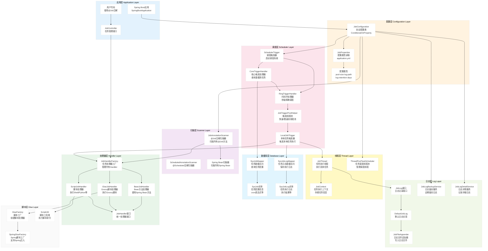

# Spring Support Job Starter

定时任务调度模块 - 基于数据库驱动的任务调度框架

## 功能特性

- **注解驱动**：使用 `@Job` 注解标记任务方法，自动扫描注册
- **数据库驱动**：定时查询数据库中的任务配置，触发本地任务执行
- **多种执行模式**：支持 Bean 模式、Groovy 脚本、Shell/Python 等脚本执行
- **任务日志**：完整的任务执行日志记录
- **线程池管理**：快速/慢速双线程池，避免慢任务阻塞
- **失效策略**：支持 DO_NOTHING 和 FIRE_ONCE_NOW 两种失效策略
- **时间环调度**：基于秒级时间环的精准调度

## 快速开始

### 1. 添加依赖

```xml
<dependency>
    <groupId>com.chua</groupId>
    <artifactId>spring-support-job-starter</artifactId>
    <version>${version}</version>
</dependency>
```

### 2. 初始化数据库

执行 `src/main/resources/sql/monitor_job.sql` 初始化任务表。

### 3. 配置属性

```yaml
plugin:
  job:
    enable: true
    pool-size: 10
    log-path: /data/applogs/job/jobhandler
    log-retention-days: 30
    trigger-pool-fast-max: 200
    trigger-pool-slow-max: 100
```

### 3. 定义任务

```java
@Component
public class DemoJobHandler {

    @Job("demoJob")
    public void execute() {
        // 任务逻辑
        System.out.println("执行任务: " + LocalDateTime.now());
    }

    @Job(value = "demoJobWithInit", init = "init", destroy = "destroy")
    public void executeWithLifecycle() {
        // 带生命周期方法的任务
    }

    public void init() {
        System.out.println("任务初始化");
    }

    public void destroy() {
        System.out.println("任务销毁");
    }
}
```

## 核心组件

| 组件 | 说明 |
|------|------|
| `JobHandler` | 任务处理器接口 |
| `JobHandlerFactory` | 任务处理器工厂，管理所有注册的处理器 |
| `BeanJobHandler` | Bean 方法任务处理器 |
| `GlueJobHandler` | Groovy 脚本任务处理器 |
| `ScriptJobHandler` | Shell/Python 等脚本任务处理器 |
| `JobAnnotationScanner` | `@Job` 注解扫描器 |
| `JobThread` | 任务执行线程 |
| `JobContext` | 任务执行上下文 |

## 配置说明

| 配置项 | 默认值 | 说明 |
|--------|--------|------|
| `plugin.job.enable` | `true` | 是否启用 |
| `plugin.job.pool-size` | `10` | 线程池大小 |
| `plugin.job.log-path` | `/data/applogs/job/jobhandler` | 日志路径 |
| `plugin.job.log-retention-days` | `30` | 日志保留天数 |
| `plugin.job.trigger-pool-fast-max` | `200` | 快速触发池最大线程数 |
| `plugin.job.trigger-pool-slow-max` | `100` | 慢速触发池最大线程数 |

## 任务执行类型

### Bean 模式
直接调用 Spring Bean 中标注了 `@Job` 注解的方法

### Groovy 脚本模式
支持动态编译执行 Groovy 脚本

### 脚本模式
支持 Shell、Python、PHP、NodeJS、PowerShell 等脚本执行

## 🏗️ 系统架构流程图

### 1. 整体系统架构



### 2. 任务调度流程架构

```mermaid
%%{init: {'theme':'base', 'themeVariables': { 'primaryColor':'#fff'}}}%%
flowchart TD
    Start(["开始<br/>Spring Boot应用启动"]) --> AutoConfig["JobConfiguration<br/>自动配置类加载<br/>ConditionalOnProperty检查"]
    
    AutoConfig --> CheckEnabled{"检查<br/>plugin.job.enable配置"}
    
    CheckEnabled -->|"未启用"| EndSkip(["结束<br/>跳过任务调度系统初始化"])
    
    CheckEnabled -->|"已启用"| ReadProperties["读取JobProperties<br/>配置属性<br/>从application.yml读取"]
    
    ReadProperties --> InitLogPath["初始化日志路径<br/>JobFileAppender.initLogPath<br/>创建日志目录"]
    
    InitLogPath --> CreateThreadPool["创建ThreadPoolTaskScheduler<br/>任务调度线程池<br/>pool-size配置"]
    
    CreateThreadPool --> ScanAnnotations["扫描@Job注解<br/>JobAnnotationScanner<br/>扫描所有Spring Bean"]
    
    ScanAnnotations --> FoundJobs{"是否找到<br/>@Job注解方法"}
    
    FoundJobs -->|"未找到"| LogNoJobs["记录日志<br/>Logger.info<br/>未找到任务"]
    FoundJobs -->|"找到任务"| ProcessJob["处理每个@Job方法<br/>循环处理每个方法"]
    
    ProcessJob --> CreateHandler["创建JobHandler<br/>BeanJobHandler<br/>封装方法调用"]
    
    CreateHandler --> RegisterHandler["注册Handler到工厂<br/>JobHandlerFactory.register<br/>存储Handler映射"]
    
    RegisterHandler --> MoreJobs{"是否还有更多<br/>@Job方法需要处理"}
    
    MoreJobs -->|"是"| ProcessJob
    MoreJobs -->|"否"| StartScheduler["启动SchedulerTrigger<br/>调度触发器<br/>启动调度系统"]
    
    LogNoJobs --> StartScheduler
    
    StartScheduler --> StartCoreHandler["启动CoreTriggerHandler<br/>核心触发处理器<br/>查询数据库任务"]
    
    StartCoreHandler --> StartRingHandler["启动RingTriggerHandler<br/>时间环处理器<br/>秒级精确调度"]
    
    StartRingHandler --> StartTriggerPool["启动JobTriggerPoolHelper<br/>触发线程池<br/>快速/慢速双线程池"]
    
    StartTriggerPool --> StartRingThread["启动时间环线程<br/>RingTriggerHandler.run<br/>每秒触发一次"]
    
    StartRingThread --> RingLoop["时间环循环<br/>每秒精确触发<br/>sleep对齐到秒"]
    
    RingLoop --> QueryDatabase["查询数据库任务<br/>CoreTriggerHandler<br/>查询SysJob表"]
    
    QueryDatabase --> FoundTasks{"是否找到<br/>需要执行的任务"}
    
    FoundTasks -->|"未找到"| RingLoop
    FoundTasks -->|"找到任务"| PushToRing["推送任务到时间环<br/>RingTriggerHandler.pushTimeRing<br/>按秒数存储任务ID"]
    
    PushToRing --> WaitTrigger["等待时间环触发<br/>RingTriggerHandler.run<br/>取出当前秒任务"]
    
    WaitTrigger --> TriggerJob["触发任务执行<br/>JobTriggerPoolHelper.trigger<br/>选择快速或慢速线程池"]
    
    TriggerJob --> CreateJobLog["创建任务日志<br/>SysJobLog<br/>保存到数据库"]
    
    CreateJobLog --> LoadJobInfo["加载任务信息<br/>JobConfig.loadById<br/>从数据库加载任务配置"]
    
    LoadJobInfo --> GetHandler["获取JobHandler<br/>JobHandlerFactory.getHandler<br/>根据任务类型获取处理器"]
    
    GetHandler --> ExecuteJob["执行任务<br/>JobHandler.execute<br/>调用具体处理器"]
    
    ExecuteJob --> HandlerType{"任务类型<br/>Bean/Glue/Script"}
    
    HandlerType -->|"Bean模式"| CallBeanMethod["调用Bean方法<br/>BeanJobHandler.execute<br/>反射调用方法"]
    HandlerType -->|"Groovy脚本"| ExecuteGroovy["执行Groovy脚本<br/>GlueJobHandler.execute<br/>动态编译执行"]
    HandlerType -->|"脚本模式"| ExecuteScript["执行脚本<br/>ScriptJobHandler.execute<br/>执行Shell/Python等"]
    
    CallBeanMethod --> WriteLog["写入执行日志<br/>JobFileAppender.append<br/>写入日志文件"]
    ExecuteGroovy --> WriteLog
    ExecuteScript --> WriteLog
    
    WriteLog --> UpdateLogStatus["更新日志状态<br/>SysJobLogMapper.update<br/>更新执行结果"]
    
    UpdateLogStatus --> CheckRetry{"检查是否需要重试<br/>failRetryCount > 0"}
    
    CheckRetry -->|"需要重试"| TriggerJob
    CheckRetry -->|"不需要重试"| RingLoop
    
    style Start fill:#e1f5ff
    style EndSkip fill:#ffcdd2
    style EndSuccess fill:#c8e6c9
    style CheckEnabled fill:#ffccbc
    style FoundJobs fill:#ffccbc
    style FoundTasks fill:#ffccbc
    style HandlerType fill:#ffccbc
    style CheckRetry fill:#ffccbc
    style StartScheduler fill:#fff9c4
    style TriggerJob fill:#fff9c4
    style ExecuteJob fill:#fff9c4
```



### 3. 任务执行流程架构

```mermaid
%%{init: {'theme':'base', 'themeVariables': { 'primaryColor':'#fff'}}}%%
flowchart TD
    Start([开始: 任务触发JobTriggerPoolHelper.trigger]) --> SelectPool{选择线程池<br/>根据任务执行时间<br/>快速池或慢速池}
    
    SelectPool -->|"快速任务"| FastPool["快速线程池<br/>trigger-pool-fast-max<br/>200线程"]
    SelectPool -->|"慢速任务"| SlowPool["慢速线程池<br/>trigger-pool-slow-max<br/>100线程"]
    
    FastPool --> CreateJobThread["创建JobThread<br/>任务执行线程<br/>JobThreadFactory创建"]
    SlowPool --> CreateJobThread
    
    CreateJobThread --> CreateJobContext["创建JobContext<br/>任务执行上下文<br/>存储任务信息"]
    
    CreateJobContext --> LoadJobConfig["加载任务配置<br/>SysJob实体<br/>从数据库加载"]
    
    LoadJobConfig --> GetHandlerType["获取处理器类型<br/>根据jobExecuteBean<br/>判断Handler类型"]
    
    GetHandlerType --> HandlerType{"处理器类型<br/>Bean/Glue/Script"}
    
    HandlerType -->|"Bean模式"| GetBeanHandler["获取BeanJobHandler<br/>JobHandlerFactory.getHandler<br/>根据bean名称获取"]
    HandlerType -->|"Groovy脚本"| GetGlueHandler["获取GlueJobHandler<br/>JobHandlerFactory.getHandler<br/>根据glue类型获取"]
    HandlerType -->|"脚本模式"| GetScriptHandler["获取ScriptJobHandler<br/>JobHandlerFactory.getHandler<br/>根据脚本类型获取"]
    
    GetBeanHandler --> ExecuteBean["执行Bean方法<br/>BeanJobHandler.execute<br/>反射调用@Job方法"]
    GetGlueHandler --> ExecuteGlue["执行Groovy脚本<br/>GlueJobHandler.execute<br/>SpringGlueFactory创建脚本"]
    GetScriptHandler --> ExecuteScript["执行脚本命令<br/>ScriptJobHandler.execute<br/>ScriptUtil执行脚本"]
    
    ExecuteBean --> CheckInit{"检查是否有<br/>init方法"}
    ExecuteGlue --> CheckInit
    ExecuteScript --> CheckInit
    
    CheckInit -->|"有init方法"| CallInit["调用init方法<br/>反射调用init方法<br/>任务初始化"]
    CheckInit -->|"无init方法"| ExecuteTask
    
    CallInit --> ExecuteTask["执行任务逻辑<br/>调用具体任务方法<br/>或执行脚本"]
    
    ExecuteTask --> TaskResult{"任务执行结果<br/>成功或失败"}
    
    TaskResult -->|"成功"| CheckDestroy{"检查是否有<br/>destroy方法"}
    TaskResult -->|"失败"| HandleError["处理错误<br/>记录异常信息<br/>Logger.error"]
    
    HandleError --> CheckRetry{"检查重试次数<br/>failRetryCount > 0"}
    
    CheckRetry -->|"需要重试"| ExecuteTask
    CheckRetry -->|"不需要重试"| UpdateLogError["更新日志为失败<br/>SysJobLogMapper.update<br/>更新执行结果"]
    
    CheckDestroy -->|"有destroy方法"| CallDestroy["调用destroy方法<br/>反射调用destroy方法<br/>任务清理"]
    CheckDestroy -->|"无destroy方法"| WriteLogSuccess
    
    CallDestroy --> WriteLogSuccess["写入成功日志<br/>JobFileAppender.append<br/>写入日志文件"]
    UpdateLogError --> WriteLogError["写入失败日志<br/>JobFileAppender.append<br/>写入错误信息"]
    
    WriteLogSuccess --> UpdateLogSuccess["更新日志为成功<br/>SysJobLogMapper.update<br/>更新执行结果"]
    WriteLogError --> UpdateLogSuccess
    
    UpdateLogSuccess --> SaveLogDetail["保存日志详情<br/>JobLogDetailService.save<br/>保存详细执行信息"]
    
    SaveLogDetail --> EndSuccess([结束: 任务执行完成])
    
    style Start fill:#e1f5ff
    style EndSuccess fill:#c8e6c9
    style SelectPool fill:#ffccbc
    style HandlerType fill:#ffccbc
    style TaskResult fill:#ffccbc
    style CheckRetry fill:#ffccbc
    style ExecuteTask fill:#fff9c4
    style ExecuteBean fill:#fff9c4
    style ExecuteGlue fill:#fff9c4
    style ExecuteScript fill:#fff9c4
```



> 💡 **提示**: 架构图支持横向滚动查看，也可以点击图表在新窗口中打开查看大图。

## 版本历史

- **4.0.0.34**: 初始版本，从 `spring-support-report-client-starter` 提取独立模块
