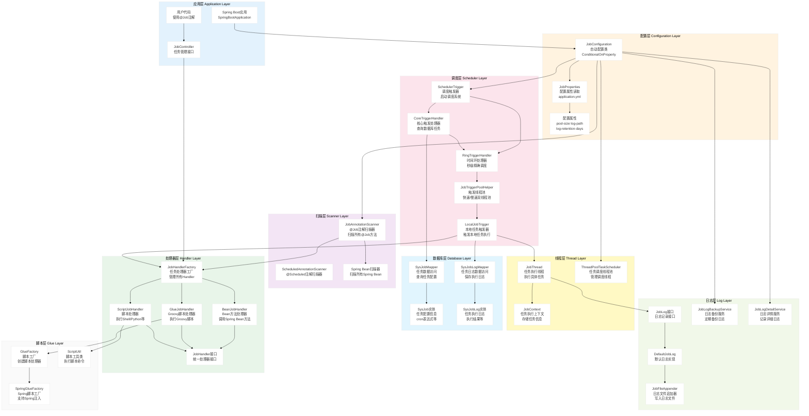

# Spring Support Job Starter

定时任务调度模块 - 基于数据库驱动的任务调度框架

## 功能特性

- **注解驱动**：使用 `@Job` 注解标记任务方法，自动扫描注册
- **数据库驱动**：定时查询数据库中的任务配置，触发本地任务执行
- **远程执行器**：可选暴露轻量下发入口，允许调度中心把任务推送到当前服务执行
- **多种执行模式**：支持 Bean 模式、Groovy 脚本、Shell/Python 等脚本执行
- **任务日志**：完整的任务执行日志记录
- **线程池管理**：快速/慢速双线程池，避免慢任务阻塞
- **失效策略**：支持 DO_NOTHING 和 FIRE_ONCE_NOW 两种失效策略
- **时间环调度**：基于秒级时间环的精准调度

## 快速开始

### 1. 添加依赖

```xml
<dependency>
    <groupId>com.chua</groupId>
    <artifactId>spring-support-job-starter</artifactId>
    <version>${version}</version>
</dependency>
```

### 2. 初始化数据库

执行 `src/main/resources/sql/monitor_job.sql` 初始化任务表。

### 3. 配置属性

```yaml
plugin:
  job:
    enable: true
    config-table-enabled: true
    table-init-mode: UPDATE
    pool-size: 10
    log-path: /data/applogs/job/jobhandler
    log-retention-days: 30
    trigger-pool-fast-max: 200
    trigger-pool-slow-max: 100
    job-annotation-sync-mode: NONE
    scheduled-annotation-sync-mode: NONE
    remote-executor:
      enabled: false
      access-token: job-secret
      dispatch-path: /v1/job-executor/dispatch
    table:
      prefix: payment
```

### 3. 定义任务

```java
@Component
public class DemoJobHandler {

    @Job("demoJob")
    public void execute() {
        // 任务逻辑
        System.out.println("执行任务: " + LocalDateTime.now());
    }

    @Job(value = "demoJobWithInit", init = "init", destroy = "destroy")
    public void executeWithLifecycle() {
        // 带生命周期方法的任务
    }

    public void init() {
        System.out.println("任务初始化");
    }

    public void destroy() {
        System.out.println("任务销毁");
    }
}
```

## 核心组件

| 组件 | 说明 |
|------|------|
| `JobHandler` | 任务处理器接口 |
| `JobHandlerFactory` | 任务处理器工厂，管理所有注册的处理器 |
| `BeanJobHandler` | Bean 方法任务处理器 |
| `GlueJobHandler` | Groovy 脚本任务处理器 |
| `ScriptJobHandler` | Shell/Python 等脚本任务处理器 |
| `JobAnnotationScanner` | `@Job` 注解扫描器 |
| `JobThread` | 任务执行线程 |
| `JobContext` | 任务执行上下文 |

## 配置说明

| 配置项 | 默认值 | 说明 |
|--------|--------|------|
| `plugin.job.enable` | `true` | 是否启用 |
| `plugin.job.config-table-enabled` | `true` | 是否启用基于任务配置表的本地轮询调度 |
| `plugin.job.pool-size` | `10` | 线程池大小 |
| `plugin.job.log-path` | `/data/applogs/job/jobhandler` | 日志路径 |
| `plugin.job.log-retention-days` | `30` | 日志保留天数 |
| `plugin.job.trigger-pool-fast-max` | `200` | 快速触发池最大线程数 |
| `plugin.job.trigger-pool-slow-max` | `100` | 慢速触发池最大线程数 |
| `plugin.job.job-annotation-sync-mode` | `NONE` | `@Job` 自动入表策略：`NONE/CREATE/UPDATE` |
| `plugin.job.scheduled-annotation-sync-mode` | `NONE` | `@Scheduled` 自动入表策略：`NONE/CREATE/UPDATE` |
| `plugin.job.table-init-mode` | `NONE` | 物理表初始化策略：`NONE/CREATE/UPDATE/DROP_CREATE` |
| `plugin.job.remote-executor.enabled` | `false` | 是否暴露远程执行器入口 |
| `plugin.job.remote-executor.access-token` | `` | 远程下发访问口令 |
| `plugin.job.remote-executor.dispatch-path` | `/v1/job-executor/dispatch` | 远程执行器接口路径 |
| `plugin.job.table.prefix` | `` | 表前缀，例如 `payment` -> `payment_sys_job` |
| `plugin.job.table.job` | `sys_job` | 自定义任务表名 |
| `plugin.job.table.log` | `sys_job_log` | 自定义任务日志表名 |
| `plugin.job.table.log-detail` | `sys_job_log_detail` | 自定义任务日志详情表名 |
| `plugin.job.table.log-backup` | `sys_job_log_backup` | 自定义任务日志备份表名 |

## 远程执行器模式

当你需要类似 XXL-Job 的“中心下发，业务服务执行”模式时，可以在业务服务里开启：

```yaml
plugin:
  job:
    enable: true
    remote-executor:
      enabled: true
      access-token: job-secret
```

此时业务服务会暴露一个远程执行器接口，调度中心可以把任务推送到该服务。

- 如果执行器服务同时保留 `config-table-enabled=true`，它仍会本地轮询任务表
- 如果要切到类似 XXL-Job 的“中心轮询 + 远程推送执行”模式，执行器服务应改为：

```yaml
plugin:
  job:
    enable: true
    config-table-enabled: false
    remote-executor:
      enabled: true
      access-token: job-secret
```

- 这种模式下，`spring-api-support-scheduler-starter` 负责中心侧轮询和路由，`job-starter` 只作为执行器 SDK
- 当执行器服务也能访问同一套任务表时，远程下发会优先复用本地 `LocalJobTrigger` 链路，任务日志仍写入统一的 `sys_job_log` 体系
- 如果执行器不访问任务表，则会退化为轻量队列执行模式；这种情况下只有“已接收”回执，没有完整数据库执行日志
- 因此要支持“类似 XXL-Job 的中心下发”，需要一个平台应用模块承载 admin/dispatch，当前推荐直接使用 `spring-api-support-scheduler-starter`

## 自动入表说明

### `@Job` 自动入表

当开启：

```yaml
plugin:
  job:
    config-table-enabled: true
    job-annotation-sync-mode: CREATE
```

或：

```yaml
plugin:
  job:
    config-table-enabled: true
    job-annotation-sync-mode: UPDATE
```

框架会在启动时把 `@Job` 注解方法自动同步到任务配置表。

- `CREATE`：表中不存在时才创建
- `UPDATE`：存在则更新，不存在则创建

### `@Scheduled` 自动入表

当开启：

```yaml
plugin:
  job:
    config-table-enabled: true
    scheduled-annotation-sync-mode: UPDATE
```

框架会把自定义 `@Scheduled` 和 Spring `@Scheduled` 方法自动同步到任务配置表。

注意：

- 当启用了自动入表并同时启用配置表调度时，框架会优先走表驱动调度，避免同一任务被直接调度和表调度双重执行。

## 任务执行类型

### Bean 模式
直接调用 Spring Bean 中标注了 `@Job` 注解的方法

### Groovy 脚本模式
支持动态编译执行 Groovy 脚本

### 脚本模式
支持 Shell、Python、PHP、NodeJS、PowerShell 等脚本执行

## 🏗️ 系统架构流程图

### 1. 整体系统架构


```mermaid
%%{init: {'theme':'base', 'themeVariables': { 'primaryColor':'#fff'}}}%%
flowchart TB
    subgraph Application["应用层 Application Layer"]
        SpringApp["Spring Boot应用<br/>SpringBootApplication"]
        UserCode["用户代码<br/>使用@Job注解"]
        JobController["JobController<br/>任务管理接口"]
    end
    
    subgraph Config["配置层 Configuration Layer"]
        JobConfiguration["JobConfiguration<br/>自动配置类<br/>ConditionalOnProperty"]
        JobProperties["JobProperties<br/>配置属性读取<br/>application.yml"]
        ConfigProps["配置属性<br/>pool-size log-path<br/>log-retention-days"]
    end
    
    subgraph Scanner["扫描层 Scanner Layer"]
        JobAnnotationScanner["JobAnnotationScanner<br/>@Job注解扫描器<br/>扫描所有@Job方法"]
        ScheduledAnnotationScanner["ScheduledAnnotationScanner<br/>@Scheduled注解扫描器"]
        BeanScanner["Spring Bean扫描器<br/>扫描所有Spring Bean"]
    end
    
    subgraph Handler["处理器层 Handler Layer"]
        JobHandlerFactory["JobHandlerFactory<br/>任务处理器工厂<br/>管理所有Handler"]
        BeanJobHandler["BeanJobHandler<br/>Bean方法处理器<br/>调用Spring Bean方法"]
        GlueJobHandler["GlueJobHandler<br/>Groovy脚本处理器<br/>执行Groovy脚本"]
        ScriptJobHandler["ScriptJobHandler<br/>脚本处理器<br/>执行Shell/Python等"]
        JobHandler["JobHandler接口<br/>统一处理器接口"]
    end
    
    subgraph Scheduler["调度层 Scheduler Layer"]
        SchedulerTrigger["SchedulerTrigger<br/>调度触发器<br/>启动调度系统"]
        CoreTriggerHandler["CoreTriggerHandler<br/>核心触发处理器<br/>查询数据库任务"]
        RingTriggerHandler["RingTriggerHandler<br/>时间环处理器<br/>秒级精确调度"]
        JobTriggerPoolHelper["JobTriggerPoolHelper<br/>触发线程池<br/>快速/慢速双线程池"]
        LocalJobTrigger["LocalJobTrigger<br/>本地任务触发器<br/>触发本地任务执行"]
    end
    
    subgraph Thread["线程层 Thread Layer"]
        JobThread["JobThread<br/>任务执行线程<br/>执行具体任务"]
        JobContext["JobContext<br/>任务执行上下文<br/>存储任务信息"]
        ThreadPoolTaskScheduler["ThreadPoolTaskScheduler<br/>任务调度线程池<br/>管理调度线程"]
    end
    
    subgraph Database["数据库层 Database Layer"]
        SysJobMapper["SysJobMapper<br/>任务数据访问<br/>查询任务配置"]
        SysJobLogMapper["SysJobLogMapper<br/>任务日志数据访问<br/>保存执行日志"]
        SysJob["SysJob实体<br/>任务配置信息<br/>cron表达式等"]
        SysJobLog["SysJobLog实体<br/>任务执行日志<br/>执行结果等"]
    end
    
    subgraph Log["日志层 Log Layer"]
        JobLog["JobLog接口<br/>日志记录接口"]
        DefaultJobLog["DefaultJobLog<br/>默认日志实现"]
        JobFileAppender["JobFileAppender<br/>日志文件追加器<br/>写入日志文件"]
        JobLogBackupService["JobLogBackupService<br/>日志备份服务<br/>定期备份日志"]
        JobLogDetailService["JobLogDetailService<br/>日志详情服务<br/>记录详细日志"]
    end
    
    subgraph Glue["脚本层 Glue Layer"]
        GlueFactory["GlueFactory<br/>脚本工厂<br/>创建脚本处理器"]
        SpringGlueFactory["SpringGlueFactory<br/>Spring脚本工厂<br/>支持Spring注入"]
        ScriptUtil["ScriptUtil<br/>脚本工具类<br/>执行脚本命令"]
    end
    
    SpringApp --> JobConfiguration
    JobConfiguration --> JobProperties
    JobProperties --> ConfigProps
    UserCode --> JobController
    JobController --> JobHandlerFactory
    
    JobConfiguration --> JobAnnotationScanner
    JobAnnotationScanner --> BeanScanner
    JobAnnotationScanner --> JobHandlerFactory
    
    JobHandlerFactory --> BeanJobHandler
    JobHandlerFactory --> GlueJobHandler
    JobHandlerFactory --> ScriptJobHandler
    BeanJobHandler --> JobHandler
    GlueJobHandler --> JobHandler
    ScriptJobHandler --> JobHandler
    
    JobConfiguration --> SchedulerTrigger
    SchedulerTrigger --> CoreTriggerHandler
    SchedulerTrigger --> RingTriggerHandler
    CoreTriggerHandler --> RingTriggerHandler
    RingTriggerHandler --> JobTriggerPoolHelper
    JobTriggerPoolHelper --> LocalJobTrigger
    LocalJobTrigger --> JobHandlerFactory
    
    LocalJobTrigger --> JobThread
    JobThread --> JobContext
    JobConfiguration --> ThreadPoolTaskScheduler
    
    CoreTriggerHandler --> SysJobMapper
    LocalJobTrigger --> SysJobLogMapper
    SysJobMapper --> SysJob
    SysJobLogMapper --> SysJobLog
    
    JobThread --> JobLog
    JobLog --> DefaultJobLog
    DefaultJobLog --> JobFileAppender
    JobConfiguration --> JobLogBackupService
    JobConfiguration --> JobLogDetailService
    
    GlueJobHandler --> GlueFactory
    GlueFactory --> SpringGlueFactory
    ScriptJobHandler --> ScriptUtil
    
    style Application fill:#e3f2fd
    style Config fill:#fff3e0
    style Scanner fill:#f3e5f5
    style Handler fill:#e8f5e9
    style Scheduler fill:#fce4ec
    style Thread fill:#fff9c4
    style Database fill:#e1f5fe
    style Log fill:#f1f8e9
    style Glue fill:#fafafa
```

### 2. 任务调度流程架构


```mermaid
%%{init: {'theme':'base', 'themeVariables': { 'primaryColor':'#fff'}}}%%
flowchart TD
    Start(["开始<br/>Spring Boot应用启动"]) --> AutoConfig["JobConfiguration<br/>自动配置类加载<br/>ConditionalOnProperty检查"]
    
    AutoConfig --> CheckEnabled{"检查<br/>plugin.job.enable配置"}
    
    CheckEnabled -->|"未启用"| EndSkip(["结束<br/>跳过任务调度系统初始化"])
    
    CheckEnabled -->|"已启用"| ReadProperties["读取JobProperties<br/>配置属性<br/>从application.yml读取"]
    
    ReadProperties --> InitLogPath["初始化日志路径<br/>JobFileAppender.initLogPath<br/>创建日志目录"]
    
    InitLogPath --> CreateThreadPool["创建ThreadPoolTaskScheduler<br/>任务调度线程池<br/>pool-size配置"]
    
    CreateThreadPool --> ScanAnnotations["扫描@Job注解<br/>JobAnnotationScanner<br/>扫描所有Spring Bean"]
    
    ScanAnnotations --> FoundJobs{"是否找到<br/>@Job注解方法"}
    
    FoundJobs -->|"未找到"| LogNoJobs["记录日志<br/>Logger.info<br/>未找到任务"]
    FoundJobs -->|"找到任务"| ProcessJob["处理每个@Job方法<br/>循环处理每个方法"]
    
    ProcessJob --> CreateHandler["创建JobHandler<br/>BeanJobHandler<br/>封装方法调用"]
    
    CreateHandler --> RegisterHandler["注册Handler到工厂<br/>JobHandlerFactory.register<br/>存储Handler映射"]
    
    RegisterHandler --> MoreJobs{"是否还有更多<br/>@Job方法需要处理"}
    
    MoreJobs -->|"是"| ProcessJob
    MoreJobs -->|"否"| StartScheduler["启动SchedulerTrigger<br/>调度触发器<br/>启动调度系统"]
    
    LogNoJobs --> StartScheduler
    
    StartScheduler --> StartCoreHandler["启动CoreTriggerHandler<br/>核心触发处理器<br/>查询数据库任务"]
    
    StartCoreHandler --> StartRingHandler["启动RingTriggerHandler<br/>时间环处理器<br/>秒级精确调度"]
    
    StartRingHandler --> StartTriggerPool["启动JobTriggerPoolHelper<br/>触发线程池<br/>快速/慢速双线程池"]
    
    StartTriggerPool --> StartRingThread["启动时间环线程<br/>RingTriggerHandler.run<br/>每秒触发一次"]
    
    StartRingThread --> RingLoop["时间环循环<br/>每秒精确触发<br/>sleep对齐到秒"]
    
    RingLoop --> QueryDatabase["查询数据库任务<br/>CoreTriggerHandler<br/>查询SysJob表"]
    
    QueryDatabase --> FoundTasks{"是否找到<br/>需要执行的任务"}
    
    FoundTasks -->|"未找到"| RingLoop
    FoundTasks -->|"找到任务"| PushToRing["推送任务到时间环<br/>RingTriggerHandler.pushTimeRing<br/>按秒数存储任务ID"]
    
    PushToRing --> WaitTrigger["等待时间环触发<br/>RingTriggerHandler.run<br/>取出当前秒任务"]
    
    WaitTrigger --> TriggerJob["触发任务执行<br/>JobTriggerPoolHelper.trigger<br/>选择快速或慢速线程池"]
    
    TriggerJob --> CreateJobLog["创建任务日志<br/>SysJobLog<br/>保存到数据库"]
    
    CreateJobLog --> LoadJobInfo["加载任务信息<br/>JobConfig.loadById<br/>从数据库加载任务配置"]
    
    LoadJobInfo --> GetHandler["获取JobHandler<br/>JobHandlerFactory.getHandler<br/>根据任务类型获取处理器"]
    
    GetHandler --> ExecuteJob["执行任务<br/>JobHandler.execute<br/>调用具体处理器"]
    
    ExecuteJob --> HandlerType{"任务类型<br/>Bean/Glue/Script"}
    
    HandlerType -->|"Bean模式"| CallBeanMethod["调用Bean方法<br/>BeanJobHandler.execute<br/>反射调用方法"]
    HandlerType -->|"Groovy脚本"| ExecuteGroovy["执行Groovy脚本<br/>GlueJobHandler.execute<br/>动态编译执行"]
    HandlerType -->|"脚本模式"| ExecuteScript["执行脚本<br/>ScriptJobHandler.execute<br/>执行Shell/Python等"]
    
    CallBeanMethod --> WriteLog["写入执行日志<br/>JobFileAppender.append<br/>写入日志文件"]
    ExecuteGroovy --> WriteLog
    ExecuteScript --> WriteLog
    
    WriteLog --> UpdateLogStatus["更新日志状态<br/>SysJobLogMapper.update<br/>更新执行结果"]
    
    UpdateLogStatus --> CheckRetry{"检查是否需要重试<br/>failRetryCount > 0"}
    
    CheckRetry -->|"需要重试"| TriggerJob
    CheckRetry -->|"不需要重试"| RingLoop
    
    style Start fill:#e1f5ff
    style EndSkip fill:#ffcdd2
    style EndSuccess fill:#c8e6c9
    style CheckEnabled fill:#ffccbc
    style FoundJobs fill:#ffccbc
    style FoundTasks fill:#ffccbc
    style HandlerType fill:#ffccbc
    style CheckRetry fill:#ffccbc
    style StartScheduler fill:#fff9c4
    style TriggerJob fill:#fff9c4
    style ExecuteJob fill:#fff9c4
```

### 3. 任务执行流程架构


```mermaid
%%{init: {'theme':'base', 'themeVariables': { 'primaryColor':'#fff'}}}%%
flowchart TD
    Start([开始: 任务触发JobTriggerPoolHelper.trigger]) --> SelectPool{选择线程池<br/>根据任务执行时间<br/>快速池或慢速池}
    
    SelectPool -->|"快速任务"| FastPool["快速线程池<br/>trigger-pool-fast-max<br/>200线程"]
    SelectPool -->|"慢速任务"| SlowPool["慢速线程池<br/>trigger-pool-slow-max<br/>100线程"]
    
    FastPool --> CreateJobThread["创建JobThread<br/>任务执行线程<br/>JobThreadFactory创建"]
    SlowPool --> CreateJobThread
    
    CreateJobThread --> CreateJobContext["创建JobContext<br/>任务执行上下文<br/>存储任务信息"]
    
    CreateJobContext --> LoadJobConfig["加载任务配置<br/>SysJob实体<br/>从数据库加载"]
    
    LoadJobConfig --> GetHandlerType["获取处理器类型<br/>根据jobExecuteBean<br/>判断Handler类型"]
    
    GetHandlerType --> HandlerType{"处理器类型<br/>Bean/Glue/Script"}
    
    HandlerType -->|"Bean模式"| GetBeanHandler["获取BeanJobHandler<br/>JobHandlerFactory.getHandler<br/>根据bean名称获取"]
    HandlerType -->|"Groovy脚本"| GetGlueHandler["获取GlueJobHandler<br/>JobHandlerFactory.getHandler<br/>根据glue类型获取"]
    HandlerType -->|"脚本模式"| GetScriptHandler["获取ScriptJobHandler<br/>JobHandlerFactory.getHandler<br/>根据脚本类型获取"]
    
    GetBeanHandler --> ExecuteBean["执行Bean方法<br/>BeanJobHandler.execute<br/>反射调用@Job方法"]
    GetGlueHandler --> ExecuteGlue["执行Groovy脚本<br/>GlueJobHandler.execute<br/>SpringGlueFactory创建脚本"]
    GetScriptHandler --> ExecuteScript["执行脚本命令<br/>ScriptJobHandler.execute<br/>ScriptUtil执行脚本"]
    
    ExecuteBean --> CheckInit{"检查是否有<br/>init方法"}
    ExecuteGlue --> CheckInit
    ExecuteScript --> CheckInit
    
    CheckInit -->|"有init方法"| CallInit["调用init方法<br/>反射调用init方法<br/>任务初始化"]
    CheckInit -->|"无init方法"| ExecuteTask
    
    CallInit --> ExecuteTask["执行任务逻辑<br/>调用具体任务方法<br/>或执行脚本"]
    
    ExecuteTask --> TaskResult{"任务执行结果<br/>成功或失败"}
    
    TaskResult -->|"成功"| CheckDestroy{"检查是否有<br/>destroy方法"}
    TaskResult -->|"失败"| HandleError["处理错误<br/>记录异常信息<br/>Logger.error"]
    
    HandleError --> CheckRetry{"检查重试次数<br/>failRetryCount > 0"}
    
    CheckRetry -->|"需要重试"| ExecuteTask
    CheckRetry -->|"不需要重试"| UpdateLogError["更新日志为失败<br/>SysJobLogMapper.update<br/>更新执行结果"]
    
    CheckDestroy -->|"有destroy方法"| CallDestroy["调用destroy方法<br/>反射调用destroy方法<br/>任务清理"]
    CheckDestroy -->|"无destroy方法"| WriteLogSuccess
    
    CallDestroy --> WriteLogSuccess["写入成功日志<br/>JobFileAppender.append<br/>写入日志文件"]
    UpdateLogError --> WriteLogError["写入失败日志<br/>JobFileAppender.append<br/>写入错误信息"]
    
    WriteLogSuccess --> UpdateLogSuccess["更新日志为成功<br/>SysJobLogMapper.update<br/>更新执行结果"]
    WriteLogError --> UpdateLogSuccess
    
    UpdateLogSuccess --> SaveLogDetail["保存日志详情<br/>JobLogDetailService.save<br/>保存详细执行信息"]
    
    SaveLogDetail --> EndSuccess([结束: 任务执行完成])
    
    style Start fill:#e1f5ff
    style EndSuccess fill:#c8e6c9
    style SelectPool fill:#ffccbc
    style HandlerType fill:#ffccbc
    style TaskResult fill:#ffccbc
    style CheckRetry fill:#ffccbc
    style ExecuteTask fill:#fff9c4
    style ExecuteBean fill:#fff9c4
    style ExecuteGlue fill:#fff9c4
    style ExecuteScript fill:#fff9c4
```

> 💡 **提示**: 架构图支持横向滚动查看，也可以点击图表在新窗口中打开查看大图。

## 版本历史

- **4.0.0.34**: 初始版本，从 `spring-support-report-client-starter` 提取独立模块
