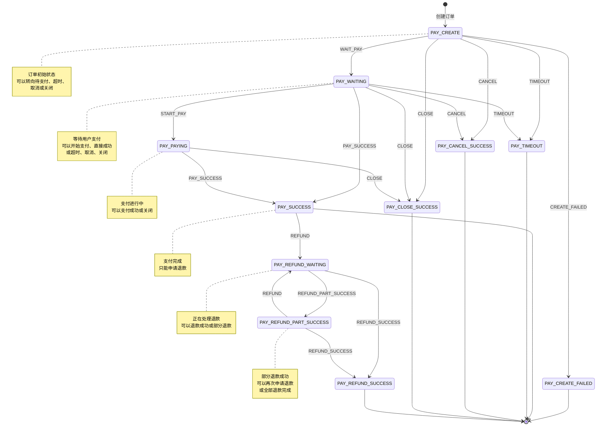
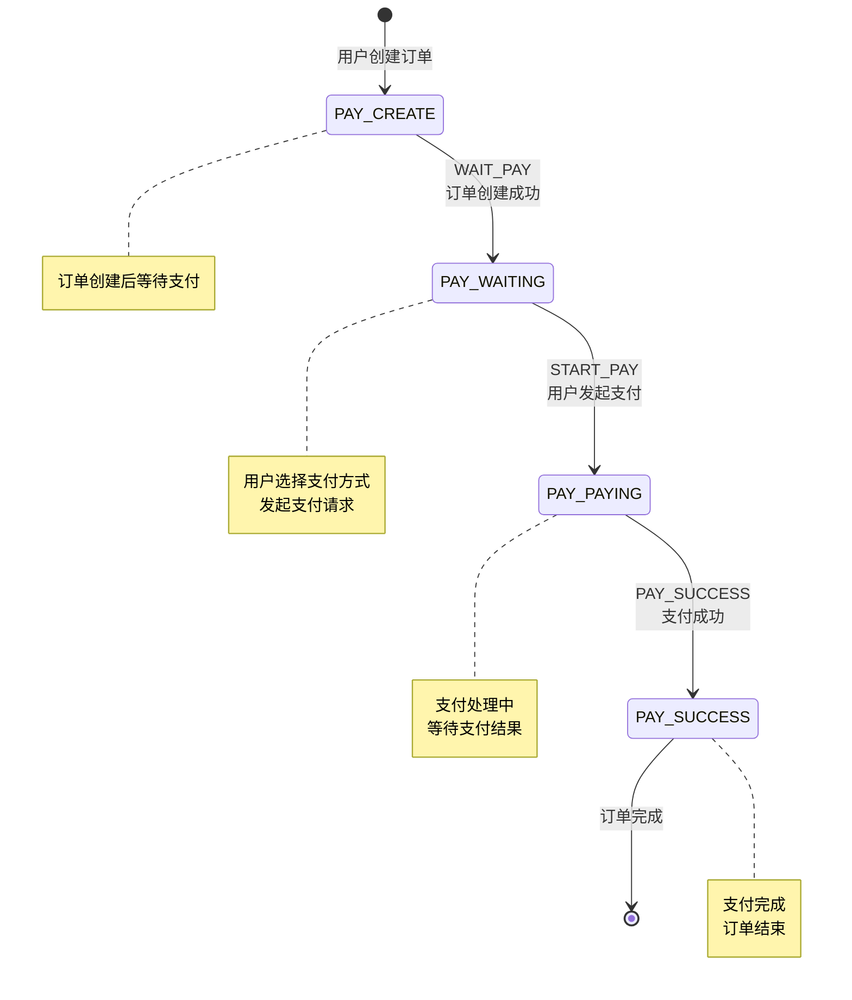
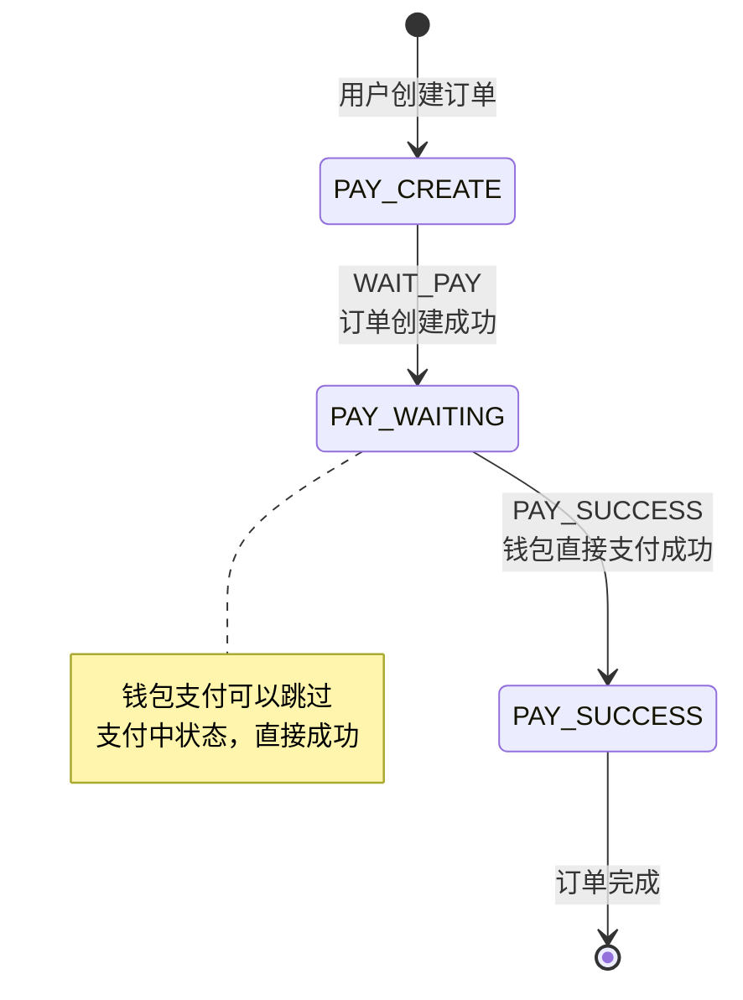
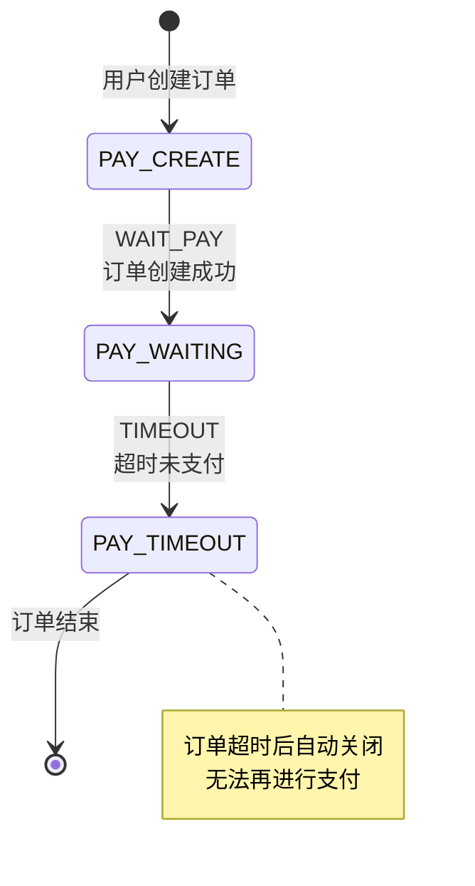
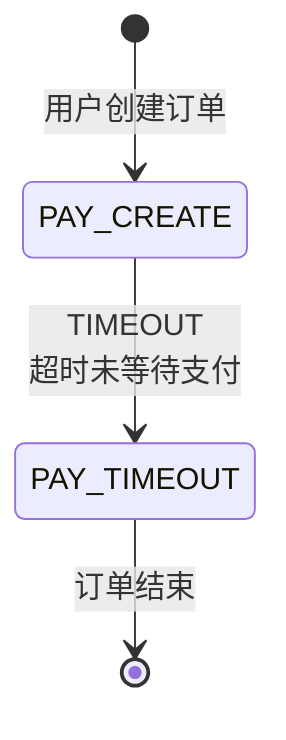
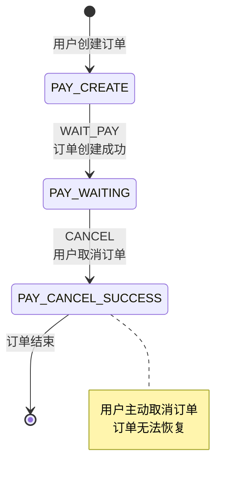
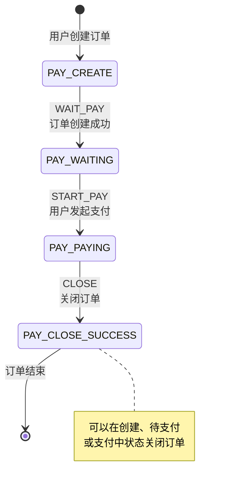
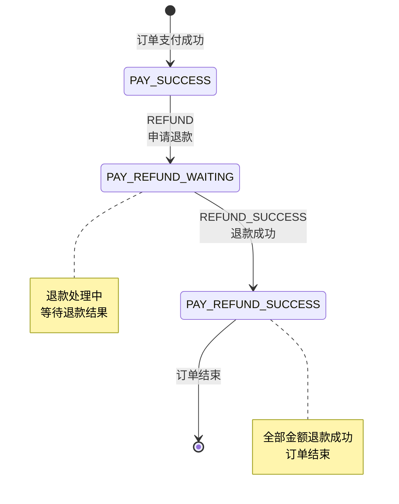
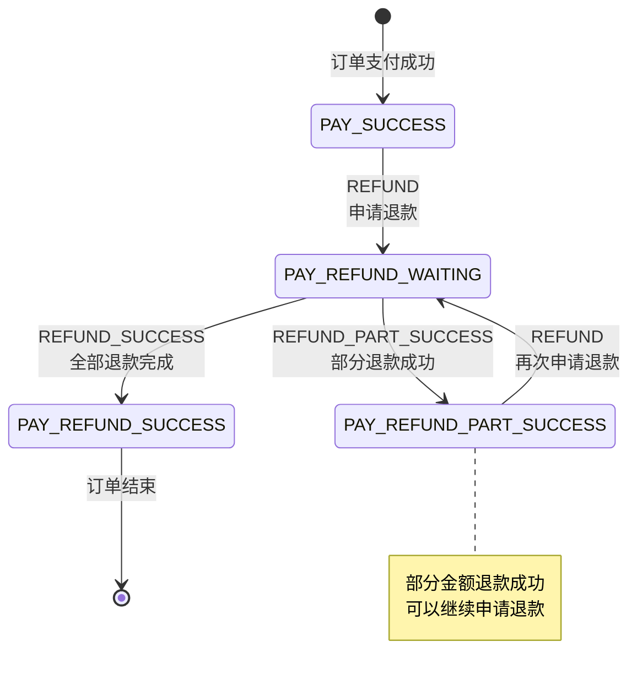

# 支付订单状态机流程图

## 完整状态转换图

## 正常支付流程

## 快速支付流程（钱包支付）

## 订单超时流程

也可以在创建状态直接超时：

## 订单取消流程

## 订单关闭流程

## 完整退款流程

## 部分退款流程

## 状态说明

| 状态代码 | 状态名称 | 说明 | 是否终态 |
|---------|---------|------|---------|
| PAY_NOT_EXIST | 订单不存在 | 订单不存在或已删除 | - |
| PAY_CREATE | 创建 | 订单初始状态 | ❌ |
| PAY_CREATE_FAILED | 创建失败 | 订单创建失败 | ✅ |
| PAY_WAITING | 待支付 | 等待用户支付 | ❌ |
| PAY_PAYING | 支付中 | 支付处理中 | ❌ |
| PAY_SUCCESS | 支付成功 | 支付完成 | ✅ |
| PAY_TIMEOUT | 订单超时 | 超时未支付 | ✅ |
| PAY_CANCEL_SUCCESS | 订单取消 | 用户取消订单 | ✅ |
| PAY_CLOSE_SUCCESS | 订单关闭 | 系统或用户关闭订单 | ✅ |
| PAY_REFUND_SUCCESS | 退款成功 | 全部金额退款成功 | ✅ |
| PAY_REFUND_PART_SUCCESS | 部分退款 | 部分金额退款成功 | ❌ |
| PAY_REFUND_WAITING | 正在退款 | 退款处理中 | ❌ |

## 事件说明

| 事件代码 | 事件名称 | 触发场景 | 适用状态 |
|---------|---------|---------|---------|
| CREATE | 创建订单 | 用户创建新订单 | 初始状态 |
| CREATE_FAILED | 创建失败 | 订单创建异常 | PAY_CREATE |
| WAIT_PAY | 等待支付 | 订单创建成功后等待支付 | PAY_CREATE |
| START_PAY | 开始支付 | 用户发起支付操作 | PAY_WAITING |
| PAY_SUCCESS | 支付成功 | 支付完成 | PAY_WAITING, PAY_PAYING |
| TIMEOUT | 订单超时 | 超过支付时限 | PAY_CREATE, PAY_WAITING |
| CANCEL | 取消订单 | 用户主动取消 | PAY_CREATE, PAY_WAITING |
| CLOSE | 关闭订单 | 系统或用户关闭订单 | PAY_CREATE, PAY_WAITING, PAY_PAYING |
| REFUND | 申请退款 | 发起退款请求 | PAY_SUCCESS, PAY_REFUND_PART_SUCCESS |
| REFUND_SUCCESS | 退款成功 | 退款完成 | PAY_REFUND_WAITING, PAY_REFUND_PART_SUCCESS |
| REFUND_PART_SUCCESS | 部分退款 | 部分金额退款成功 | PAY_REFUND_WAITING |

## 状态转换矩阵

| 当前状态 \ 事件 | WAIT_PAY | START_PAY | PAY_SUCCESS | TIMEOUT | CANCEL | CLOSE | REFUND | REFUND_SUCCESS | REFUND_PART_SUCCESS |
|----------------|----------|-----------|-------------|---------|--------|-------|--------|----------------|-------------------|
| PAY_CREATE | ✅ | ❌ | ❌ | ✅ | ✅ | ✅ | ❌ | ❌ | ❌ |
| PAY_WAITING | ❌ | ✅ | ✅ | ✅ | ✅ | ✅ | ❌ | ❌ | ❌ |
| PAY_PAYING | ❌ | ❌ | ✅ | ❌ | ❌ | ✅ | ❌ | ❌ | ❌ |
| PAY_SUCCESS | ❌ | ❌ | ❌ | ❌ | ❌ | ❌ | ✅ | ❌ | ❌ |
| PAY_REFUND_WAITING | ❌ | ❌ | ❌ | ❌ | ❌ | ❌ | ❌ | ✅ | ✅ |
| PAY_REFUND_PART_SUCCESS | ❌ | ❌ | ❌ | ❌ | ❌ | ❌ | ✅ | ✅ | ❌ |
| 其他终态 | ❌ | ❌ | ❌ | ❌ | ❌ | ❌ | ❌ | ❌ | ❌ |

✅ = 允许转换  
❌ = 不允许转换

## 使用建议

1. **状态转换前检查**：使用 `canSendEvent` 方法检查状态转换是否合法
2. **事务保护**：状态转换和数据库更新应在同一事务中完成
3. **日志记录**：状态机会自动记录状态转换日志，注意日志级别配置
4. **错误处理**：状态转换失败时，及时返回错误信息给用户
5. **监控告警**：对非法状态转换设置监控告警，及时发现问题

