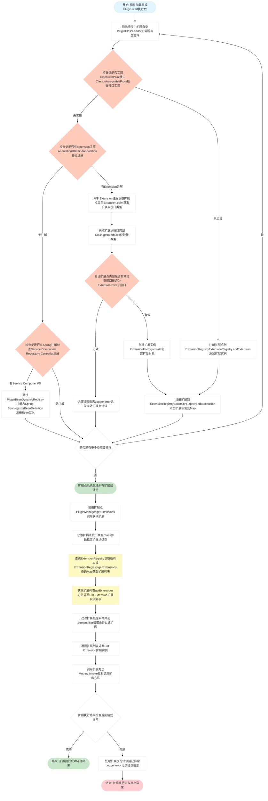

# Spring Support Plugin Starter

> 🚀 **完整实现 PF4J 所有功能的 Spring Boot Starter**

一个功能完整、开箱即用的插件系统 Spring Boot Starter，完全兼容 PF4J 标准，并提供更多增强功能。

## 📦 快速开始

### 1. 添加依赖

```xml
<dependency>
    <groupId>com.chua</groupId>
    <artifactId>spring-support-plugin-starter</artifactId>
    <version>最新版本</version>
</dependency>
```

### 2. 配置（可选）

#### application.yml

```yaml
spring:
  plugin:
    enabled: true                    # 启用插件系统（默认：true）
    plugins-root: ./plugins         # 插件目录（默认：./plugins）
    auto-load: true                 # 自动加载（默认：true）
    auto-start: true                # 自动启动（默认：true）
    watch-enabled: true             # 热加载（默认：false）
    auto-reload: true               # 自动重载（默认：true）
    runtime-mode: development       # 运行模式（development/production）
    show-info: true                 # 显示插件信息（默认：true）
    show-details: false             # 显示详细信息（默认：false）
```

#### application.properties

```properties
spring.plugin.enabled=true
spring.plugin.plugins-root=./plugins
spring.plugin.watch-enabled=true
spring.plugin.runtime-mode=development
```

### 3. 启动应用

```java
@SpringBootApplication
public class Application {
    public static void main(String[] args) {
        SpringApplication.run(Application.class, args);
    }
}
```

**就这么简单！** 插件系统会自动：
1. 创建插件目录
2. 扫描并加载所有插件（支持JAR和ZIP格式）
3. 启动所有插件
4. 注册插件 Bean 到容器
5. 注册Controller映射到Spring MVC

---

## 📋 配置属性详解

| 属性 | 类型 | 默认值 | 说明 |
|-----|------|--------|------|
| `spring.plugin.enabled` | boolean | true | 是否启用插件系统 |
| `spring.plugin.plugins-root` | String | ./plugins | 插件根目录路径 |
| `spring.plugin.auto-load` | boolean | true | 是否自动加载插件 |
| `spring.plugin.auto-start` | boolean | true | 是否自动启动插件 |
| `spring.plugin.watch-enabled` | boolean | false | 是否启用目录监听（热加载） |
| `spring.plugin.auto-reload` | boolean | true | 文件修改时是否自动重载 |
| `spring.plugin.runtime-mode` | enum | DEVELOPMENT | 运行模式（DEVELOPMENT/PRODUCTION） |
| `spring.plugin.show-info` | boolean | true | 是否显示插件信息 |
| `spring.plugin.show-details` | boolean | false | 是否显示详细信息 |
| `spring.plugin.strict-mode` | boolean | false | 是否严格模式 |
| `spring.plugin.resolve-dependencies` | boolean | true | 是否解析依赖 |

---

## 🎯 运行模式

### 开发模式 (DEVELOPMENT)

适合本地开发和调试：

```yaml
spring:
  plugin:
    runtime-mode: development
    watch-enabled: true      # 自动启用
    show-info: true
    show-details: true       # 显示详细信息
```

**特性：**
- ✅ 支持热加载
- ✅ 详细的日志输出
- ✅ 完整的插件信息

### 生产模式 (PRODUCTION)

适合生产环境：

```yaml
spring:
  plugin:
    runtime-mode: production
    watch-enabled: false     # 自动禁用
    show-info: false
    show-details: false
```

**特性：**
- ✅ 禁用热加载（性能优化）
- ✅ 简洁的日志输出
- ✅ 更高的稳定性

---

## 🔌 创建插件

### 1. 创建插件项目

```xml
<project>
    <groupId>com.example</groupId>
    <artifactId>my-plugin</artifactId>
    <version>1.0.0</version>
    
    <dependencies>
        <dependency>
            <groupId>com.chua</groupId>
            <artifactId>utils-support-common-starter</artifactId>
            <version>最新版本</version>
            <scope>provided</scope>
        </dependency>
    </dependencies>
</project>
```

### 2. 创建插件类

```java
package com.example.myplugin;

import com.chua.common.support.objects.plugin.api.Plugin;

public class MyPlugin extends Plugin {
    
    @Override
    public void start() {
        System.out.println("MyPlugin started!");
    }
    
    @Override
    public void stop() {
        System.out.println("MyPlugin stopped!");
    }
    
    @Override
    public void delete() {
        System.out.println("MyPlugin deleted!");
    }
}
```

### 3. 创建插件描述符

在 `src/main/resources/plugin.properties`：

```properties
plugin.id=my-plugin
plugin.name=My Plugin
plugin.version=1.0.0
plugin.description=My awesome plugin
plugin.class=com.example.myplugin.MyPlugin
plugin.provider=Your Name
plugin.license=Apache 2.0
```

### 4. 创建服务类

#### 使用 @Extension 注解

```java
@Extension
public class MyService {
    public String hello() {
        return "Hello from plugin!";
    }
}
```

#### 使用 Spring 注解（自动识别）

```java
@Service
public class MySpringService {
    public String sayHi() {
        return "Hi from Spring plugin!";
    }
}
```

### 5. 打包

```bash
mvn clean package
```

生成的插件文件：`target/my-plugin-1.0.0.jar` 或 `target/my-plugin-1.0.0.zip`

---

## 💻 使用插件

### 注入插件管理器

```java
@RestController
@RequestMapping("/plugin")
public class PluginController {
    
    @Autowired
    private PluginManager pluginManager;
    
    @GetMapping("/list")
    public List<String> listPlugins() {
        return pluginManager.getPlugins().stream()
            .map(PluginWrapper::getPluginId)
            .collect(Collectors.toList());
    }
    
    @GetMapping("/load")
    public String loadPlugin(@RequestParam String path) throws Exception {
        return pluginManager.loadPlugin(new File(path));
    }
    
    @PostMapping("/unload/{id}")
    public boolean unloadPlugin(@PathVariable String id) throws Exception {
        return pluginManager.unloadPlugin(id);
    }
    
    @PostMapping("/reload/{id}")
    public void reloadPlugin(@PathVariable String id) throws Exception {
        pluginManager.reloadPlugin(id);
    }
}
```

### 获取插件扩展点

```java
@Service
public class PluginService {
    
    @Autowired
    private PluginManager pluginManager;
    
    public void useExtensions() {
        // 获取所有实现了某接口的扩展
        List<MyService> services = 
            pluginManager.getExtensions(MyService.class);
        
        for (MyService service : services) {
            System.out.println(service.hello());
        }
    }
}
```

---

## 🎮 Controller 映射管理

插件系统中的 Controller 是特殊的 Bean，需要动态注册、卸载和升级 URL 映射。

### 自动映射注册

当插件启动时，系统会自动：

1. **扫描 Controller 类**：识别所有 `@Controller` 和 `@RestController` 注解的类
2. **解析映射注解**：解析 `@RequestMapping`、`@GetMapping`、`@PostMapping` 等注解
3. **注册到 Spring MVC**：通过 `RequestMappingHandlerMapping.registerMapping()` 注册 URL 映射
4. **存储映射信息**：将映射信息存储到插件上下文中，用于后续卸载和升级

### 映射卸载

当插件卸载或删除时，系统会自动：

1. **获取映射信息**：从插件上下文获取所有已注册的 Controller 映射
2. **卸载映射**：通过 `RequestMappingHandlerMapping.unregisterMapping()` 卸载所有 URL 映射
3. **清理资源**：释放映射相关的资源

### 映射升级

当插件重载时，系统会自动：

1. **比较映射差异**：对比新旧插件的 Controller 映射
2. **卸载旧映射**：先卸载所有旧的 URL 映射
3. **注册新映射**：重新注册新的 URL 映射
4. **处理映射变更**：处理路径变更、方法变更等情况

### 示例

```java
@RestController
@RequestMapping("/plugin/api")
public class PluginApiController {
    
    @GetMapping("/hello")
    public String hello() {
        return "Hello from plugin!";
    }
    
    @PostMapping("/data")
    public String saveData(@RequestBody String data) {
        return "Data saved: " + data;
    }
}
```

**映射注册流程：**
- 插件启动 → 扫描到 `PluginApiController`
- 解析 `@RequestMapping("/plugin/api")` 和 `@GetMapping("/hello")`
- 注册映射：`GET /plugin/api/hello` → `hello()` 方法
- 注册映射：`POST /plugin/api/data` → `saveData()` 方法

**映射卸载流程：**
- 插件卸载 → 获取所有映射信息
- 卸载映射：`GET /plugin/api/hello`
- 卸载映射：`POST /plugin/api/data`

**映射升级流程：**
- 插件重载 → 比较新旧映射
- 如果路径变更：`/plugin/api` → `/plugin/v2/api`
  - 卸载旧映射：`GET /plugin/api/hello`
  - 注册新映射：`GET /plugin/v2/api/hello`

### 注意事项

1. **映射冲突**：如果多个插件注册了相同的 URL 映射，后加载的插件会覆盖先加载的插件映射
2. **路径前缀**：建议为插件 Controller 添加唯一的前缀，避免映射冲突
3. **热加载支持**：映射的注册和卸载支持热加载，无需重启应用

### 内存管理和垃圾回收

⚠️ **重要提示：插件卸载后的内存管理**

1. **自动GC机制**：
   - 系统在卸载插件时会**自动调用 `System.gc()`** 来释放文件锁和内存
   - 特别是在 Windows 系统上，文件锁释放需要特殊处理
   - 卸载流程：卸载Bean → 关闭ClassLoader → 释放文件锁 → **自动GC**

2. **手动GC建议**：
   - ✅ **推荐做法**：系统已自动处理，通常**不需要手动GC**
   - ⚠️ **特殊情况**：如果遇到以下情况，可以手动触发GC：
     - 插件卸载后文件仍被锁定（Windows系统常见）
     - 内存占用过高，需要立即释放
     - 频繁卸载/重载插件，内存压力大
   - 📝 **手动GC示例**：
     ```java
     // 卸载插件后手动触发GC（可选）
     pluginManager.unloadPlugin("my-plugin");
     
     // 如果需要立即释放内存，可以手动调用
     System.gc();
     System.runFinalization();
     
     // 或者等待一段时间让GC自动执行
     Thread.sleep(100);
     ```

3. **最佳实践**：
   - 插件卸载后，系统会自动处理GC，**无需手动干预**
   - 如果遇到文件锁定问题，系统会自动重试（最多3次）
   - 生产环境建议监控内存使用情况，必要时手动触发GC

---

## 🔥 热加载

### 启用热加载

```yaml
spring:
  plugin:
    watch-enabled: true
    auto-reload: true
```

### 行为说明

#### 新增插件 (CREATE)
```
./plugins/new-plugin-1.0.0.jar 或 new-plugin-1.0.0.zip ← 添加文件
↓
自动加载并启动插件
↓
注册Controller映射到RequestMappingHandlerMapping
```

#### 修改插件 (MODIFY)
```
./plugins/my-plugin-1.0.0.jar 或 my-plugin-1.0.0.zip ← 更新文件
↓
卸载Controller映射 → 卸载Bean → 卸载扩展点
↓
重新加载插件
↓
注册扩展点 → 注册Bean → 升级Controller映射（比较新旧映射差异）
```

#### 删除插件 (DELETE)
```
./plugins/old-plugin-1.0.0.jar 或 old-plugin-1.0.0.zip ← 删除文件
↓
卸载Controller映射 → 卸载Bean → 卸载扩展点
↓
自动卸载插件
```

---

## 📊 PF4J 功能对比

| 功能 | PF4J | 本 Starter | 说明 |
|------|------|-----------|------|
| 插件管理 | ✅ | ✅ | 完全兼容 |
| 扩展点 | ✅ | ✅ | 完全兼容 |
| 热加载 | ✅ | ✅ | 完全兼容 |
| Bean管理 | ❌ | ✅ | **增强功能** |
| Spring集成 | ⚠️ | ✅ | **自动识别** |
| SPI扩展 | ❌ | ✅ | **独有功能** |
| Windows支持 | ⚠️ | ✅ | **完美支持** |

**结论：完全兼容 PF4J，并提供更多增强功能！**

---

## 🎯 最佳实践

### 开发环境

```yaml
spring:
  plugin:
    runtime-mode: development
    watch-enabled: true
    show-details: true
```

### 生产环境

```yaml
spring:
  plugin:
    runtime-mode: production
    plugins-root: /opt/app/plugins  # 绝对路径
    watch-enabled: false            # 禁用热加载
    show-info: false
```

### 插件命名

```
<plugin-id>-<version>.jar 或 <plugin-id>-<version>.zip
示例：my-plugin-1.0.0.jar 或 my-plugin-1.0.0.zip
```

---

## 🔍 故障排查

### 插件加载失败

**检查：**
1. plugin.properties 是否存在
2. plugin.class 是否正确
3. JAR 文件是否完整

### 热加载不工作

**检查：**
1. watch-enabled 是否为 true
2. 插件目录路径是否正确
3. Windows：文件是否被锁定

---

## 🏗️ 系统架构流程图

### 1. 整体系统架构

```mermaid
%%{init: {'theme':'base', 'themeVariables': { 'primaryColor':'#fff'}}}%%
flowchart TB
    subgraph Application["应用层 Application Layer"]
        SpringApp["Spring Boot应用<br/>SpringBootApplication"]
        UserCode["用户代码<br/>使用PluginManager"]
        PluginController["PluginController<br/>插件管理接口"]
    end
    
    subgraph Config["配置层 Configuration Layer"]
        PluginAutoConfig["PluginAutoConfiguration<br/>自动配置类<br/>ConditionalOnProperty"]
        PluginProperties["PluginProperties<br/>配置属性读取<br/>application.yml"]
        RuntimeMode["运行模式<br/>RuntimeMode枚举<br/>DEVELOPMENT或PRODUCTION"]
        ConfigProps["配置属性<br/>plugins-root auto-load<br/>auto-start watch-enabled"]
    end
    
    subgraph Manager["管理层 Manager Layer"]
        SpringPluginManager["SpringPluginManager<br/>插件管理器<br/>实现PluginManager接口"]
        PluginManager["PluginManager接口<br/>PF4J标准规范"]
        DefaultPluginManager["DefaultPluginManager<br/>默认实现<br/>PF4J核心"]
        PluginRegistry["插件注册表<br/>Map存储PluginWrapper"]
    end
    
    subgraph Loader["加载层 Loader Layer"]
        PluginLoader["PluginLoader<br/>插件加载器<br/>loadPlugin方法"]
        PluginDescriptor["PluginDescriptor<br/>插件描述符<br/>解析plugin.properties"]
        PluginWrapper["PluginWrapper<br/>插件包装器<br/>封装Plugin实例"]
        ClassLoader["PluginClassLoader<br/>插件类加载器<br/>实现类隔离"]
        JarPluginLoader["JarPluginLoader<br/>JAR文件加载器"]
    end
    
    subgraph Lifecycle["生命周期层 Lifecycle Layer"]
        Plugin["Plugin接口<br/>start/stop/delete<br/>生命周期方法"]
        PluginState["PluginState<br/>状态管理枚举<br/>CREATED/STARTED/STOPPED"]
        LifecycleListener["LifecycleListener<br/>生命周期监听器<br/>onPluginStateChanged"]
        PluginLifecycle["插件生命周期管理"]
    end
    
    subgraph Extension["扩展层 Extension Layer"]
        ExtensionPoint["ExtensionPoint<br/>扩展点接口<br/>定义扩展契约"]
        ExtensionAnnotation["Extension注解<br/>标记扩展实现"]
        ExtensionFinder["ExtensionFinder<br/>扩展查找器<br/>扫描插件类"]
        ExtensionRegistry["ExtensionRegistry<br/>扩展注册表<br/>存储扩展实例"]
        ExtensionFactory["ExtensionFactory<br/>扩展工厂<br/>创建扩展实例"]
    end
    
    subgraph Spring["Spring集成层 Spring Integration Layer"]
        ObjectContext["ObjectContext<br/>对象上下文<br/>Bean管理容器"]
        PluginBeanRegistry["PluginBeanDynamicRegistry<br/>动态Bean注册器<br/>实现BeanDefinitionRegistry"]
        SpringScanner["Spring注解扫描器<br/>扫描Service/Component<br/>Repository/Controller"]
        BeanFactory["Spring BeanFactory<br/>标准Bean工厂"]
        BeanDefinition["BeanDefinition<br/>Bean定义信息"]
    end
    
    subgraph Watcher["监听层 Watcher Layer"]
        DirectoryWatcher["DirectoryWatcher<br/>目录监听器<br/>监听plugins目录"]
        FileWatcher["FileWatcher<br/>文件监听器<br/>处理文件事件"]
        WatchService["WatchService<br/>文件系统监听服务<br/>Java NIO"]
        WatchEvent["WatchEvent<br/>文件系统事件<br/>CREATE MODIFY DELETE"]
    end
    
    subgraph Storage["存储层 Storage Layer"]
        PluginDir["插件目录<br/>plugins默认路径<br/>可配置"]
        PluginJar["插件文件<br/>支持JAR和ZIP格式<br/>格式: plugin-id-version.jar/zip"]
        PluginCache["插件缓存<br/>缓存已加载的插件信息"]
        PluginPropertiesFile["plugin.properties<br/>插件描述符文件"]
    end
    
    SpringApp --> PluginAutoConfig
    PluginAutoConfig --> PluginProperties
    PluginAutoConfig --> SpringPluginManager
    PluginProperties --> RuntimeMode
    PluginProperties --> ConfigProps
    UserCode --> PluginController
    PluginController --> SpringPluginManager
    
    SpringPluginManager --> PluginManager
    SpringPluginManager --> DefaultPluginManager
    SpringPluginManager --> PluginLoader
    SpringPluginManager --> ObjectContext
    SpringPluginManager --> PluginBeanRegistry
    SpringPluginManager --> PluginRegistry
    
    PluginLoader --> PluginDescriptor
    PluginLoader --> PluginWrapper
    PluginLoader --> JarPluginLoader
    PluginWrapper --> ClassLoader
    PluginWrapper --> Plugin
    
    Plugin --> PluginState
    Plugin --> LifecycleListener
    Plugin --> PluginLifecycle
    
    SpringPluginManager --> ExtensionFinder
    ExtensionFinder --> ExtensionPoint
    ExtensionFinder --> ExtensionAnnotation
    ExtensionFinder --> ExtensionRegistry
    ExtensionFinder --> ExtensionFactory
    
    PluginBeanRegistry --> SpringScanner
    SpringScanner --> BeanFactory
    SpringScanner --> BeanDefinition
    ObjectContext --> BeanFactory
    
    SpringPluginManager --> DirectoryWatcher
    DirectoryWatcher --> FileWatcher
    FileWatcher --> WatchService
    WatchService --> WatchEvent
    
    PluginLoader --> PluginDir
    PluginDir --> PluginJar
    PluginJar --> PluginPropertiesFile
    PluginLoader --> PluginCache
    
    style Application fill:#e3f2fd
    style Config fill:#fff3e0
    style Manager fill:#f3e5f5
    style Loader fill:#e8f5e9
    style Lifecycle fill:#fce4ec
    style Extension fill:#fff9c4
    style Spring fill:#e1f5fe
    style Watcher fill:#f1f8e9
    style Storage fill:#fafafa
```



### 2. 插件加载流程架构

```mermaid
%%{init: {'theme':'base', 'themeVariables': { 'primaryColor':'#fff'}}}%%
flowchart TD
    Start(["开始<br/>Spring Boot应用启动"]) --> AutoConfig["PluginAutoConfiguration<br/>自动配置类加载<br/>ConditionalOnProperty检查"]
    
    AutoConfig --> CheckEnabled{"检查<br/>spring.plugin.enabled配置"}
    
    CheckEnabled -->|"未启用"| EndSkip(["结束<br/>跳过插件系统初始化"])
    
    CheckEnabled -->|"已启用"| ReadProperties["读取PluginProperties<br/>配置属性<br/>从application.yml读取"]
    
    ReadProperties --> CheckRuntimeMode{"检查运行模式<br/>RuntimeMode枚举"}
    
    CheckRuntimeMode -->|"PRODUCTION"| AdjustProd["调整配置<br/>禁用watchEnabled<br/>简化showInfo"]
    CheckRuntimeMode -->|"DEVELOPMENT"| AdjustDev["调整配置<br/>启用watchEnabled<br/>启用showDetails"]
    
    AdjustProd --> CreateObjectContext["创建ObjectContext<br/>对象上下文<br/>管理插件Bean"]
    AdjustDev --> CreateObjectContext
    
    CreateObjectContext --> CreateRegistry["创建PluginBeanDynamicRegistry<br/>动态Bean注册器<br/>实现BeanDefinitionRegistry"]
    
    CreateRegistry --> CreatePluginDir{"检查插件目录<br/>是否存在<br/>默认plugins目录"}
    
    CreatePluginDir -->|"不存在"| MkdirPluginDir["创建插件目录<br/>File.mkdirs<br/>创建plugins目录"]
    CreatePluginDir -->|"已存在"| CreateManager
    
    MkdirPluginDir --> CreateManager["创建SpringPluginManager<br/>插件管理器<br/>实例化管理器"]
    
    CreateManager --> SetAutoStart["设置autoStart<br/>自动启动配置"]
    CreateManager --> SetDynamicRegistry["设置动态注册器<br/>PluginBeanDynamicRegistry"]
    
    SetDynamicRegistry --> CheckAutoLoad{"检查autoLoad<br/>自动加载配置"}
    
    CheckAutoLoad -->|"未启用"| CheckWatch
    CheckAutoLoad -->|"已启用"| LoadPlugins["调用loadPlugins方法<br/>加载插件<br/>SpringPluginManager.loadPlugins"]
    
    LoadPlugins --> ScanPluginDir["扫描插件目录<br/>File.listFiles<br/>查找所有.jar和.zip文件<br/>支持JAR和ZIP格式"]
    
    ScanPluginDir --> FoundPlugins{"是否找到<br/>插件文件<br/>(JAR或ZIP)"}
    
    FoundPlugins -->|"未找到"| LogNoPlugins["记录日志<br/>Logger.info<br/>未找到插件"]
    FoundPlugins -->|"找到插件"| ProcessPlugin["处理每个插件文件<br/>循环处理每个JAR/ZIP<br/>JarPluginLoader/ZipPluginLoader"]
    
    ProcessPlugin --> LoadPluginDescriptor["加载plugin.properties<br/>插件描述符<br/>JarPluginLoader.loadPluginDescriptor"]
    
    LoadPluginDescriptor --> ParseDescriptor["解析插件描述符<br/>Properties读取<br/>plugin.id/name/version/class"]
    
    ParseDescriptor --> CheckDependencies{"检查插件依赖<br/>resolveDependencies<br/>验证依赖关系"}
    
    CheckDependencies -->|"依赖不满足"| SkipPlugin["跳过插件<br/>记录错误<br/>Logger.error"]
    CheckDependencies -->|"依赖满足"| CreatePluginWrapper["创建PluginWrapper<br/>插件包装器<br/>封装插件信息"]
    
    CreatePluginWrapper --> CreateClassLoader["创建PluginClassLoader<br/>插件类加载器<br/>实现类隔离"]
    
    CreateClassLoader --> LoadPluginClass["加载插件主类<br/>Class.forName<br/>加载plugin.class"]
    
    LoadPluginClass --> InstantiatePlugin["实例化Plugin对象<br/>Constructor.newInstance<br/>创建Plugin实例"]
    
    InstantiatePlugin --> RegisterPlugin["注册插件到PluginManager<br/>插件列表<br/>pluginManager.addPlugin"]
    
    RegisterPlugin --> MorePlugins{"是否还有更多<br/>插件需要处理"}
    
    MorePlugins -->|"是"| ProcessPlugin
    MorePlugins -->|"否"| CheckAutoStart{"检查autoStart<br/>自动启动配置"}
    
    SkipPlugin --> MorePlugins
    
    CheckAutoStart -->|"已启用"| StartAllPlugins["启动所有已加载的插件<br/>SpringPluginManager.startPlugins"]
    CheckAutoStart -->|"未启用"| CheckWatch
    
    StartAllPlugins --> StartPlugin["对每个插件调用start方法<br/>Plugin.start<br/>执行插件启动逻辑"]
    
    StartPlugin --> ChangeState["改变插件状态为STARTED<br/>PluginWrapper.setPluginState<br/>设置状态"]
    
    ChangeState --> ScanExtensions["扫描插件中的扩展点<br/>ExtensionFinder.find<br/>扫描Extension注解"]
    
    ScanExtensions --> RegisterExtensions[注册扩展点到ExtensionRegistryExtensionRegistry.addExtension添加扩展]
    
    RegisterExtensions --> ScanSpringBeans["扫描Spring注解<br/>SpringScanner.scan<br/>扫描Service/Component等"]
    
    ScanSpringBeans --> RegisterBeans["通过PluginBeanDynamicRegistry<br/>注册Bean到Spring容器<br/>registerBeanDefinition"]
    
    RegisterBeans --> MoreStartPlugins{"是否还有更多<br/>插件需要启动"}
    
    MoreStartPlugins -->|"是"| StartPlugin
    MoreStartPlugins -->|"否"| CheckWatch{"检查watchEnabled<br/>热加载配置"}
    
    CheckWatch -->|"已启用"| StartWatcher["启动DirectoryWatcher<br/>目录监听器<br/>DirectoryWatcher.start"]
    CheckWatch -->|"未启用"| CheckShowInfo
    
    StartWatcher --> CreateWatchService["创建WatchService<br/>文件系统监听服务<br/>FileSystems.getDefault"]
    
    CreateWatchService --> WatchPluginDir["监听插件目录文件变化<br/>WatchService.register<br/>注册CREATE/MODIFY/DELETE事件"]
    
    WatchPluginDir --> SetAutoReload["设置autoReload<br/>自动重载配置"]
    
    SetAutoReload --> CheckShowInfo{"检查showInfo<br/>显示信息配置"}
    
    CheckShowInfo -->|"已启用"| PrintPluginInfo["打印插件信息列表<br/>Logger.info<br/>打印所有插件信息"]
    CheckShowInfo -->|"未启用"| EndSuccess
    
    PrintPluginInfo --> PrintDetails{"检查showDetails<br/>显示详情配置"}
    
    PrintDetails -->|"已启用"| PrintFullInfo["打印完整插件信息<br/>ID/Version/Description<br/>Provider/License/Dependencies"]
    PrintDetails -->|"未启用"| PrintBasicInfo["打印基本插件信息<br/>ID/Version/Description"]
    
    PrintFullInfo --> EndSuccess(["结束<br/>插件系统初始化成功"])
    PrintBasicInfo --> EndSuccess
    LogNoPlugins --> EndSuccess
    
    EndSuccess --> Running(["系统运行中<br/>插件系统就绪"])
    
    style Start fill:#e1f5ff
    style EndSuccess fill:#c8e6c9
    style EndSkip fill:#ffcdd2
    style CheckEnabled fill:#ffccbc
    style CheckRuntimeMode fill:#fff9c4
    style CheckAutoLoad fill:#ffccbc
    style CheckAutoStart fill:#ffccbc
    style CheckWatch fill:#ffccbc
    style CheckShowInfo fill:#ffccbc
    style LoadPlugins fill:#fff9c4
    style StartAllPlugins fill:#fff9c4
    style StartWatcher fill:#fff9c4
```



### 3. 热加载流程架构

```mermaid
%%{init: {'theme':'base', 'themeVariables': { 'primaryColor':'#fff'}}}%%
flowchart TD
    Start([开始: DirectoryWatcher监听插件目录]) --> WatchLoop[WatchService持续监听文件系统事件WatchService.take阻塞等待事件]
    
    WatchLoop --> FileEvent{检测到文件事件WatchEvent类型}
    
    FileEvent -->|"CREATE创建"| HandleCreate[处理新增插件文件DirectoryWatcher.onFileCreated]
    FileEvent -->|"MODIFY修改"| HandleModify[处理修改插件文件DirectoryWatcher.onFileModified]
    FileEvent -->|"DELETE删除"| HandleDelete[处理删除插件文件DirectoryWatcher.onFileDeleted]
    
    HandleCreate --> ValidatePlugin{验证是否为插件文件Path.toString.endsWith检查.jar或.zip后缀}
    
    ValidatePlugin -->|"不是插件文件"| IgnoreFile[忽略文件继续监听Logger.debug记录忽略日志]
    ValidatePlugin -->|"是JAR或ZIP"| LoadNewPlugin[加载新插件SpringPluginManager.loadPlugin传入文件路径<br/>支持JAR和ZIP格式]
    
    LoadNewPlugin --> ParseNewDescriptor[解析新插件描述符JarPluginLoader.loadPluginDescriptor读取plugin.properties]
    
    ParseNewDescriptor --> CheckNewDependencies{检查新插件依赖resolveDependencies验证plugin.requires依赖关系}
    
    CheckNewDependencies -->|"依赖不满足"| LogError[记录错误日志Logger.error记录依赖错误信息]
    CheckNewDependencies -->|"依赖满足"| CreateNewWrapper[创建新PluginWrappernew PluginWrapper封装插件信息]
    
    CreateNewWrapper --> CheckAutoStart{检查autoStart配置从PluginProperties读取spring.plugin.auto-start}
    
    CheckAutoStart -->|"已启用或true"| StartNewPlugin[启动新插件Plugin.start执行插件启动逻辑]
    CheckAutoStart -->|"未启用或false"| RegisterNewPlugin[仅注册插件不启动pluginManager.addPlugin添加到注册表]
    
    StartNewPlugin --> ScanNewExtensions[扫描新插件扩展点ExtensionFinder.find扫描Extension注解]
    
    ScanNewExtensions --> RegisterNewExtensions[注册新扩展点到ExtensionRegistryExtensionRegistry.addExtension添加扩展实例]
    
    RegisterNewExtensions --> ScanNewSpringBeans[扫描新插件Spring注解SpringScanner.scan扫描Service Component Repository Controller注解]
    
    ScanNewSpringBeans --> RegisterNewBeans[通过PluginBeanDynamicRegistry注册新BeanregisterBeanDefinition注册Bean定义到Spring容器]
    
    RegisterNewBeans --> NotifyCreate[通知插件创建事件LifecycleListener.onPluginStateChanged触发插件状态变更事件]
    
    RegisterNewPlugin --> NotifyCreate
    
    NotifyCreate --> EndCreate([结束: 新插件加载完成])
    
    HandleModify --> CheckAutoReload{检查autoReload自动重载配置从PluginProperties读取spring.plugin.auto-reload}
    
    CheckAutoReload -->|"未启用或false"| IgnoreModify[忽略修改继续监听Logger.debug记录忽略日志]
    CheckAutoReload -->|"已启用或true"| ReloadPlugin[重载插件SpringPluginManager.reloadPlugin传入插件ID]
    
    ReloadPlugin --> FindPluginWrapper[查找现有PluginWrapperpluginManager.getPlugin根据插件ID查找]
    
    FindPluginWrapper --> PluginExists{插件是否存在Map.containsKey检查插件注册表}
    
    PluginExists -->|"不存在"| LoadAsNew[按新插件处理调用loadPlugin方法]
    PluginExists -->|"存在"| UnloadPlugin[卸载插件SpringPluginManager.unloadPlugin传入插件ID]
    
    UnloadPlugin --> StopPlugin[停止插件Plugin.stop执行插件停止逻辑]
    
    StopPlugin --> UnregisterExtensions[注销扩展点ExtensionRegistry.removeExtension从注册表移除扩展]
    
    UnregisterExtensions --> UnregisterControllerMappings[卸载Controller映射RequestMappingHandlerMapping.unregisterMapping卸载URL映射<br/>从插件上下文获取映射信息<br/>移除所有相关的HandlerMethod映射]
    
    UnregisterControllerMappings --> UnregisterBeans[注销BeanPluginBeanDynamicRegistry.removeBeanDefinition从Spring容器移除Bean]
    
    UnregisterBeans --> CloseClassLoader[关闭PluginClassLoader释放资源PluginClassLoader.close关闭类加载器]
    
    CloseClassLoader --> ReleaseFileLock[释放文件锁Windows特殊处理FileChannel.close释放文件通道锁]
    
    ReleaseFileLock --> WaitRelease{等待文件锁释放System.gc强制垃圾回收Windows需要特殊处理}
    
    WaitRelease -->|"未释放"| RetryRelease[重试释放文件锁Thread.sleep等待后重试最多重试3次]
    RetryRelease --> WaitRelease
    
    WaitRelease -->|"已释放"| ReloadPluginJar[重新加载插件JAR文件JarPluginLoader.loadPlugin重新加载JAR]
    
    LoadAsNew --> ReloadPluginJar
    
    ReloadPluginJar --> ParseReloadDescriptor[解析重载插件描述符JarPluginLoader.loadPluginDescriptor重新解析plugin.properties]
    
    ParseReloadDescriptor --> CreateReloadWrapper[创建新PluginWrappernew PluginWrapper重新封装插件信息]
    
    CreateReloadWrapper --> CheckReloadAutoStart{检查autoStart配置从PluginProperties读取spring.plugin.auto-start}
    
    CheckReloadAutoStart -->|"已启用或true"| StartReloadPlugin[启动重载插件Plugin.start执行插件启动逻辑]
    CheckReloadAutoStart -->|"未启用或false"| RegisterReloadPlugin[仅注册重载插件pluginManager.addPlugin添加到注册表]
    
    StartReloadPlugin --> ScanReloadExtensions[扫描重载插件扩展点ExtensionFinder.find重新扫描Extension注解]
    
    ScanReloadExtensions --> RegisterReloadExtensions[注册重载扩展点ExtensionRegistry.addExtension重新注册扩展实例]
    
    RegisterReloadExtensions --> ScanReloadSpringBeans[扫描重载插件Spring注解SpringScanner.scan重新扫描Spring注解]
    
    ScanReloadSpringBeans --> RegisterReloadBeans[注册重载BeanregisterBeanDefinition重新注册Bean定义到Spring容器]
    
    RegisterReloadBeans --> UpgradeControllerMappings[升级Controller映射比较新旧映射差异<br/>卸载旧映射RequestMappingHandlerMapping.unregisterMapping<br/>注册新映射RequestMappingHandlerMapping.registerMapping<br/>处理映射变更和路径更新]
    
    UpgradeControllerMappings --> NotifyReload[通知插件重载事件LifecycleListener.onPluginStateChanged触发插件重载事件]
    
    RegisterReloadPlugin --> NotifyReload
    
    NotifyReload --> EndReload([结束: 插件重载完成])
    
    HandleDelete --> FindDeletedPlugin[查找被删除的插件pluginManager.getPlugin根据文件路径查找插件ID]
    
    FindDeletedPlugin --> DeletedPluginExists{插件是否存在Map.containsKey检查插件注册表}
    
    DeletedPluginExists -->|"不存在"| IgnoreDelete[忽略删除继续监听Logger.debug记录忽略日志]
    DeletedPluginExists -->|"存在"| UnloadDeletedPlugin[卸载被删除的插件SpringPluginManager.unloadPlugin传入插件ID]
    
    UnloadDeletedPlugin --> StopDeletedPlugin[停止被删除插件Plugin.stop执行插件停止逻辑]
    
    StopDeletedPlugin --> UnregisterDeletedExtensions[注销被删除扩展点ExtensionRegistry.removeExtension从注册表移除扩展]
    
    UnregisterDeletedExtensions --> UnregisterDeletedControllerMappings[卸载被删除Controller映射RequestMappingHandlerMapping.unregisterMapping卸载URL映射<br/>从插件上下文获取映射信息<br/>移除所有相关的HandlerMethod映射]
    
    UnregisterDeletedControllerMappings --> UnregisterDeletedBeans[注销被删除BeanPluginBeanDynamicRegistry.removeBeanDefinition从Spring容器移除Bean]
    
    UnregisterDeletedBeans --> CloseDeletedClassLoader[关闭被删除ClassLoaderPluginClassLoader.close关闭类加载器释放资源]
    
    CloseDeletedClassLoader --> RemoveDeletedPlugin[从插件列表移除pluginManager.removePlugin从Map中移除插件]
    
    RemoveDeletedPlugin --> NotifyDelete[通知插件删除事件LifecycleListener.onPluginStateChanged触发插件删除事件]
    
    NotifyDelete --> EndDelete([结束: 插件删除完成])
    
    IgnoreFile --> WatchLoop
    IgnoreModify --> WatchLoop
    IgnoreDelete --> WatchLoop
    LogError --> WatchLoop
    EndCreate --> WatchLoop
    EndReload --> WatchLoop
    EndDelete --> WatchLoop
    
    style Start fill:#e1f5ff
    style EndCreate fill:#c8e6c9
    style EndReload fill:#c8e6c9
    style EndDelete fill:#c8e6c9
    style FileEvent fill:#ffccbc
    style CheckAutoReload fill:#fff9c4
    style CheckAutoStart fill:#ffccbc
    style CheckReloadAutoStart fill:#ffccbc
    style ReloadPlugin fill:#fff9c4
    style UnloadPlugin fill:#fff9c4
    style ReleaseFileLock fill:#ffccbc
```



### 4. 扩展点系统架构



### 5. Spring Bean 注册流程架构

```mermaid
%%{init: {'theme':'base', 'themeVariables': { 'primaryColor':'#fff'}}}%%
flowchart TD
    Start([开始: 插件启动完成Plugin.start执行后]) --> ScanPluginPackage[扫描插件包中的所有类PluginClassLoader加载所有类文件]
    
    ScanPluginPackage --> CheckSpringAnnotation{检查类是否有Spring注解AnnotationUtils.findAnnotation查找注解}
    
    CheckSpringAnnotation -->|"有Service注解"| ProcessService[处理Service注解类SpringScanner.scan扫描Service类]
    CheckSpringAnnotation -->|"有Component注解"| ProcessComponent[处理Component注解类SpringScanner.scan扫描Component类]
    CheckSpringAnnotation -->|"有Repository注解"| ProcessRepository[处理Repository注解类SpringScanner.scan扫描Repository类]
    CheckSpringAnnotation -->|"有Controller注解"| ProcessController[处理Controller注解类SpringScanner.scan扫描Controller类]
    CheckSpringAnnotation -->|"无Spring注解"| CheckExtension{检查是否为扩展点检查Extension注解或ExtensionPoint接口}
    
    ProcessService --> ValidateBean[验证Bean有效性检查类是否为接口/抽象类检查依赖是否可用]
    ProcessComponent --> ValidateBean
    ProcessRepository --> ValidateBean
    ProcessController --> ValidateBean
    
    ValidateBean --> BeanValid{Bean是否有效检查类是否可实例化}
    
    BeanValid -->|"无效"| LogInvalidBean[记录错误日志Logger.error记录错误信息跳过该Bean]
    BeanValid -->|"有效"| CreateBeanDefinition[创建BeanDefinitionGenericBeanDefinition创建Bean定义对象]
    
    CreateBeanDefinition --> SetBeanClass[设置Bean类名BeanDefinition.setBeanClassName设置类全限定名]
    
    SetBeanClass --> SetBeanScope[设置Bean作用域BeanDefinition.setScope设置作用域默认singleton]
    
    SetBeanScope --> SetBeanProperties[设置Bean属性BeanDefinition.setPropertyValues设置属性值]
    
    SetBeanProperties --> CheckDependencies{检查Bean依赖检查Autowired Resource依赖是否可用}
    
    CheckDependencies -->|"依赖不满足"| LogDependencyError[记录依赖错误Logger.error记录依赖缺失错误]
    CheckDependencies -->|"依赖满足"| RegisterToRegistry[通过PluginBeanDynamicRegistry注册BeanregisterBeanDefinition注册Bean定义]
    
    RegisterToRegistry --> GenerateBeanName[生成Bean名称格式pluginId.beanNameBeanNameGenerator.generateBeanName生成唯一Bean名称]
    
    GenerateBeanName --> GetBeanFactory[获取Spring BeanFactoryDefaultListableBeanFactory获取Bean工厂]
    
    GetBeanFactory --> CheckBeanExists{检查Bean是否已存在BeanFactory.containsBean检查Bean是否已注册}
    
    CheckBeanExists -->|"不存在"| RegisterBeanDefinition[注册BeanDefinition到BeanFactoryBeanDefinitionRegistry.registerBeanDefinition注册Bean定义]
    CheckBeanExists -->|"已存在"| CheckReplaceCondition{检查是否应该替换检查Primary Order注解}
    
    CheckReplaceCondition -->|"新Bean有Primary注解"| ReplaceBean[替换已存在的BeanBeanDefinitionRegistry.removeBeanDefinition移除旧Bean后注册新Bean]
    CheckReplaceCondition -->|"新Bean的Order优先级更高Order值更小"| ReplaceBean
    CheckReplaceCondition -->|"不满足替换条件"| SkipBean[跳过注册保留原有BeanLogger.debug记录跳过日志]
    
    ReplaceBean --> RemoveOldBean[移除旧BeanBeanDefinitionRegistry.removeBeanDefinition移除旧Bean定义]
    RemoveOldBean --> RegisterBeanDefinition
    
    SkipBean --> NextBean
    
    RegisterBeanDefinition --> SetPluginContext[设置插件上下文PluginContextBeanDefinition.setAttribute设置插件上下文信息]
    
    SetPluginContext --> CreateBeanInstance[创建Bean实例BeanFactory.getBean创建Bean实例]
    
    CreateBeanInstance --> InjectDependencies[注入依赖AutowiredAnnotationBeanPostProcessor处理Autowired Resource Inject注解]
    
    InjectDependencies --> CallPostConstruct[调用PostConstruct方法CommonAnnotationBeanPostProcessor处理PostConstruct注解]
    
    CallPostConstruct --> RegisterBean[注册Bean到Spring容器BeanFactory.registerSingleton注册单例Bean]
    
    RegisterBean --> BeanRegistered{Bean是否注册成功检查Bean是否在容器中}
    
    BeanRegistered -->|"成功"| CheckControllerType{检查是否为Controller类型检查Controller或RestController注解}
    BeanRegistered -->|"失败"| LogRegisterError[记录注册错误Logger.error记录注册失败错误]
    
    CheckControllerType -->|"是Controller"| RegisterControllerMapping[注册Controller映射RequestMappingHandlerMapping.registerMapping注册URL映射解析RequestMapping GetMapping等注解]
    CheckControllerType -->|"不是Controller"| NotifyBeanRegistered[通知Bean注册事件ApplicationEventPublisher.publishEvent发布Bean注册事件]
    
    RegisterControllerMapping --> StoreMappingInfo[存储映射信息记录Controller映射到插件上下文]
    StoreMappingInfo --> NotifyBeanRegistered
    
    NotifyBeanRegistered --> NextBean{是否还有更多Bean需要注册}
    
    CheckExtension -->|"是扩展点"| RegisterExtension[注册为扩展点ExtensionRegistry.addExtension注册扩展到扩展注册表]
    CheckExtension -->|"不是扩展点"| NextBean
    
    RegisterExtension --> NextBean
    
    LogInvalidBean --> NextBean
    LogDependencyError --> NextBean
    LogRegisterError --> NextBean
    
    NextBean -->|"是"| ScanPluginPackage
    NextBean -->|"否"| AllBeansRegistered([所有Bean注册完成插件所有Bean已注册到Spring容器])
    
    AllBeansRegistered --> BeanAvailable[Bean可用于依赖注入BeanFactory.getBean可以获取Bean实例]
    
    BeanAvailable --> InjectToMainApp[主应用可以通过Autowired注入插件BeanAutowired自动注入插件Bean]
    
    InjectToMainApp --> EndSuccess([结束: Spring集成完成插件Bean已集成到Spring容器])
    
    style Start fill:#e1f5ff
    style AllBeansRegistered fill:#c8e6c9
    style EndSuccess fill:#c8e6c9
    style CheckSpringAnnotation fill:#ffccbc
    style ValidateBean fill:#ffccbc
    style CheckDependencies fill:#ffccbc
    style BeanRegistered fill:#ffccbc
    style RegisterToRegistry fill:#fff9c4
    style RegisterBeanDefinition fill:#fff9c4
    style CreateBeanInstance fill:#fff9c4
    style CheckBeanExists fill:#ffccbc
    style CheckReplaceCondition fill:#ffccbc
    style ReplaceBean fill:#fff9c4
```



> 💡 **提示**: 架构图支持横向滚动查看，也可以点击图表在新窗口中打开查看大图。

---

## 🔒 Bean 覆盖机制说明

### Bean 命名规则

插件中的 Bean 注册到 Spring 容器时，会使用以下命名格式：

```
{pluginId}.{beanName}
```

**示例：**
- 插件ID：`my-plugin`
- Bean名称：`userService`
- Spring容器中的名称：`my-plugin.userService`

这种命名方式确保了：
- ✅ **避免冲突**：插件Bean不会与主应用的Bean名称冲突
- ✅ **唯一性**：不同插件的同名Bean可以共存
- ✅ **可追溯性**：通过Bean名称可以识别Bean来源

### Bean 覆盖策略

当插件尝试注册一个已存在的Bean时（例如热加载场景），系统会按照以下规则决定是否覆盖：

#### 1. 检查条件

```java
// 伪代码逻辑
if (bean已存在) {
    if (新Bean有@Primary注解) {
        替换旧Bean
    } else if (新Bean的@Order值 < 旧Bean的@Order值) {
        替换旧Bean  // @Order值越小，优先级越高
    } else {
        跳过注册，保留旧Bean
    }
} else {
    直接注册新Bean
}
```

#### 2. 覆盖规则详解

| 条件 | 是否覆盖 | 说明 |
|------|---------|------|
| 新Bean有`@Primary`注解 | ✅ **是** | `@Primary`表示优先使用，会替换已存在的Bean |
| 新Bean的`@Order`值更小 | ✅ **是** | `@Order`值越小优先级越高，会替换优先级低的Bean |
| 新Bean的`@Order`值更大或相等 | ❌ **否** | 保留已存在的Bean，跳过新Bean注册 |
| 新Bean无`@Primary`且无`@Order` | ❌ **否** | 默认不覆盖，保留已存在的Bean |

#### 3. 使用示例

**场景1：插件Bean不会覆盖主应用Bean**

```java
// 主应用中的Bean
@Service
public class UserService {
    // ...
}

// 插件中的Bean（即使同名也不会冲突）
@Service  // 注册为 "my-plugin.userService"
public class UserService {
    // ...
}
```

**场景2：使用@Primary强制覆盖**

```java
// 主应用中的Bean
@Service
public class PaymentService {
    // ...
}

// 插件中的Bean（使用@Primary覆盖主应用的Bean）
@Service
@Primary  // 会替换主应用中的PaymentService
public class PaymentService {
    // ...
}
```

**场景3：使用@Order控制优先级**

```java
// 主应用中的Bean
@Service
@Order(100)  // 优先级较低
public class ConfigService {
    // ...
}

// 插件中的Bean（优先级更高，会覆盖）
@Service
@Order(10)  // 优先级更高，会替换主应用的ConfigService
public class ConfigService {
    // ...
}
```

### 最佳实践

1. **避免覆盖主应用Bean**
   - 使用插件ID前缀命名Bean，避免与主应用冲突
   - 除非明确需要，否则不要使用`@Primary`覆盖主应用Bean

2. **合理使用@Primary**
   - 仅在确实需要替换现有Bean时使用
   - 考虑对主应用功能的影响

3. **使用@Order控制加载顺序**
   - 高优先级插件（`@Order`值小）的Bean会优先注册
   - 相同优先级的Bean，按插件加载顺序注册

4. **热加载时的Bean更新**
   - 插件重载时，会先卸载旧Bean，再注册新Bean
   - 如果新Bean不满足覆盖条件，旧Bean会被保留

### 注意事项

⚠️ **重要提示：**

1. **主应用Bean不会被覆盖**：由于Bean命名规则（`pluginId.beanName`），插件Bean不会与主应用Bean冲突
2. **插件间Bean可能覆盖**：如果多个插件有相同ID和Bean名称，后加载的插件可能会覆盖先加载的插件Bean（取决于覆盖策略）
3. **@Autowired注入**：主应用可以通过完整Bean名称注入插件Bean：
   ```java
   @Autowired
   @Qualifier("my-plugin.userService")
   private UserService pluginUserService;
   ```

4. **Spring单例Bean注册生效说明**：
   - ✅ **插件Bean会正常生效**：即使主应用已有单例Bean，插件注册的单例Bean也会正常生效
   - ✅ **Bean名称隔离**：插件Bean使用 `pluginId.beanName` 命名规则，与主应用Bean名称不同，不会冲突
   - ✅ **单例作用域**：插件Bean默认使用 `singleton` 作用域，通过 `BeanFactory.registerSingleton()` 注册
   - ✅ **独立实例**：每个插件Bean都是独立的单例实例，即使类型相同，也不会与主应用Bean冲突
   - 📝 **示例**：
     ```java
     // 主应用中的单例Bean
     @Service
     public class UserService { ... }
     
     // 插件中的单例Bean（会正常注册和生效）
     @Service
     public class UserService { ... }  // Bean名称: "my-plugin.userService"
     
     // 主应用可以同时注入两个Bean
     @Autowired
     private UserService mainUserService;  // 主应用Bean
     
     @Autowired
     @Qualifier("my-plugin.userService")
     private UserService pluginUserService;  // 插件Bean
     ```

---

## 📚 相关文档

- [完整功能对比](../../PF4J_FEATURE_COMPARISON.md)
- [使用指南](../../SPRING_BOOT_PLUGIN_GUIDE.md)
- [卸载机制](../../PLUGIN_UNLOAD_GUIDE.md)

---

## 💡 示例项目

完整的示例项目请参考：`examples/plugin-demo`

---

## 🎉 总结

这是一个**生产就绪、功能完整、文档齐全**的企业级插件系统 Spring Boot Starter！

- ✅ **完全兼容 PF4J**
- ✅ **零配置启动**
- ✅ **开箱即用**
- ✅ **高度可扩展**
- ✅ **完美的 Spring 集成**

**立即开始使用吧！** 🚀
